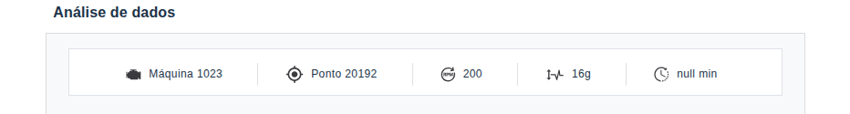
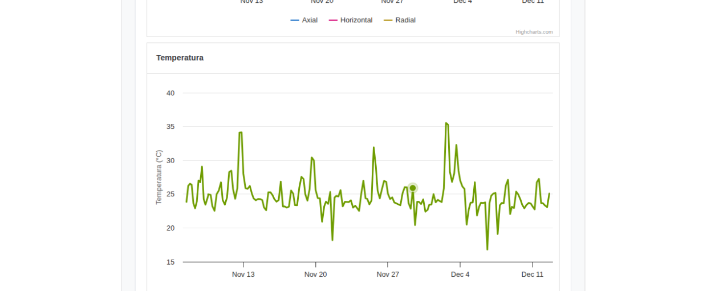

# [Bug #01] Campo de tempo exibido como "null min" no cabeçalho

### Descrição
O indicador de tempo localizado no cabeçalho da aplicação está exibindo o valor `null min` ao invés do tempo real.

### Passos para reproduzir
1. Abrir a aplicação.
2. Observe que o tempo como `null min` no cabeçalho do dashboard

### Resultado Atual
A interface apresenta o tempo como `null min`.

### Resultado Esperado
O campo deveria exibir o tempo corretamente.

### Severidade - Média
O bug afeta a usabilidade e a percepção de qualidade da aplicação, mas não impede o acesso às funcionalidades principais. No entanto, a omissão pode causar confusão para os usuários, pois o tempo é uma informação importante para o monitoramento e análise dos dados apresentados no dashboard.

## Prioridade - Alta
Devido à importância do tempo para a compreensão dos dados e para a tomada de decisões, é recomendado que este bug seja corrigido com alta prioridade para garantir uma melhor experiência do usuário e a confiabilidade da aplicação.

### Evidências

---

# [Bug #02] Tooltip não exibido no grafico de Temperatura

### Descrição
Ao navegar com o mouse sobre o grafico de temperatura, não é exbido o tooltip com as informações para o usuario como nos demais graficos

### Passos para reproduzir
1. Abrir a aplicação.
2. Observe o segundo grafico de temperatura
3. Repouse o mouse sob o grafico
4. Observe que o tooltip com as informações de temperatura não exibidos

### Resultado Atual
O Grafico de temperatura não apresenta o tooltip com as informações de temperatura

### Resultado Esperado
Ao repousar o mouse sob o grafico é esperado que as informações de temperatura sejam exibidas para o usuario

### Severidade - Média
O bug afeta a percepção de qualidade da aplicação, mas não impede o acesso às funcionalidades principais. Porém, a ausência do tooltip pode causar incomodo para os usuários, pois eles não conseguem acessar informações detalhadas sobre a temperatura, o que é essencial para a análise dos dados apresentados no grafico.

### Prioridade - Alta
Devido à importância do tooltip para a compreensão dos dados e para a tomada de decisões, é recomendado que este bug seja corrigido com alta prioridade.

### Evidências

---

# [Bug #03] Erro 404 no console ao tentar carregar /vite.svg

### Descrição
Ao abrir a aplicação, é possível observar um erro 404 no console do navegador relacionado ao arquivo `/vite.svg`. Este erro indica que o arquivo não foi encontrado no servidor.

### Passos para reproduzir
1. Abrir a aplicação.
2. Abrir o console do navegador (pressionando F12)
3. Observar o erro 404 relacionado ao arquivo `/vite.svg`

### Resultado Atual
`Failed to load resource: the server responded with a status of 404 (/vite.svg)`

### Resultado Esperado
A aplicação não deve tentar carregar recursos inexistentes.

### Severidade - Baixa
O bug não afeta diretamente a funcionalidade da aplicação.

### Prioridade - Baixa
Baixo impacto — não afeta funcionalidades da aplicação, apenas o carregamento de um recurso estático.