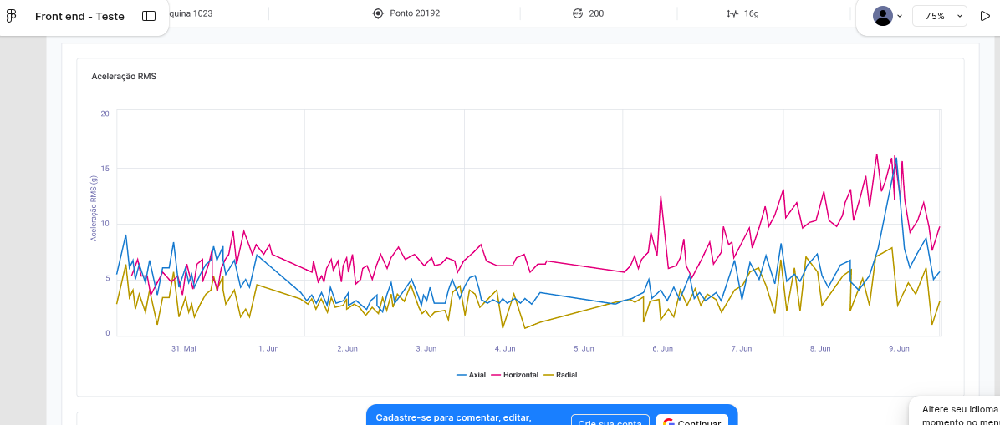

# Ausência visual de informações para os toolstips

## Descrição
O protótipo no Figma não apresenta o estado de "Hover" (passar o mouse) nem o componente de Tooltip.

## Referencia
Requisito: "Como usuário, ao passar o mouse sobre a série temporal, quero ver um tooltip exibindo os valores de dados."

## Feedback
A ausência do estado de "Hover" e do componente de Tooltip no protótipo pode levar a uma falta de clareza para os desenvolvedores e testadores sobre como o tooltip deve ser exibido.

### Evidências
