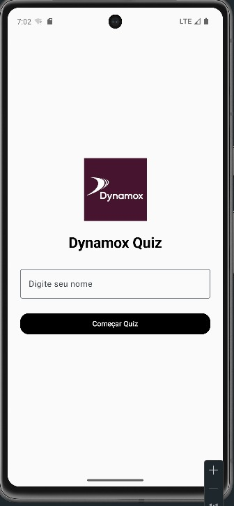
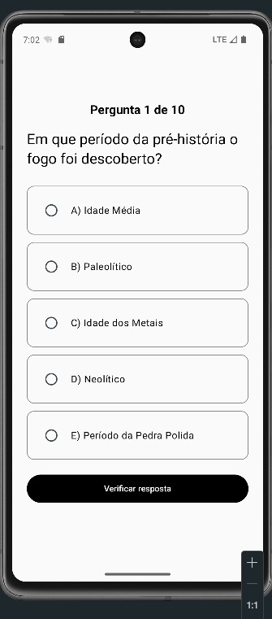
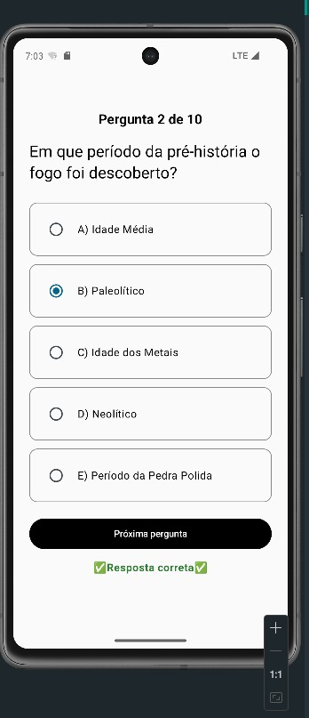
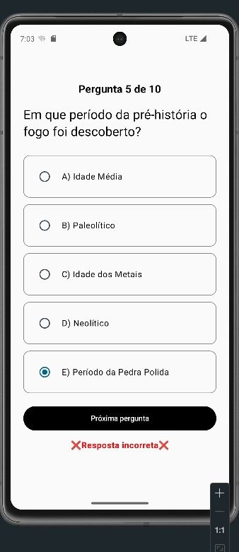
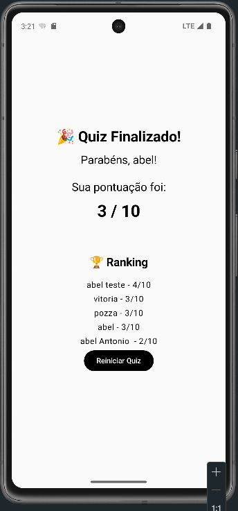

# Dynamox Quiz

Aplicativo Android desenvolvido em Kotlin para o desafio técnico da Dynamox.

O aplicativo permite que o usuário informe um nickname, responda 10 perguntas de múltipla escolha consumidas via API e visualize sua pontuação final. Os scores ficam persistidos localmente utilizando Room Database.

---

## Tecnologias utilizadas

- Kotlin
- Jetpack Compose
- MVVM
- Retrofit
- OkHttp
- Coroutines
- StateFlow
- Room Database
- JUnit
- MockK

---

## Estrutura do projeto

O projeto foi dividido em camadas para facilitar manutenção, organização e separação de responsabilidades.

```txt
data/
 ├── local/
 ├── remote/
 └── repository/

domain/
 └── repository/

presentation/
 └── quiz/
```

---

## Funcionalidades

- Cadastro de nickname
- Carregamento de perguntas via API
- Envio e validação de respostas
- Feedback de resposta correta/incorreta
- Controle de pontuação
- Exibição do resultado final
- Reinício do quiz
- Persistência de scores utilizando Room
- Ranking local de pontuações
- Tratamento de erros da API
- Testes unitários no ViewModel

---

## API utilizada

Base URL:

```txt
https://quiz-api-bwi5hjqyaq-uc.a.run.app/
```

Endpoints utilizados:

- `GET /question`
- `POST /answer?questionId=id`

---

## Persistência local

Foi utilizado Room Database para armazenar:

- nickname
- score final

Os dados permanecem salvos localmente mesmo após fechar o aplicativo.

---

## Testes

Foram implementados testes unitários no `QuizViewModel` para validar regras de negócio do fluxo do quiz.

---

## Screenshots

### Tela inicial



### Pergunta carregada



### Resposta correta



### Resposta incorreta



### Resultado final e ranking



---

## Como executar

1. Clone o repositório

```bash
git clone https://github.com/SEU_USUARIO/DynamoxQuiz.git
```

2. Abra o projeto no Android Studio

3. Aguarde o Gradle sincronizar

4. Execute em um emulador ou dispositivo físico
---

## Melhorias futuras

- Melhorar tratamento de erros
- Adicionar mais testes
- Melhorar experiência visual
- Implementar Navigation Compose

---

## Autor

Abel Antônio Pozza
