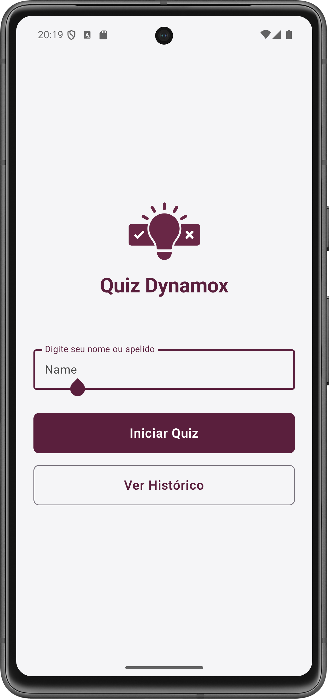
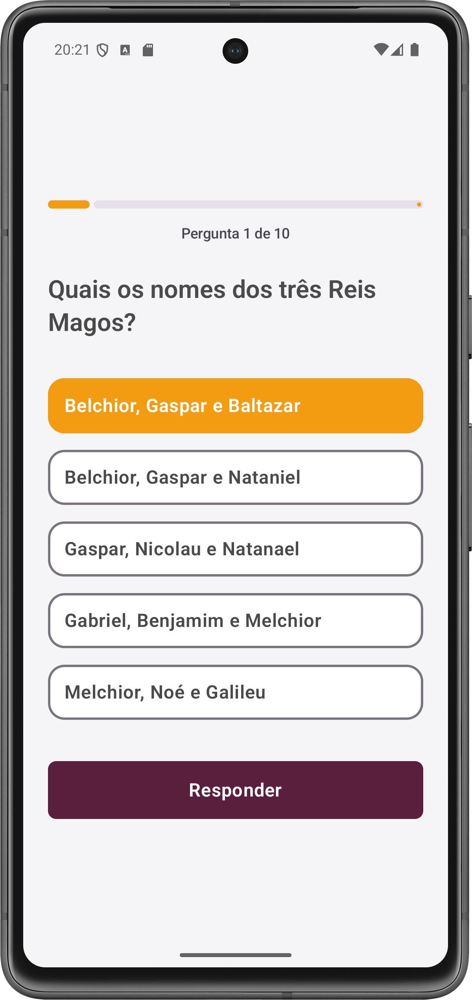
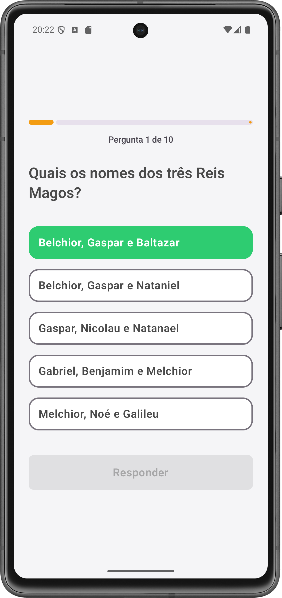
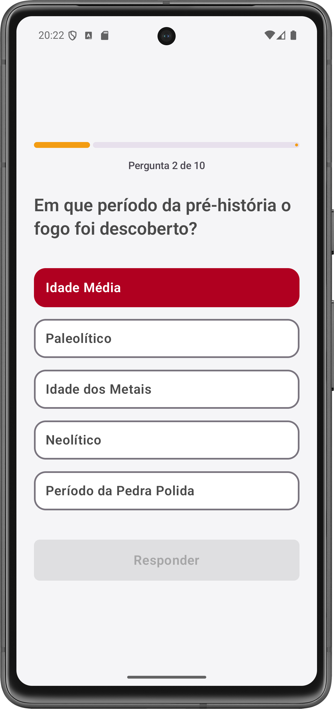
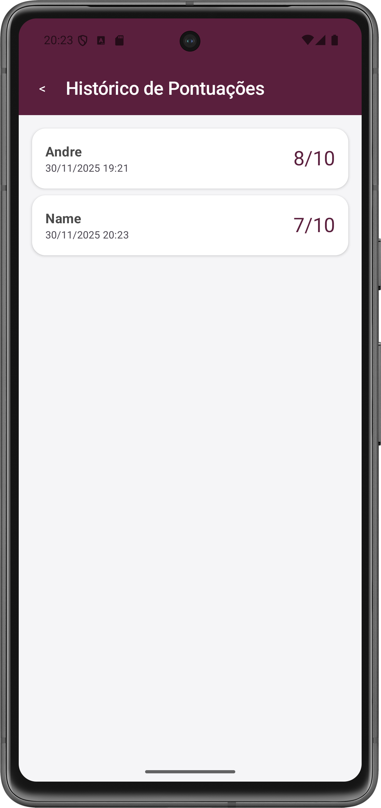
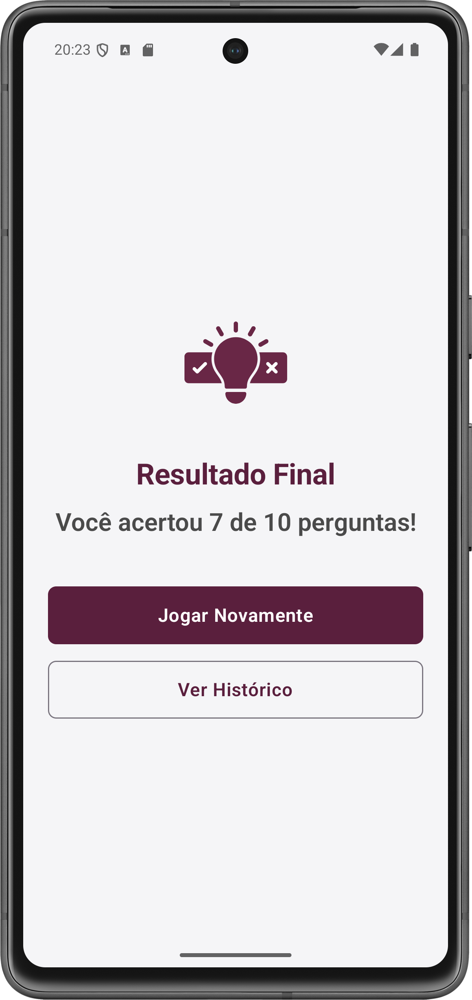
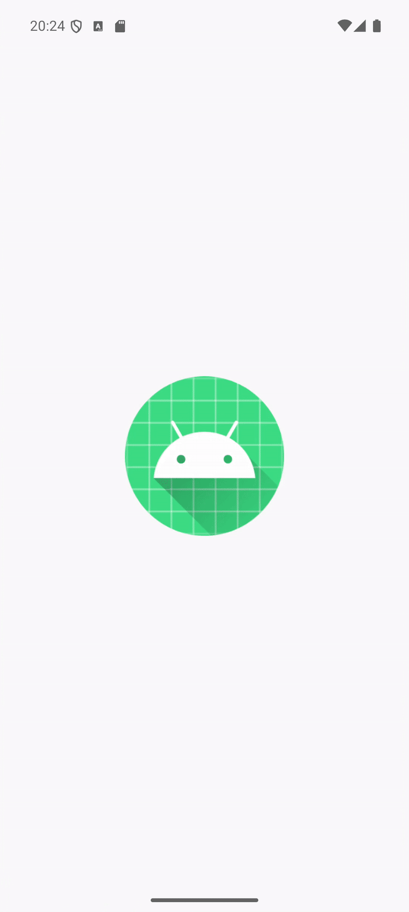
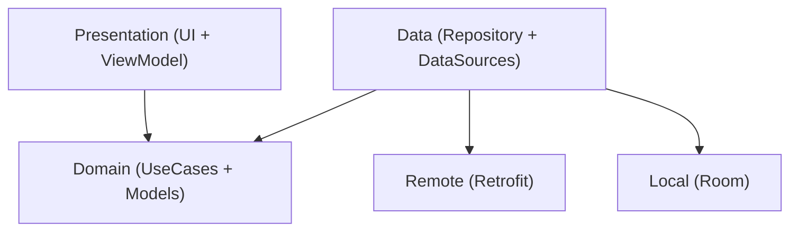

# QuizApp — Dynamox Android Developer Challenge

<p align="center">
  
  
  
  
</p>

> Aplicativo Android nativo de Quiz, desenvolvido com foco em **Arquitetura Limpa**, **Escalabilidade** e **Experiência do Usuário**.

## Funcionalidades

- **Quiz Interativo:** Perguntas obtidas via API REST com validação de respostas.
- **Anti-Duplicidade Inteligente:** Garantia de que nenhuma pergunta se repita durante a sessão.
- **Feedback Visual Imediato:** Cores e estados animados indicando resposta correta/incorreta.
- **Histórico Persistente:** Banco de dados local (Room) para armazenar nome do jogador e
  pontuações.
- **UI Moderna:** Jetpack Compose + Material 3 + animações de entrada.
- **Internacionalização:** Suporte completo a **PT**, **EN** e **IT**.
- **Edge-to-Edge + Design System:** Integração com status bar transparente e tema focado na
  identidade visual da Dynamox.

---

## Screenshots


|               Tela Inicial                |            Pergunta           |           Resposta correta           |            Resposta falsa            |                   Histórico                    |                Resultado                 |
|:-----------------------------------------:|:--------------------------------------:|:-------------------------------------------:|:--------------------------------------------:|:----------------------------------------------:|:----------------------------------------:|
|  |  |  |  |  |  |

---

## Demo

<div align="center">
  
  <br>
  <em>A animação acima demonstra o fluxo completo do usuário.</em>
</div>

---

## Arquitetura

O projeto segue **Clean Architecture** e **MVVM**, garantindo separação clara de responsabilidades.


> **Nota sobre a Dependência:** No diagrama, a seta que aponta de `Data` para `Domain` representa a **direção da dependência**, e não o fluxo de execução. Isso é um princípio fundamental da Clean Architecture (Princípio da Inversão de Dependência - DIP), onde a camada externa (`Data`) deve depender da abstração (interface do Repositório) definida na camada interna (`Domain`), garantindo que as regras de negócio permaneçam isoladas e independentes da infraestrutura.

---

## Principais Tecnologias

- **Linguagem:** 100% Kotlin
- **UI:** Jetpack Compose (Material 3)
- **Injeção de Dependência:** Hilt
- **Assincronismo:** Coroutines e Flow
- **Persistência:** Room Database
- **Rede:** Retrofit + OkHttp
- **Navegação:** Jetpack Navigation
- **Testes:** JUnit + MockK

---

## Qualidade e Testes

O projeto possui uma cobertura robusta de testes automatizados:

- **Testes Unitários:** Cobrindo 100% dos UseCases, Repositórios e ViewModels.
- **Testes de Integração:** Verificação do `ScoreDao` com banco de dados em memória.
- **Testes Instrumentados (UI):** Verificação de exibição de elementos na `WelcomeScreen`.

### Como executar os testes

```bash
./gradlew test             # Roda todos os testes unitários
./gradlew connectedAndroidTest  # Roda testes de UI/Integração no emulador
```
---

## Premissas Técnicas

1. **Evitar Perguntas Repetidas:** Como a API pode retornar questões duplicadas, o `GetNewQuestionUseCase` implementa um mecanismo de retry por sessão para garantir unicidade.
2. **Latência da API:** A aplicação está preparada para lidar com respostas lentas da API, adotando timeouts ampliados e lógica de retry para garantir resiliência. Mesmo em cenários de latência elevada, o app mantém estabilidade e fornece feedback adequado ao usuário.
3. **Tratamento de Erros:** A aplicação diferencia falhas de conectividade (`IOException`) de respostas HTTP de erro (4xx/5xx). Para códigos HTTP de falha, é aplicado um fallback seguro com mensagens amigáveis ao usuário, garantindo estabilidade mesmo quando a resposta do servidor não traz detalhes adicionais.
4. **Persistência de Jogadores:** Como não há endpoint específico para cadastro de jogadores, nomes e pontuações são armazenados localmente via Room.

---

## Como rodar o projeto

1.  Clone este repositório:
    ```bash
    git clone https://github.com/andrebritovita/developer-challenges.git
    ```
    
2.  Acesse o diretório e troque para a branch do projeto:
    ```bash
    cd developer-challenges
    git checkout andre-vita
    ```
3.  Abra o **Android Studio** (Recomendado: Ladybug ou superior).
4.  Selecione **"Open"** e navegue até a pasta **`QuizApp`** dentro do diretório clonado (`developer-challenges/QuizApp`).
5.  Aguarde o sincronismo do Gradle.
6.  Selecione um dispositivo físico ou emulador (**Min SDK 24**).
7.  Clique em **Run** ▶️.

---

## Repositório do projeto

O aplicativo desenvolvido para o desafio encontra-se no diretório **QuizApp** dentro da branch dedicada:

👉 [Acessar o projeto QuizApp (branch andre-vita)](https://github.com/andrebritovita/developer-challenges/tree/andre-vita/QuizApp)
---


## Ideias de Melhorias Futuras

- [ ] **Modularização por Features:** Extrair funcionalidades (`:feature:quiz`, `:feature:history`) e o núcleo (`:core:data`, `:core:ui`) em módulos Gradle isolados para reduzir tempo de build e forçar limites de arquitetura.
- [ ] **Estratégia de Prefetching:** Implementar o carregamento antecipado da próxima pergunta em background para eliminar a latência de rede entre as rodadas, proporcionando uma experiência instantânea.
- [ ] **Acessibilidade Aprimorada:** Adicionar feedback textual explícito ("Resposta Correta") e suporte a TalkBack (para acessibilidade), além do feedback por cores (atual).
- [ ] **Social Sharing:** Implementar `Intent` de compartilhamento nativo para que os usuários enviem seus resultados.
- [ ] **Tratamento Granular de Erros:** Implementar tratamentos específicos para códigos HTTP (404 vs 500).

*Autor: André Brito Vita*
