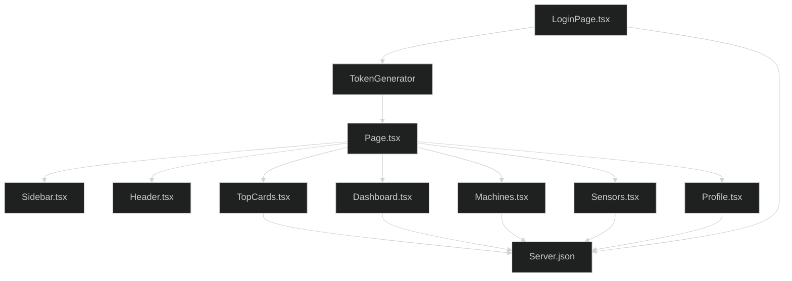
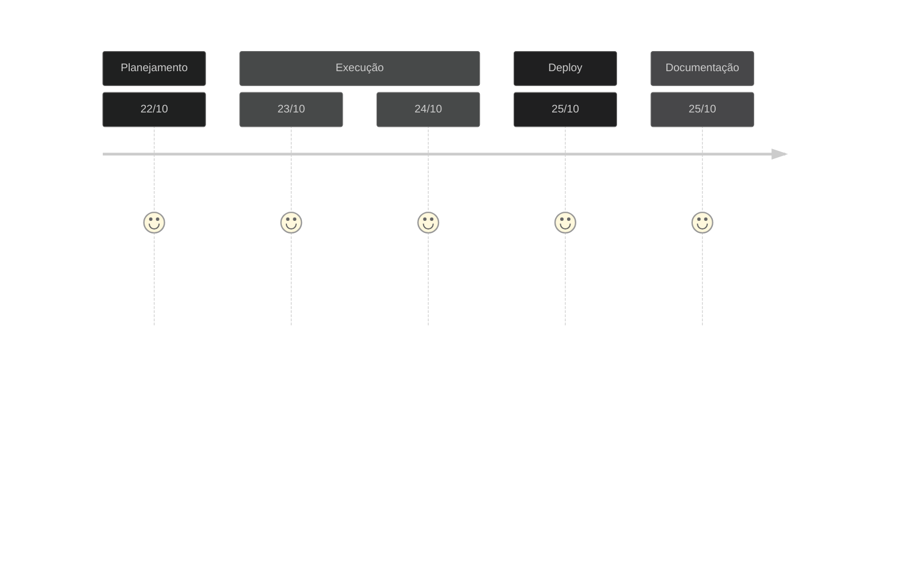

# Teste Dynamox DynaPredict - Outubro 2023

Bem vindo!
Esta é a solução encontrada para o desafio de Frontend da empresa [Dynamox](https://advicehealth.com.br/) 

## 🌐 Acesso ao deploy no Vercel
[Deploy Dynamox](https://test-dynamox.vercel.app/) 
- Email test: **joao.silva@example.com**
- Pass test: **Mudar@123**

## 📋 Desafio
Construir uma aplicação robusta e intuitiva desenvolvida usando React e TypeScript. Ela deve incluir autenticação, gerenciamento de máquinas, gerenciamento de sensores e recursos gerais de fácil uso.

## 📋 Demanda
-	[x] Como usuário, quero fazer login usando um e-mail e senha fixos para que eu possa acessar rotas privadas.
-	[x] Como usuário, quero poder sair do sistema para evitar o acesso não autorizado à minha conta.
-	[x] Nenhuma rota privada deve ser acessível sem autenticação.
-	[x] Como usuário, quero criar uma nova máquina com um nome arbitrário e com um tipo selecionado de uma lista ["Bomba", "Ventilador"] para que eu possa gerenciá-la posteriormente.
- [x] Como usuário, quero alterar os atributos (nome e tipo) de uma máquina após criá-la para que eu possa manter as informações atualizadas.
- [x] Como usuário, quero excluir uma máquina quando ela não estiver mais em uso para que ela não polua o sistema.
- [x] Como usuário, quero criar pelo menos dois pontos de monitoramento com nomes arbitrários para uma máquina existente, para que eu possa monitorar o desempenho da máquina.
- [x] Como usuário, quero associar um sensor a um ponto de monitoramento existente para que eu possa monitorar o desempenho da máquina. O sensor deve ter um ID único, e o nome do modelo do sensor deve ser um dos seguintes: ["TcAg", "TcAs", "HF+"].
- [x] Como usuário, quero que o sistema me impeça de configurar sensores "TcAg" e "TcAs" para máquinas do tipo "Bomba".
- [x] Como usuário, quero ver todos os meus pontos de monitoramento em uma lista paginada para que eu possa gerenciá-los. A lista deve exibir até 5 pontos de monitoramento por página e deve incluir as seguintes informações: "Nome da Máquina", "Tipo de Máquina", "Nome do Ponto de Monitoramento" e "Modelo do Sensor".
- [x] Como usuário, quero ordenar a lista de pontos de monitoramento por qualquer uma de suas colunas em ordem ascendente ou descendente, para que eu possa encontrar facilmente as informações que estou procurando.

## 📋 Requisitos Técnicos
- [x] Use TypeScript.
- [x] Use React.
-	[x] Use o Redux para gerenciar estados globais.
-	[x] Use Redux Thunks ou Redux Saga para gerenciar efeitos colaterais assíncronos.
-	[x] Use Next.js ou Vite.
- [x] Use o Material UI 5 para estilizar a aplicação.
-	[x] Crie componentes reutilizáveis.
- [x] O código está bem organizado e documentado.
- [x] O layout da aplicação é responsivo.

## ✍️ Desenvolvimento do Projeto

### Decisões de projeto
A proposta de desenvolvimento focou em 3 fatores principais, com foco na metodologia **DRY** `Don't Repeat Yourself`, **Clean Code** e **SOLID**.
- Consistência: buscou-se manter uma estrutura consistente em todo o código para facilitar a leitura e compreensão, com o uso de estilo de codificação consistente, incluindo a nomenclatura de variáveis, formatação, indentação e comentários.
- Clareza: a escrita do código foi realizada buscando-se a clareza e a legibilidade, evitando abreviações excessivas e utilizando nomes descritivos para funções, variáveis e classes. 
- Modularidade: o projeto se pautou pela divisão do mesmo em componente e funções menores e bem definidas, cada uma com uma responsabilidade específica, visando a manutenção, teste e reutilização do código.

### Organização do código
Na organização do código buscou-se seguir os seguintes princípios:
- Estrutura de diretórios: organização do código em uma estrutura de diretórios lógica e coerente, separando componentes distintos, como módulos, modelos, arquivos de configuração.
- Modularidade: divisão do código em arquivos e módulos separados, com base em sua funcionalidade ou propósito.
- Documentação: descritivo com uma documentação adequada para o projeto, descreve a finalidade do projeto, instruções para instalação, dependências, configuração e execução.

### Linha de Raciocínio
Para a realização do desafio estabeleci os parâmetros a seguir no desenvolvimento:
- Inicialmente o projeto foi dividido em 5 partes principais `/LoginPage.tsx`, `/Dashboard.tsx`, `/Machines.tsx`, `/Sensors.tsx` e `/Profile.tsx`, e três módulos secundários: `/Sidebar.tsx`, `/Header.tsx` e `/TopCards.tsx`, seguindo a lógica de que cada componente poderá ser reutilizado em outros projetos. 
- O componente `/LoginPage.tsx` é a página inicial do projeto, onde o usuário deve fornecer suas credencias de `email` e `senha`para acesso. No momento do login é gerado um token aleatório de autenticação atrevés do `/tokenGenerator.ts` que permite a navegação na área privada do sistema, impedindo acesso externo ao sistema.
- Ao acessar a tela principal do sistema o usuário tem à sua disposição um `sidebar` e um `header` fixos onde ele pode navegar entre os diferentes componentes do sistema.
- O primeiro componente renderizado é o `/Dashboard.tsx`, onde o usuário tem uma visão geral de **máquina** e **sensores** já cadastrados, dispostos em uma **tabela** paginada com possibilidade de ordenamento entre colunas.
- O componente `/Machine.tsx` visa o cadastro e atualização de **máquinas**. Neste componente o usuário pode *cadastrar e excluir* *tipos de máquinas*, *adicionar* *máquinas* vinculadas ao setor de produção e ao tipo cadastrado, além de *editar* e *excluir* máquinas do sistema.
- O componente `/Sensors.tsx` visa vincular os diferentes tipos de **sensores** às máquinas previamente criadas. Neste componente podemos *selecionar* uma máquina do sistema, *selecionar* em uma lista um tipo pré-definido de sensor ["TcAg", "TcAs", "HF+"], *nomear* o sensor escolhido e *salvar* o esquema de monitoramento. Ressalta-se que noeste componente já possuímos `dois grupos` de cadastro de monitoramento iniciais, e  ainda tempos a possibilidade de criar `n grupos`extras de monitoramento. Ainda, temos uma restrição ativa, onde máquinas com o `tipo de máquina = bomba` só permitem o cadastro de monitoramento com o sensor do tipo ["HF+"]. Todos os sistemas de monitoramente cadastrados neste componente são renderizados no componente `/Dashboard.tsx`.
- O componente `/Profile.tsx`, que renderiza o contexto do **usuário logado** , apresenta um simples form com dados básicos de cadastro, com alguns inputs passíveis de edição e outros bloqueados. Foi realizada uma validação simples via frontend nos inputs de senha e telefone.
- Todo fluxo de renderização de componentes passa pela `/page.txs`, onde um sistema de **autenticação por token** garante que apenas o usuário logado tenha acesso às páginas do sistema.
- Utilizou-se, em parte do projeto, o controle de estados via **redux**, em especial no que se refere às *máquinas*, *sensores* e *usuários*.

### Simulação Banco de Dados
- Para popular as informações e simular um banco de dados ativo foi montado um `/server.json` *não relacional*. Tal implementação no formato não relacional pode apresentar desconexões de dados ao navegar no sistema.
- As requisições API permitem a utilização dos métodos GET, POST, PUT e DELETE.

### Organograma Estrutural


### Linha do Tempo


## ⚙️ Linguagens de Programação Utilizadas
[](https://www.linkedin.com/in/targanski/)

## 🖥️ Documentação de Implantação

### Pré-requisitos
Antes de prosseguir com a implantação, é necessário garantir que o ambiente de desenvolvimento atenda aos seguintes pré-requisitos:
`Node.js` (versão 12 ou superior) instalado e gerenciador de pacotes `npm` instalado.

### Etapas de Implantação
Siga as etapas abaixo para implantar o código web:

1. Clone o repositório do código web para o servidor de hospedagem.
```bash
git clone https://github.com/Ftarganski/test-dynamox.git
```

2. Navegue até o diretório raiz do projeto clonado.

3. Execute o seguinte comando para instalar as dependências do projeto:
```bash
npm install
```

4. Após a conclusão da instalação das dependências, execute os seguintes comandos para iniciar a aplicação:
```bash
yarn dev
yarn server
```
Estes comandos irão iniciar a aplicação no modo de desenvolvimento juntamente com o server.json

5. Acesse a aplicação web no navegador utilizando o endereço local: 
`[http://localhost:3000](http://localhost:3000)` ==> **Aplicação**
`[http://localhost:3001](http://localhost:3001)` ==> **Server.Json**

### Build
```bash
yarn build
```
Para criar o aplicativo para produção na pasta `build`. Este comando irá empacotar a aplicação no modo de produção e otimizar a compilação para obter o melhor desempenho. A compilação será minificada e os nomes dos arquivos itão incluir os hashes.

### Considerações Finais
Após a conclusão dessas etapas, o código web estará implantado e acessível por meio do servidor de hospedagem. Certifique-se de realizar os testes necessários para garantir que a aplicação esteja funcionando conforme o esperado.

Lembre-se de que esta documentação cobre apenas a implantação do código web. Outros aspectos, como implantação de banco de dados, configurações de servidor e escalabilidade, podem exigir etapas adicionais que não são abordadas aqui.

### Deploy de Desenvolvimento
O deploy de desenvolvimento foi realizado na plataforma Vercel e pode ser acessado em [Deploy Dynamox](https://test-dynamox.vercel.app/) 
- Email test: **joao.silva@example.com**
- Pass test: **Mudar@123**
