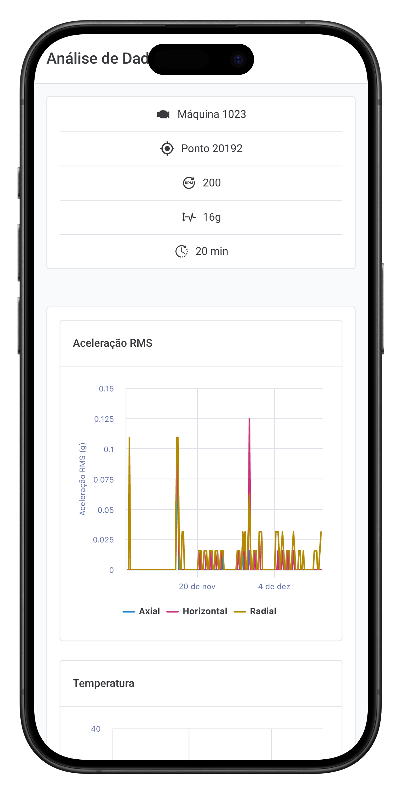
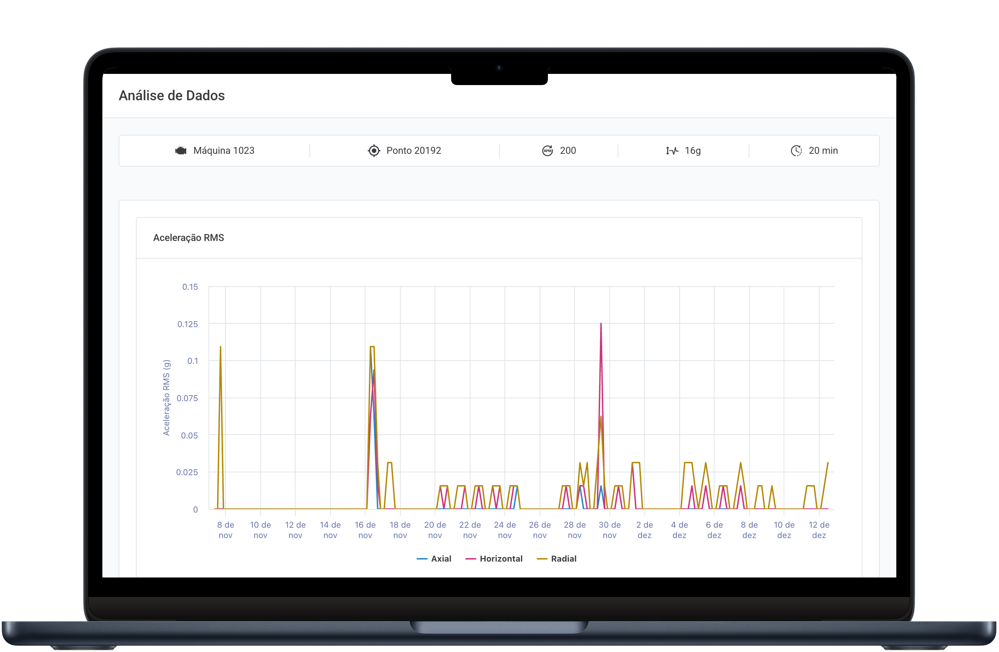
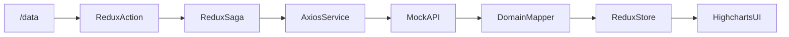

# Dynamox Front-End Challenge

Dashboard responsivo para análise de séries temporais de uma máquina industrial.

[Live](#aplicação-publicada) |
[Funcionalidades](#funcionalidades) |
[Execução](#execução-local) |
[Testes](#testes-e-qualidade) |
[Documentação](#documentação)





## Sobre o desafio

Esta implementação responde ao
[Dynamox Front-end Developer Challenge](https://github.com/dynamox-s-a/developer-challenges/blob/main/front-end-challenge-v2.md):
construir com React e TypeScript uma página `/data` que carregue medições por uma API REST mock,
apresente informações da máquina e exiba gráficos sincronizados de aceleração, velocidade e
temperatura.

Além dos requisitos técnicos, foram implementados os bônus de Storybook, testes end-to-end com
Cypress e deploy em cloud.

## Aplicação publicada

- [Dashboard](https://dynamox.leonardojacomussi.com/data)
- [API mock](https://dynamox.leonardojacomussi.com/api/measurements)
- [Storybook](https://dynamox-storybook.leonardojacomussi.com)

## Funcionalidades

- Resumo da máquina, ponto monitorado, rotação, faixa e intervalo de aquisição.
- Gráfico de aceleração RMS nos eixos `x`, `y` e `z`.
- Gráfico de temperatura.
- Gráfico de velocidade RMS nos eixos `x`, `y` e `z`.
- Tooltip e crosshair sincronizados pelo timestamp mais próximo.
- Estados de loading, erro com retry, vazio e falha inesperada.
- Layout responsivo para mobile, tablet e desktop.
- Semântica, teclado, foco, contraste e nomes acessíveis.
- SPA com fallback de rota e API mock disponível localmente e na Vercel.

## Tecnologias

- React 19, React Router 7, TypeScript 6 e Vite 8
- Material UI 5 e Roboto
- Redux Toolkit, Redux Saga, React Redux e Axios
- Highcharts
- Vitest, Testing Library, axe-core e `redux-saga-test-plan`
- Storybook
- Cypress
- Biome
- GitHub Actions e Vercel

## Arquitetura resumida

Ao entrar em `/data`, a página dispara `measurementsRequested`. A Saga busca o contrato externo,
o mapper converte datas ISO e valores máximos para o modelo interno e o slice armazena o resultado.
Selectors memoizados separam as métricas consumidas pelos três gráficos.


```mermaid
flowchart LR
    Route["/data"] --> Action[ReduxAction]
    Action --> Saga[ReduxSaga]
    Saga --> Service[AxiosService]
    Service --> Api[MockAPI]
    Api --> Mapper[DomainMapper]
    Mapper --> Store[ReduxStore]
    Store --> Charts[HighchartsUI]
```

O hover não passa pelo Redux. Adapters imperativos atualizam tooltip e crosshair diretamente nas
instâncias do Highcharts e removem listeners no cleanup.

O `json-server` local e a Function da Vercel servem o mesmo conteúdo de
[`mock/db.json`](mock/db.json), preservando o contrato entre ambientes. Consulte
[`docs/architecture.md`](docs/architecture.md) para detalhes.

## Execução local

### Requisitos

- Node.js 24, definido em [`.nvmrc`](.nvmrc)
- pnpm 9.15.4, definido em [`package.json`](package.json)

### Instalação

```bash
git clone --branch leonardo-jacomussi \
  https://github.com/leonardojacomussi/dynamox-front-end-challenge.git
cd dynamox-front-end-challenge
corepack enable
cp .env.example .env
pnpm install --frozen-lockfile
```

O `.env.example` define `VITE_API_BASE_URL=http://localhost:3001`. O arquivo `.env` local é
ignorado pelo Git e não deve conter credenciais destinadas ao browser.

### Desenvolvimento

```bash
pnpm dev
```

Esse comando inicia Vite e `json-server` em conjunto:

- aplicação: `http://localhost:5173/data`;
- API: `http://localhost:3001/measurements`.

### Storybook

```bash
pnpm storybook
```

Disponível em `http://localhost:6006`.

## Scripts

### Qualidade e build

```bash
pnpm format:check       # verifica formatação
pnpm format             # aplica formatação
pnpm lint               # executa lint
pnpm exec tsc -b        # valida TypeScript da aplicação e tooling
pnpm typecheck:e2e      # valida TypeScript do Cypress
pnpm test               # executa Vitest
pnpm test:watch         # mantém Vitest em watch
pnpm test:coverage      # gera relatório de coverage
pnpm build              # gera build de produção
pnpm build-storybook    # gera Storybook estático
pnpm preview            # serve o build localmente
```

### End-to-end

```bash
pnpm e2e                # inicia API/Vite e abre Cypress
pnpm e2e:open           # abre Cypress usando serviços existentes
pnpm e2e:run            # executa Cypress headless usando serviços existentes
pnpm e2e:ci             # build, servidores temporários e Cypress headless
```

Os scripts `dev:web:e2e`, `build:e2e`, `preview:e2e` e `e2e:run:preview` são suporte interno da
execução automatizada.

## Testes e qualidade

- Vitest testa domínio, estado, sagas, componentes e sincronização.
- Testing Library prioriza comportamento e queries acessíveis.
- O contrato da Function é validado contra o dataset oficial.
- Storybook documenta estados isolados e integra axe-core.
- Cypress usa API real local nos fluxos de sucesso e intercepta falhas controladas.
- O smoke de produção valida endpoints e fluxos essenciais depois do deploy.

`pnpm test:coverage` gera o relatório localmente. Não há threshold obrigatório, e o CI executa
`pnpm test` sem coverage. A estratégia completa está em
[`docs/testing-strategy.md`](docs/testing-strategy.md).

## CI/CD e deploy

O workflow de CI roda em pull requests, push para `leonardo-jacomussi` e execução manual:

- `quality`: formatação, lint, tipos, testes, build da aplicação e Storybook;
- `e2e`: instalação do Cypress e `pnpm e2e:ci`.

O CD é chamado somente em push ou execução manual na branch da solução, depois de ambos passarem.
A aplicação e a API usam um projeto Vercel; o Storybook usa outro. Não há integração Git direta
na Vercel. O workflow faz build prebuilt, deploy de produção e smoke dos três endpoints.

`VITE_API_BASE_URL=/api` é fornecida pelos ambientes da Vercel e do GitHub Actions. IDs de projeto
e token da Vercel permanecem em variables/secrets do GitHub Environment.

## Estratégia do fork

- `main` preserva os arquivos oficiais do repositório da Dynamox.
- `leonardo-jacomussi` é a branch padrão do fork e contém a solução.
- A pull request deve partir de `leonardojacomussi:leonardo-jacomussi` para
  `dynamox-s-a/developer-challenges:main`.

Essa organização mantém o enunciado separado da árvore da aplicação sem alterar o destino da
avaliação.

## Limitações e premissas

- A aplicação possui uma única página funcional e uma rota de fallback.
- A API é mock, somente leitura e sem persistência.
- Os metadados da máquina são constantes porque não existem no payload fornecido.
- O mapper confia no contrato conhecido e não executa validação runtime.
- Timestamps são armazenados como números e exibidos no timezone local do navegador.
- Não há autenticação, backend de produção ou Nx porque não fazem parte deste desafio front-end.

## Documentação

- [`docs/sketch.md`](docs/sketch.md): blueprint técnico consolidado.
- [`docs/TODO.md`](docs/TODO.md): roadmap e status das entregas.
- [`docs/architecture.md`](docs/architecture.md): arquitetura, dados, gráficos e deploy.
- [`docs/testing-strategy.md`](docs/testing-strategy.md): estratégia e limites dos testes.
- [`docs/ai-assisted-development.md`](docs/ai-assisted-development.md): governança do uso de IA.
- [`docs/decisions`](docs/decisions): registros de decisões arquiteturais.
- [`CONTRIBUTING.md`](CONTRIBUTING.md): setup e critérios para contribuir.

## Desenvolvimento assistido por IA

O repositório contém `AGENTS.md`, Cursor Rules, Commands, Skills, critérios do Bugbot e MCPs
opcionais. Eles fornecem contexto e checklists, mas não substituem revisão humana nem as validações
determinísticas. Consulte
[`docs/ai-assisted-development.md`](docs/ai-assisted-development.md).
