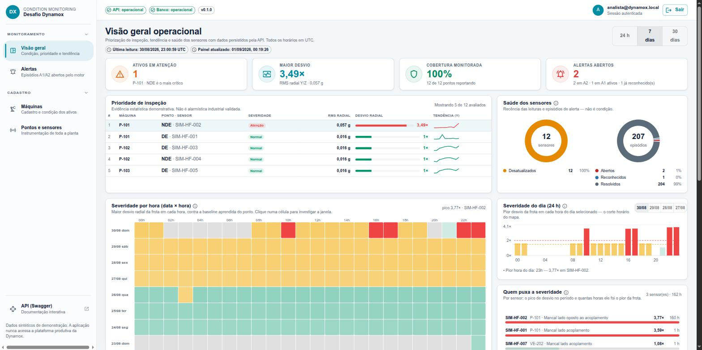
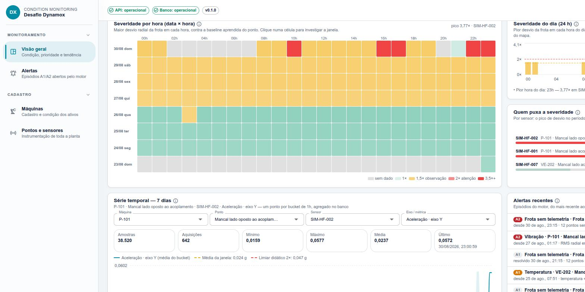
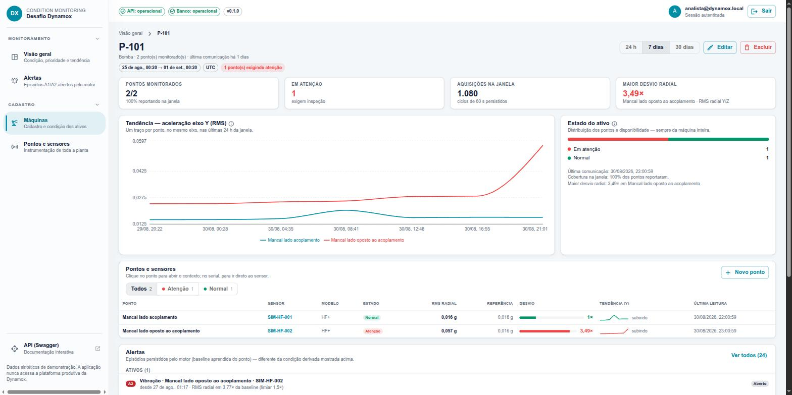
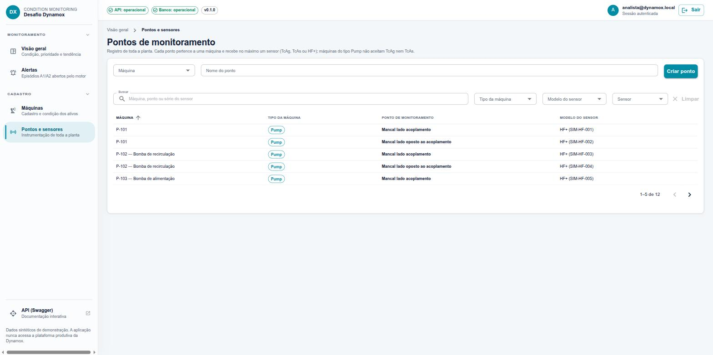
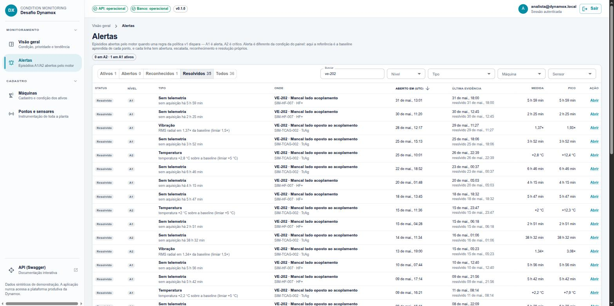
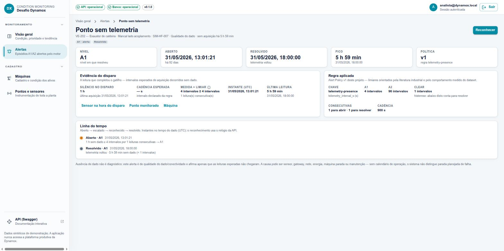
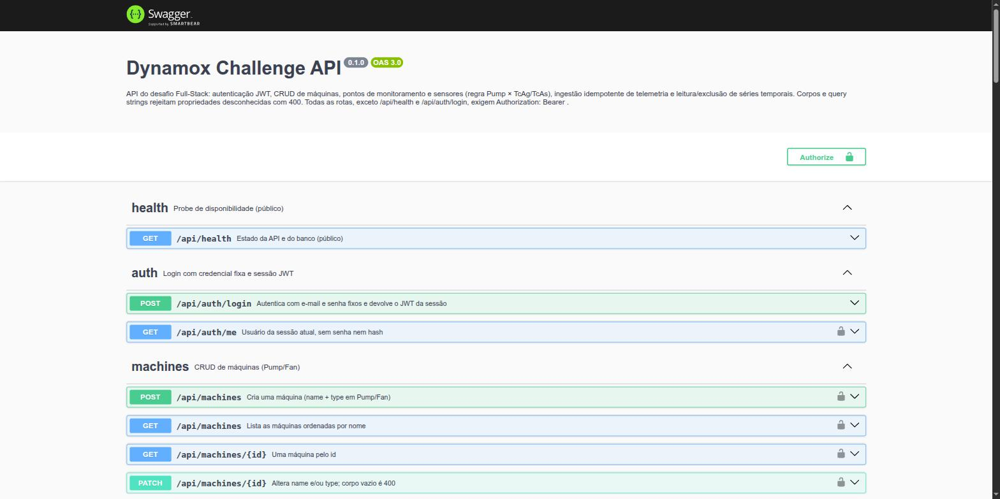

# Dynamox Full-Stack Developer Challenge

Industrial condition-monitoring application built for the
[Dynamox Full-Stack Developer Challenge](./full-stack-challenge.md): authentication, machine /
monitoring point / sensor management, idempotent time-series ingestion and retrieval, and — on
top of the challenge — SQL-side analytics, an explainable alert engine and a reproducible
30-day synthetic plant.

> All data is synthetic. The application never calls Dynamox production services; the
> frontend and the simulator refuse Dynamox domains by code. Versão em português:
> [`docs/README.pt-BR.md`](./docs/README.pt-BR.md).

## Highlights

- **Full-stack, fully integrated**: React 18 + MUI 5 + Redux Toolkit talking to a NestJS 10 API
  over JWT, persisted in PostgreSQL 16 through Prisma 5, organized as an Nx monorepo.
- **10+ million raw samples handled in SQL**: every screen receives a compact aggregate;
  raw samples are paged only on the last investigation level. All 19 benchmarked routes answer
  below 350 ms, including 30-day analytical windows (max 198 ms).
- **Telemetry contract derived from the public Dynamox specification**: idempotent ingestion by
  header key and content fingerprint, validated by Ajv and published in the API's own OpenAPI
  with contract and parity tests.
- **Condition ≠ alert**: condition is derived and recalculable; alerts are persistent A1/A2
  episodes with learned baselines, consecutive trigger, hysteresis and an auditable lifecycle —
  replayable exactly once and validated against the generator's ground truth.
- **Hierarchical investigation**: dashboard → time window → machine → point → sensor →
  acquisition → raw samples, every step bookmarkable in the URL.
- **689 automated tests** (353 API incl. e2e against a real database, 212 web, 124 sensor twin),
  29 semantic demo invariants and a reproducible one-command demo environment.

## At a glance

| | |
|---|---|
|  |  |
| Operational dashboard — KPIs, inspection priority, sensor health, severity map | Severity date × hour, day profile, offenders and the aggregated series |
|  |  |
| Machine page — window KPIs, trend per point, points/sensors, alerts | Monitoring points — 5 per page, four columns, sort and filters |
|  |  |
| Alerts — status counts, search, filters, 50 per page | Alert episode — evidence, applied rule, timeline |
|  | |
| Swagger UI — the runtime contract at `/api/docs` | |

Screens captured from the demo environment (`npm run demo:prepare`); all data is synthetic.

## Stack

| Layer | Technology |
|---|---|
| Frontend | React 18.3, TypeScript 5.6, Vite 5.4, Material UI 5.16, Redux Toolkit 2.3 (thunks), React Router 7, Recharts 2.13 |
| Backend | Node.js 22, NestJS 10.4, Prisma 5.22, `@nestjs/swagger` 7.4, Ajv |
| Database | PostgreSQL 16 (Docker Compose, port 5433) |
| Monorepo | Nx 20.2 over npm workspaces — `apps/api`, `apps/web`, `libs/domain`, `libs/contracts`, `libs/ui`, `simulation/sensor-twin` |
| Tests | Jest + Supertest (API), Vitest + Testing Library (web), Jest (sensor twin) |

## Quick start

Prerequisites: Node.js 20+ (validated with 22), npm 10, Docker with Compose v2.

```bash
cp .env.example .env          # required: the API refuses to start without JWT_SECRET
npm install
npm run db:up                 # PostgreSQL 16 in a container
npm run prisma:deploy         # migrations
npm run seed                  # fixed users + minimal demo data (idempotent)
npm run build                 # Nx: libs -> api -> web
```

In two terminals:

```bash
npm run dev:api               # http://localhost:3000/api   (Swagger: /api/docs)
npm run dev:web               # http://localhost:5173
```

Credentials: `analista@dynamox.local` / `Dynamox@2026` (ADMIN) ·
`consulta@dynamox.local` / `Consulta@2026` (VIEWER, read-only).

Full guide (environment variables, scripts, conventions): [`docs/SETUP.md`](./docs/SETUP.md).

## Demo

The minimal seed shows the CRUD and one short series. The complete demonstration — a synthetic
plant with 6 machines, 12 sensors, 30 days of telemetry (≈ 10 M samples), the alert engine
backfilled over the whole history and three months of prior alert history — is one command:

```bash
npm run demo:prepare          # ~10 min; the API must NOT be running (the script starts its own)
npm run dev:api && npm run dev:web
npm run demo:verify -- --api  # 29 semantic invariants: scenarios detected, transient not alerted, routes answer
```

`demo:prepare` resets the database, loads the plant and the history through the public
ingestion endpoint, stops its temporary API and replays the alert engine over the history
(`alerts:backfill`) — the backfill needs the API stopped because the live presence timer would
interfere with the replayed clock. `demo:verify` checks meaning, not status codes: the ramp on
SIM-HF-002 produced an A2, the one-cycle transient on SIM-HF-005 did not open an episode,
healthy sensors have no condition alerts, every seeded historical episode is resolved.

## Architecture

The architectural entry point, with Mermaid diagrams (system context, monorepo, request flow,
drill-down, ingestion, condition pipeline, alert engine and lifecycle, ER model, contracts,
simulation port, performance and testing):
**[`docs/ARCHITECTURE.md`](./docs/ARCHITECTURE.md)**.

In one paragraph: React/Vite provides the interface; NestJS exposes the REST/OpenAPI boundary;
PostgreSQL/Prisma persists resources and raw time series; analytical SQL reduces millions of
samples before anything reaches React; a deterministic sensor twin produces reproducible
telemetry through the same ingestion contract any producer would use; condition evaluation
explains the current state; alert policies turn sustained deviations into persistent
episodes; the generator's ground truth validates the engine but is never read by it; the
solution runs independently of any Dynamox production service.

## Requirements coverage

Requirement-by-requirement audit against the challenge statement, with status, implementation,
evidence, tests and routes: **[`docs/REQUIREMENTS.md`](./docs/REQUIREMENTS.md)**.

Not implemented (bonus): Cypress, cloud deployment, time-series forecasting, load balancer,
load tests.

## API

Swagger UI at `http://localhost:3000/api/docs` (JSON at `/api/docs-json`) is the runtime
contract — 30 operations in eight groups: `health`, `auth`, `machines`, `monitoring-points`,
`telemetry`, `time-series`, `analytics`, `alerts`. Every route except `/api/health` and
`/api/auth/login` requires `Authorization: Bearer <token>`; mutations require the `ADMIN` role.

The **public Dynamox OpenAPI** kept in [`contracts/dynamox/`](./contracts/dynamox/README.md)
is a design-time reference (pinned snapshot, never edited) from which the internal telemetry
contract was derived and reduced. It is not called by the application.

## Testing

```bash
npm run test                        # 689 tests: API (Jest, needs the database) + web (Vitest) + sensor twin
npm run test:unit -w @dynamox/api   # isolated unit tests only (< 2 s)
npm run lint && npm run typecheck && npm run build
npm run demo:verify -- --api        # semantic invariants of the demo environment
npm run alerts:validate             # alert engine vs synthetic ground truth -> docs/analysis/07-validation/alert-validation.md
```

What each layer proves: [`docs/ARCHITECTURE.md` → Testing](./docs/ARCHITECTURE.md#testing).

## Performance

```bash
npm run perf:latency                # requires the API running; fails if any route's max >= 350 ms
```

Latest local run (Node 22, Linux, PostgreSQL 16 in Docker, 10 M samples): all routes pass;
heaviest are `GET /analytics/series/:id/points` over 30 days (p50 165 ms, max 198 ms) and
`GET /analytics/heatmap` over 30 days (p50 106 ms). The full table and the engineering behind it
are in [`docs/ARCHITECTURE.md` → Performance](./docs/ARCHITECTURE.md#performance). This is a
sequential latency benchmark, not a load test.

## Assumptions and design decisions

1. **Fixed credentials** are users created by the seed (configurable by environment), never
   hard-coded in the frontend; the API issues and validates the JWT.
2. **Session**: token in `sessionStorage` (survives reload, dies with the browser), 8 h validity,
   no refresh token.
3. **Uniqueness**: machine names are unique globally; monitoring point names are unique per
   machine; both trimmed and limited to 120 characters, enforced by database indexes.
4. **Natural identifiers in URLs**: pages use machine names and point slugs
   (`/machines/P-101/points/mancal-lado-oposto-ao-acoplamento`) so links stay readable and
   bookmarkable; the API resolves them server-side.
5. **Sensor compatibility** (`Pump` refuses `TcAg`/`TcAs`) is enforced on association **and**
   on machine type change, under row locks.
6. **Pagination of 5** is what the interface uses; the API accepts `pageSize` up to 50 for
   programmatic clients.
7. **Sorting** is server-side, by the public labels shown in the table.
8. **"Number of time series stored"** is the complete list of series (count = length) plus the
   per-series sample count.
9. **Ingestion format**: a reduced, traceable derivation of the public Dynamox
   `POST /v1/telemetry-cycles` body; the idempotency key travels in a header because the body
   forbids extra properties.
10. **Acquisition = ingestion cycle**; all instants are UTC end to end (database, API, URL,
    screen).
11. **Time-window semantics**: `from` inclusive, `to` exclusive; alert lists use intersection
    with the active period; analytical windows anchor on the last known reading, not on the
    wall clock, so a stopped plant does not silently decay to "unclassified".
12. **Condition versus alert**: condition compares the current synchronized acquisition with the
    previous one (derived, recalculable); an alert compares against a baseline learned from
    192 healthy cycles (persistent episode). The two numbers may legitimately differ.
13. **Silence is absence of telemetry**: a silent sensor means no data arrived, never a
    diagnosed sensor failure; a silent fleet means widespread telemetry loss, never a diagnosed
    plant failure.
14. **Strict contracts**: unknown properties in bodies and query strings are rejected with
    `400` and a stable error code.

## Known limitations

- No cloud deployment, load balancer, load tests or Cypress suite.
- No forecasting: the alert engine detects sustained deviations; it does not predict.
- Alerts have no notifications, snooze, assignee, SLA or manual resolution; there is no
  operating calendar, so a planned stop and a gateway failure look the same (`FLEET_SILENT`).
- Responsive layout is implemented with MUI breakpoints and validated at desktop resolution;
  device emulation was not part of the validation.
- ROS support is an offline provenance bridge (optional, requires ROS Noetic); Gazebo is not
  implemented.

## Documentation

| Document | Purpose |
|---|---|
| [`docs/ARCHITECTURE.md`](./docs/ARCHITECTURE.md) | architecture story and diagrams |
| [`docs/REQUIREMENTS.md`](./docs/REQUIREMENTS.md) | challenge audit matrix |
| [`docs/SETUP.md`](./docs/SETUP.md) | operations: environment, scripts, demo, backfill |
| [`docs/analysis/README.md`](./docs/analysis/README.md) | engineering knowledge base (domain, API, contracts, simulation, decisions, validation) |
| [`contracts/dynamox/README.md`](./contracts/dynamox/README.md) | provenance of the public snapshot and the internal contract |
| [`simulation/sensor-twin/README.md`](./simulation/sensor-twin/README.md) | the synthetic plant |
| [`full-stack-challenge.md`](./full-stack-challenge.md) | the original statement |
