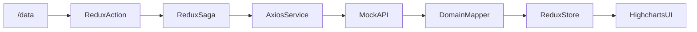

# Dynamox Front-End Challenge

Responsive dashboard for analyzing industrial machine time series.

[Live](#live-application) |
[Features](#features) |
[Running locally](#running-locally) |
[Testing](#testing-and-quality) |
[Documentation](#documentation)


[](https://github.com/leonardojacomussi/dynamox-front-end-challenge/actions/workflows/ci.yml?query=branch%3Aleonardo-jacomussi)

<table>
  <tbody>
    <tr>
      <td>
        
      </td>
      <td>
        
      </td>
    </tr>
  </tbody>
</table>

## About the challenge

This implementation addresses the
[Dynamox Front-end Developer Challenge](https://github.com/dynamox-s-a/developer-challenges/blob/main/front-end-challenge-v2.md):
build a `/data` page with React and TypeScript that loads measurements from a mock REST API,
presents machine information, and displays synchronized acceleration, velocity, and temperature
charts.

In addition to the technical requirements, Storybook, Cypress end-to-end tests, and cloud deployment
were implemented as bonus items.

## Live application

- [Dashboard](https://dynamox.leonardojacomussi.com/data)
- [Mock API](https://dynamox.leonardojacomussi.com/api/measurements)
- [Storybook](https://dynamox-storybook.leonardojacomussi.com)

## Features

- Machine summary, monitored point, rotation, range, and acquisition interval.
- RMS acceleration chart on the `x`, `y`, and `z` axes.
- Temperature chart.
- RMS velocity chart on the `x`, `y`, and `z` axes.
- Tooltip and crosshair synchronized by the nearest timestamp.
- Loading, retryable error, empty, and unexpected failure states.
- Responsive layout for mobile, tablet, and desktop.
- Semantics, keyboard support, focus, contrast, and accessible names.
- SPA with route fallback and a mock API available locally and on Vercel.

## Technologies

- React 19, React Router 7, TypeScript 6, and Vite 8
- Material UI 5 and Roboto
- Redux Toolkit, Redux Saga, React Redux, and Axios
- Highcharts
- Vitest, Testing Library, axe-core, and `redux-saga-test-plan`
- Storybook
- Cypress
- Biome
- GitHub Actions and Vercel

## Architecture overview

When `/data` is opened, the page dispatches `measurementsRequested`. The Saga fetches the external
contract, the mapper converts ISO dates and maximum values into the internal model, and the slice
stores the result. Memoized selectors separate the metrics consumed by the three charts.


```mermaid
flowchart LR
    Route["/data"] --> Action[ReduxAction]
    Action --> Saga[ReduxSaga]
    Saga --> Service[AxiosService]
    Service --> Api[MockAPI]
    Api --> Mapper[DomainMapper]
    Mapper --> Store[ReduxStore]
    Store --> Charts[HighchartsUI]
```

Hover state does not pass through Redux. Imperative adapters update the tooltip and crosshair
directly on Highcharts instances and remove listeners during cleanup.

The local `json-server` and the Vercel Function serve [`mock/db.json`](mock/db.json). The mock fully
preserves the names and measurements from the official dataset and adds only one stable `id` per
series, which is required to represent REST resources. See
[`docs/architecture.md`](docs/architecture.md) for details.

## Running locally

### Requirements

- Node.js 24, defined in [`.nvmrc`](.nvmrc)
- pnpm 9.15.4, defined in [`package.json`](package.json)

### Installation

```bash
git clone --branch leonardo-jacomussi \
  https://github.com/leonardojacomussi/dynamox-front-end-challenge.git
cd dynamox-front-end-challenge
corepack enable
cp .env.example .env
pnpm install --frozen-lockfile
```

`.env.example` defines `VITE_API_BASE_URL=http://localhost:3001`. The local `.env` file is ignored
by Git and must not contain credentials intended for the browser.

If Cypress reports that the local binary is not installed, run:

```bash
pnpm exec cypress install
```

### Development

```bash
pnpm dev
```

This command starts Vite and `json-server` together:

- application: `http://localhost:5173/data`;
- API: `http://localhost:3001/measurements`.

### Storybook

```bash
pnpm storybook
```

Available at `http://localhost:6006`.

## Scripts

### Quality and build

```bash
pnpm format:check       # checks formatting
pnpm format             # applies formatting
pnpm lint               # runs lint
pnpm exec tsc -b        # validates application and tooling TypeScript
pnpm typecheck:e2e      # validates Cypress TypeScript
pnpm test               # runs Vitest
pnpm test:watch         # keeps Vitest in watch mode
pnpm test:coverage      # generates the coverage report
pnpm build              # creates the production build
pnpm build-storybook    # creates the static Storybook build
pnpm preview            # serves the build and starts the local API
```

After `pnpm build`, `pnpm preview` makes the application available at
`http://localhost:4173/data` and the API at `http://localhost:3001/measurements`. The build uses the
URL defined in the `.env` created during setup.

### End-to-end

```bash
pnpm e2e                # starts API/Vite and opens Cypress
pnpm e2e:open           # opens Cypress using existing services
pnpm e2e:run            # runs Cypress headlessly using existing services
pnpm e2e:ci             # build, temporary servers, and headless Cypress
```

The `dev:web:e2e`, `build:e2e`, `preview:e2e`, and `e2e:run:preview` scripts provide internal
support for automated execution.

## Testing and quality

- Vitest tests the domain, state, sagas, components, and synchronization.
- Testing Library prioritizes behavior and accessible queries.
- The Function contract is validated against the official dataset.
- Storybook documents isolated states and integrates axe-core.
- Cypress uses the real local API in success flows and intercepts controlled failures.
- The production smoke test validates endpoints and essential flows after deployment.

`pnpm test:coverage` generates the report locally. There is no mandatory threshold, and CI runs
`pnpm test` without coverage. The complete strategy is documented in
[`docs/testing-strategy.md`](docs/testing-strategy.md).

## CI/CD and deployment

The CI workflow runs on pull requests, pushes to `leonardo-jacomussi`, and manual runs:

- `quality`: formatting, lint, types, tests, application build, and Storybook;
- `e2e`: Cypress installation and `pnpm e2e:ci`.

Because the workflow belongs to the fork, GitHub may not display it as a check on the pull request
to upstream. The badge at the beginning of this document points to runs from the delivery branch.

CD is invoked only on pushes or manual runs on the solution branch, after both jobs pass. The
application and API use one Vercel project; Storybook uses another. There is no direct Git
integration in Vercel. The workflow performs a prebuilt build, production deployment, and smoke
testing of all three endpoints.

`VITE_API_BASE_URL=/api` is provided by the Vercel and GitHub Actions environments. Vercel project
IDs and token remain in GitHub Environment variables/secrets.

## Fork strategy

- `main` preserves the official files from the Dynamox repository.
- `leonardo-jacomussi` is the fork's default branch and contains the solution.
- The pull request must originate from `leonardojacomussi:leonardo-jacomussi` and target
  `dynamox-s-a/developer-challenges:main`.

This organization keeps the challenge statement separate from the application tree without changing
the evaluation target.

## Limitations and assumptions

- The application has a single functional page and a fallback route.
- The API is a read-only mock with no persistence.
- Machine metadata is constant because it is not included in the provided payload.
- The mapper trusts the known contract and does not perform runtime validation.
- Timestamps are stored as numbers and displayed in the browser's local timezone.
- There is no authentication, production backend, or Nx because they are outside the scope of this
  front-end challenge.

## Documentation

- [`docs/sketch.md`](docs/sketch.md): consolidated technical blueprint.
- [`docs/TODO.md`](docs/TODO.md): delivery roadmap and status.
- [`docs/architecture.md`](docs/architecture.md): architecture, data, charts, and deployment.
- [`docs/testing-strategy.md`](docs/testing-strategy.md): testing strategy and boundaries.
- [`docs/ai-assisted-development.md`](docs/ai-assisted-development.md): governance of AI use.
- [`docs/decisions`](docs/decisions): architecture decision records.
- [`CONTRIBUTING.md`](CONTRIBUTING.md): setup and contribution criteria.

## AI-assisted development

The repository contains `AGENTS.md`, Cursor Rules, Commands, Skills, Bugbot criteria, and optional
MCPs. They provide context and checklists, but do not replace human review or deterministic
validation. See
[`docs/ai-assisted-development.md`](docs/ai-assisted-development.md).
