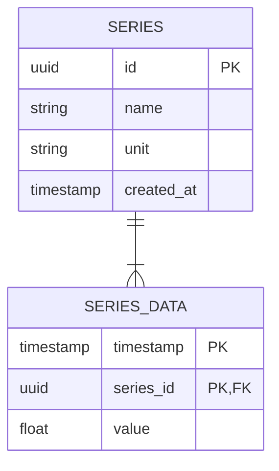

# Dynamox Back-end Challenge

## Database

For this project, I selected a database composed of two tables: one containing the measurement metadata (name and unit), and another containing the corresponding time series data.


```mermaid
erDiagram
    SERIES {
        uuid id PK
        string name
        string unit
        timestamp created_at
    }

    SERIES_DATA {
        timestamp timestamp PK
        uuid series_id PK,FK
        float value
    }

    SERIES ||--|{ SERIES_DATA : ""
```

## Requirements

* Docker and Docker Compose
* Python 3.12+

## How to Run - Docker

The easiest way to execute the project is using Docker Compose, which will provision both the PostgreSQL database and the FastAPI application.

1. Clone the repository and navigate to the project root.
2. Build and start the containers:
   ```bash
   docker-compose up --build -d
   ```
3. The API will be available at: `http://localhost:8000`
4. Access the interactive API documentation at: `http://localhost:8000/docs`

## How to Run - Local Development

To run the application locally outside of the application container:

1. Start only the database container:
   ```bash
   docker-compose up -d db
   ```
2. Create and activate a virtual environment:
   ```bash
   python -m venv venv
   source venv/bin/activate
   ```
3. Install the dependencies:
   ```bash
   pip install -r requirements.txt
   ```
4. Run the application using Uvicorn:
   ```bash
   uvicorn app.main:app --reload --host 0.0.0.0 --port 8000
   ```

## Running the Automated Tests

The project uses `pytest` for unit and integration testing. Ensure the database container is running before executing the tests.

Execute the tests from the project root:
```bash
pytest -v
```

## Running the Load Tests

Load tests were implemented using Locust to ensure the application meets the sub-350ms response time requirement for bulk data insertion.

1. Ensure the API is running (via Docker or locally).
2. In a separate terminal, with the virtual environment activated, run:
   ```bash
   locust -f locustfile.py
   ```
3. Open `http://localhost:8089` in your browser.
4. Configure the test (e.g., 50 concurrent users, spawn rate of 5) and set the host to `http://localhost:8000`.
5. Start the test to observe RPS and latency metrics.

## API Endpoints Overview

* `POST /api/series/`: Creates a new series with bulk data points.
* `GET /api/series/{id}`: Retrieves a specific series and its data points.
* `GET /api/series/`: Lists all available series.
* `GET /api/series/count`: Returns the total number of data points for a given series.
* `GET /api/series/{id}/predict`: Predicts future values for a series based on historical data using Simple Linear Regression.

## Implemented Features

* **Asynchronous Database Access:** Implemented with `asyncpg` and SQLAlchemy for high throughput.
* **Bulk Inserts:** Optimized data ingestion to handle batches of 500+ points per request efficiently.
* **Data Prediction:** Custom implementation of Ordinary Least Squares (OLS) Linear Regression to forecast future sensor values without heavy external machine learning dependencies.
* **Load Testing:** Locust implementation proving stable latencies under the requested threshold during continuous stress testing.