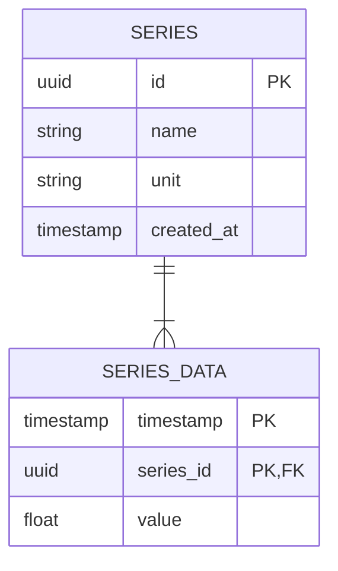

# Dynamox Back-end Challenge

## Database

For this project, I selected a database composed of two tables: one containing the measurement metadata (name and unit), and another containing the corresponding time series data.

```mermaid
erDiagram
    SERIES {
        uuid id PK
        string name
        string unit
        timestamp created_at
    }

    SERIES_DATA {
        timestamp timestamp PK
        uuid series_id PK,FK
        float value
    }

    SERIES ||--|{ SERIES_DATA : ""
```