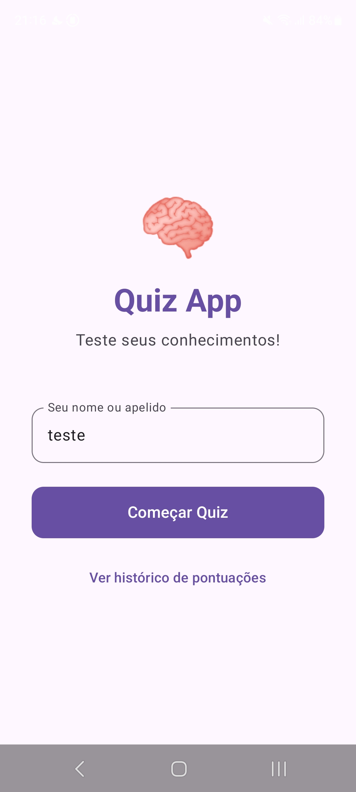
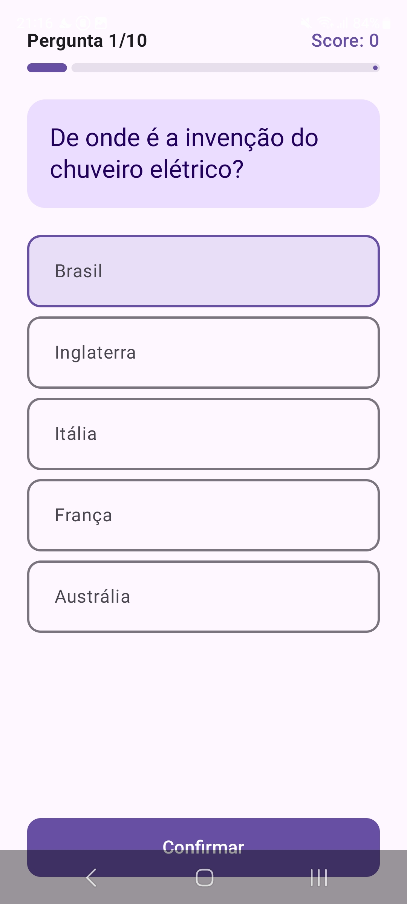
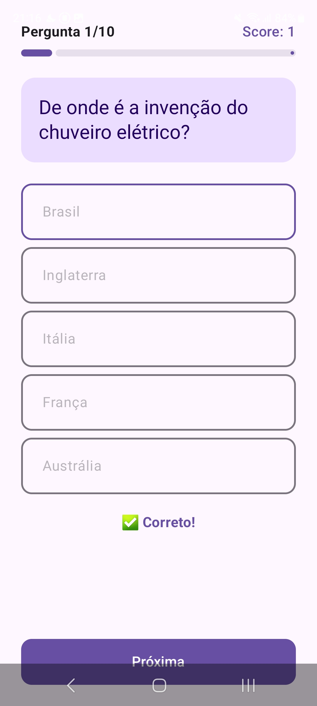
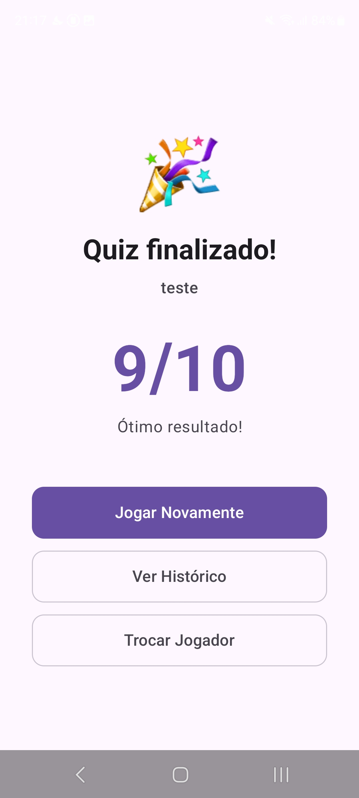
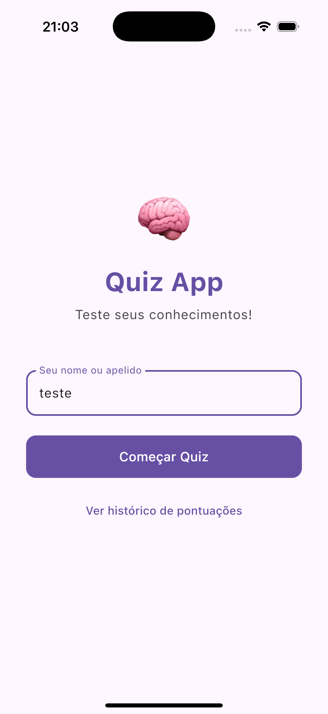
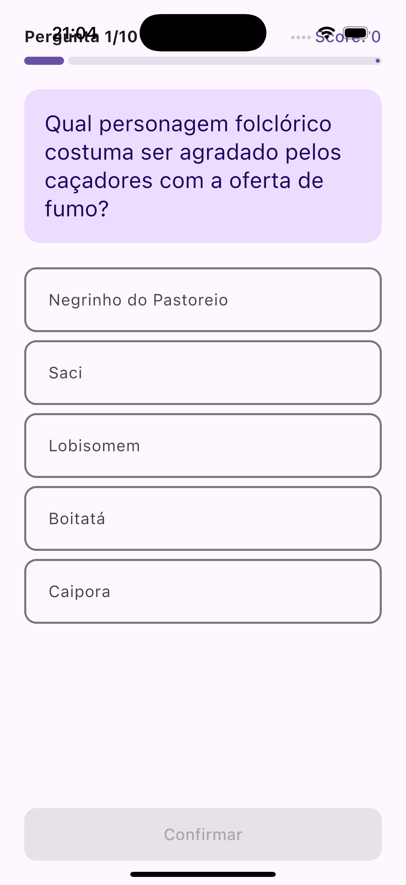
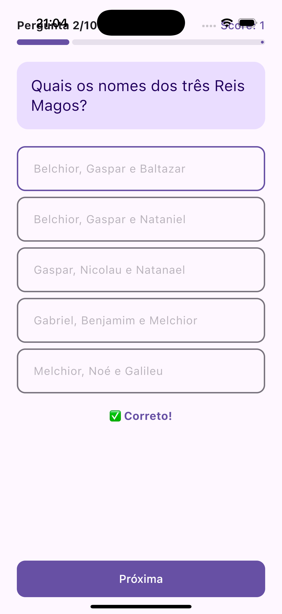
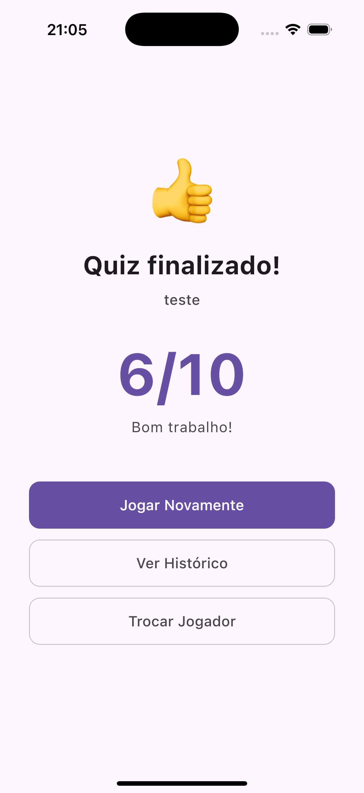

# Quiz Application - Kotlin Multiplatform

Aplicação de quiz multiplataforma (Android/iOS) desenvolvida com **Kotlin Multiplatform**, seguindo **Clean Architecture**, **Domain-Driven Design (DDD)** e **Test-Driven Development (TDD)**.

## Sobre o Projeto

Quiz com 10 perguntas de múltipla escolha obtidas via API REST. O jogador informa seu nome, responde às perguntas com feedback imediato, e ao final visualiza sua pontuação. Scores são persistidos localmente, permitindo múltiplos jogadores e consulta de histórico.

## Tech Stack

| Camada | Tecnologia |
|--------|-----------|
| Linguagem | Kotlin 2.3 |
| UI | Jetpack Compose Multiplatform 1.10 |
| HTTP | Ktor 3.4 (OkHttp / Darwin) |
| Persistência | SQLDelight 2.2 |
| DI | Koin 4.1 |
| Serialização | kotlinx.serialization 1.10 |
| Async | Kotlin Coroutines + Flow |
| CI | GitHub Actions |

## Arquitetura

```
┌──────────────────────────────┐
│     UI (Compose + ViewModel) │  ← Screens, navegação, estado
├──────────────────────────────┤
│     Application (Use Cases)  │  ← Orquestração de fluxos
├──────────────────────────────┤
│     Domain (Core)            │  ← Regras de negócio puras
├──────────────────────────────┤
│     Infrastructure           │  ← HTTP (Ktor), DB (SQLDelight)
└──────────────────────────────┘
```

Dependências apontam para dentro — o Domain não conhece frameworks. Interfaces (Ports) são definidas no domínio e implementadas na infraestrutura (Hexagonal Architecture).

**Padrões aplicados:** Repository, Use Case, Value Object, Entity, Aggregate, Factory Method, Result Monad, MVVM.

## Estrutura do Projeto

```
composeApp/src/
├── commonMain/kotlin/org/kaelkill/quiz/
│   ├── domain/              # Value Objects, Entities, Aggregates, Ports
│   ├── application/         # Use Cases (orquestração)
│   ├── infrastructure/      # Repositories: HTTP (Ktor) + DB (SQLDelight)
│   ├── di/                  # Módulo Koin
│   └── ui/                  # Screens (Compose) + ViewModel
├── commonTest/              # 101 testes (unitários + integração)
├── androidMain/             # AndroidSqliteDriver, MainActivity
└── iosMain/                 # NativeSqliteDriver, MainViewController
```

## Como Executar

### Pré-requisitos

- **JDK 17+**
- **Android Studio** (para Android) ou **Xcode 15+** (para iOS)

### Testes

```bash
./gradlew :composeApp:testDebugUnitTest
```

### Android

```bash
./gradlew :composeApp:installDebug
```

### iOS

```bash
open iosApp/iosApp.xcodeproj
```
Selecione um simulador e execute com **⌘R**.

## CI — GitHub Actions

O pipeline ([`.github/workflows/ci.yml`](.github/workflows/ci.yml)) roda automaticamente em push/PR para `main`:

1. **Testes** — `./gradlew :composeApp:testDebugUnitTest`
2. **Build** — `./gradlew :composeApp:assembleDebug`
3. **Artefato** — APK de debug disponível para download nos artifacts da run

## Testes

101 testes automatizados cobrindo todas as camadas:

| Camada | O que é testado |
|--------|----------------|
| **Domain** | Value Objects, Entities, Aggregate (`QuizSession`) — validações e invariantes |
| **Application** | Todos os Use Cases com fakes — happy path, erros de rede, falhas de persistência |
| **Infrastructure** | `HttpQuestionRepository` com Ktor MockEngine, repositórios in-memory |
| **Integração** | Fluxo completo: login → carregar perguntas → responder 10 → score final |

## Premissas

- A API (`quiz-api-bwi5hjqyaq-uc.a.run.app`) está disponível e retorna JSON válido
- Cada pergunta possui exatamente 5 alternativas
- Scores são persistidos localmente via SQLDelight
- Nomes de jogadores são únicos (case-sensitive)

## Screenshots

### Android

| Login | Loading | Pergunta |
|-------|---------|----------|
|  |  |  |

| Resposta | Resultado | Histórico |
|----------|-----------|-----------|
|  |  |  |

### iOS

| Login | Loading | Pergunta |
|-------|---------|----------|
|  |  |  |

| Resposta | Resultado | Histórico |
|----------|-----------|-----------|
|  |  |  |

## Documentação

- [DOMAIN_MODEL.md](docs/DOMAIN_MODEL.md) — Modelagem do domínio (linguagem ubíqua, value objects, entidades, agregados e fluxos)