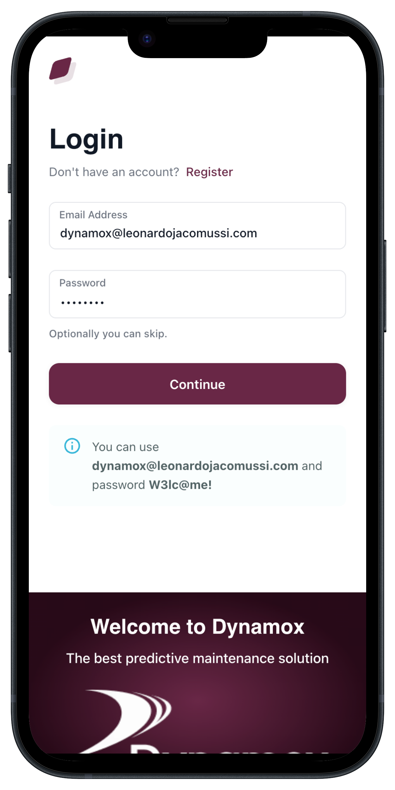
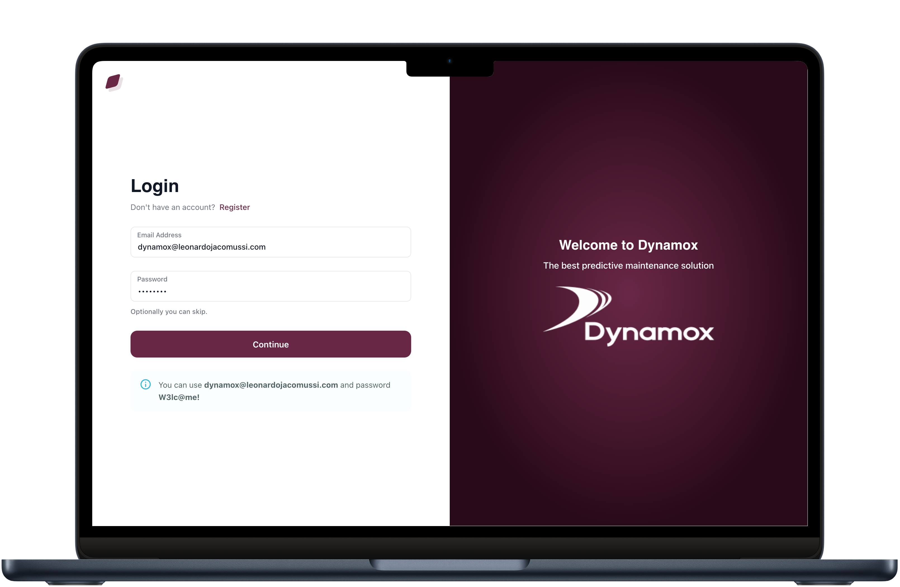

<h1 align="center"> Dynamox full-stack challenge </h1>

<p align="center">
Test for full-stack developer assessment. <br/>
</p>

<p align="center">
  <a href="#live">Live</a>&nbsp;&nbsp;&nbsp;|&nbsp;&nbsp;&nbsp;
  <a href="#technologies">Technologies</a>&nbsp;&nbsp;&nbsp;|&nbsp;&nbsp;&nbsp;
  <a href="#layout">Layout</a>&nbsp;&nbsp;&nbsp;|&nbsp;&nbsp;&nbsp;
  <a href="#local">Build an run locally</a>&nbsp;&nbsp;&nbsp;|&nbsp;&nbsp;&nbsp;
  <a href="#tests">Tests</a>&nbsp;&nbsp;&nbsp;|&nbsp;&nbsp;&nbsp;
  <a href="#insomnia">Insomnia</a>&nbsp;&nbsp;&nbsp;|&nbsp;&nbsp;&nbsp;
  <a href="#considerations">Considerations</a>&nbsp;&nbsp;&nbsp;|&nbsp;&nbsp;&nbsp;
  <a href="#license">License</a>
</p>

<p align="center">
  
</p>

<table>
  <tbody>
    <tr>
      <td>
        
      </td>
      <td>
        
      </td>
    </tr>
  </tbody>
</table>

<h2 id="live">👁️‍🗨️ Live</h2>

This frontend of this project is hosted at [Vercel](https://vercel.com/home) and the backend is hosted at [Render](https://render.com/) with a Nx monorepo. You can access the application by the link [https://dynamox-challenge.leonardojacomussi.com/](https://dynamox-challenge.leonardojacomussi.com/)

<h2 id="technologies">🚀 Technologies</h2>

This project was developed with the following technologies:

- Nx
- Typescript
- NestJs
- PostgreSQL
- PrismaORM
- NextJs
- Redux
- Material UI 5
- JestJS
- Git and Github

<h2 id="layout">🔖 Layout</h2>

The layout used was DeviasKit with Material UI, access the original template [here](https://mui.com/store/items/devias-kit/).

<h2 id="local">⚙️ Build an run locally</h2>

Clone this this repo:

```shel
git clone git@github.com:leonardojacomussi/dynamox-challenge.git
```

Make sure it is in the `leonardo-jacomussi` branch:

```shel
git checkout leonardo-jacomussi
```

Install dependencies:

```shel
npm install
```

Create a `.env` file in the project root with the following environment variables for the database and authentication:

```shel
POSTGRES_PRISMA_URL=postgres://...
JWT_SECRET=6Pb2CVgaQ%R%$...
```

Run the backend in `NestJs` with:

```shel
npx nx serve backend
```

Run the frontend in `NextJs` with:

```shel
npx nx dev frontend
```

Acesse o link informado em seu terminal.

<h2 id="tests">🃏 Run the backend tests</h2>

```shel
npx nx test backend
```

<h2 id="insomnia"> Insomnia</h2>

Below is a file with a collection of requests to test the API routes in the Insomnia software, access [here](./.github/Insomnia_2024-03-01.json) or in the `.github` folder in the project root. Just import and you will have all routes set up for testing.

<h2 id="considerations">💭 Considerations</h2>

I would love to focus a little more on the project with code refactorings, implementing tests on the Frontend and improving the application's visual feedback.

Otherwise, it was interesting to use the proposed set of tools and I thank you for the tips in the test instructions.

<h2 id="license">📜 License</h2>

This project is under the MIT license.
