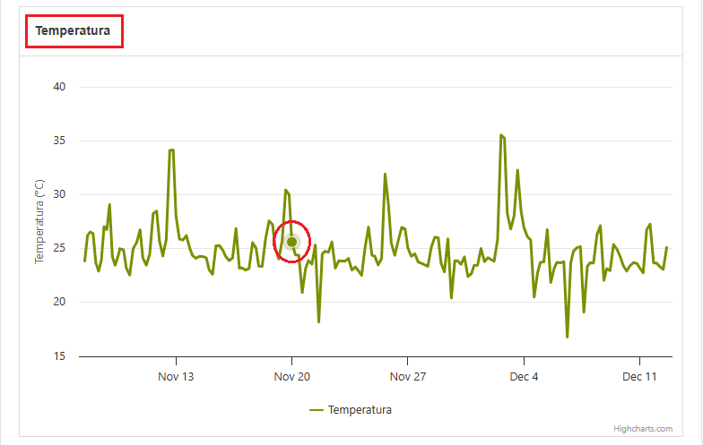
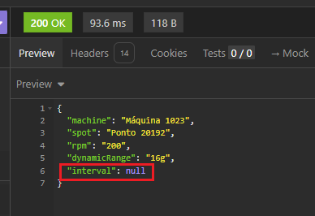

# Bug Report

## 1. Tooltip do gráfico "Temperatura" não está funcionando
Tooltip não é exibido ao passar o mouse sobre pontos do gráfico de Temperatura

## Ambiente
- Sistema Operacional: Windows 10 Pro
- Navegador: Google Chrome 149

## Severidade
Alta

## Prioridade
Alta

## Pré-condições
Acessar o site

## Passos para Reproduzir
1. Acessar o site
2. Localizar o gráfico de Temperatura
3. Passar o mouse sobre um ponto do gráfico

## Resultado Esperado
O tooltip deve ser exibido contendo valor e timestamp do ponto selecionado.

## Resultado Obtido
Nenhum tooltip é exibido.

## Evidências

## Observações
O problema ocorre apenas no gráfico de Temperatura. Os demais gráficos apresentam comportamento correto.

--------------------------------------------------------------------------------------------------------------------------------------------------------------------------------

## 2. API GET /metadata.json está retornando NULL no campo de interval
API está retornando NULL no campo de interval

## Ambiente
- Sistema Operacional: Windows 10 Pro
- Navegador: Google Chrome 149
- API testada com Insomnia

## Severidade
Alta

## Prioridade
Alta

## Pré-condições
Acessar o site ou validar usando Insomnia

## Passos para Reproduzir
1. Acessar o site ou chamar endpoint GET /metadata.json
2. Observar o resultado do campo "interval"

## Resultado Esperado
Deve exibir um valor correto, se for 0 deve exibir 0, mas não NULL

## Resultado Obtido
É exibido o valor NULL

## Evidências

## Observações
O problema ocorre apenas no campo de interval.