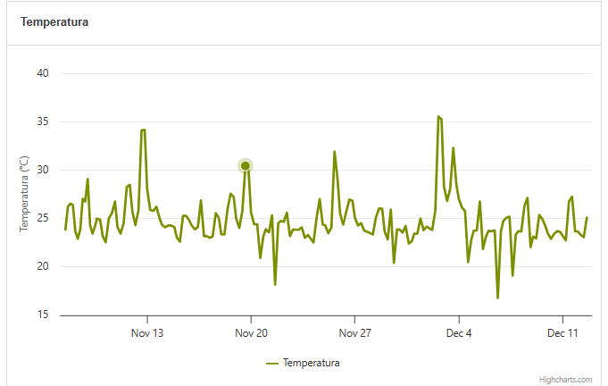

# Bug Report: Value tooltip is not displayed on the Temperature chart

**Description:** 
When interacting with the "Temperature" chart, the tooltip that should display the time series values is not rendered on the screen. The chart recognizes the cursor position (highlighting the point on the line), but the numerical information required by the product specifications does not appear.

**Steps to Reproduce:**
1. Access the application and wait for the initial data to load.
2. Scroll down to the "Temperature" chart container.
3. Hover the mouse over any point on the time series line.

**Expected Behavior:**
According to the product requirements ("As a user, when hovering over the time series, I want to see a tooltip displaying the data values"), a tooltip containing the temperature value and the corresponding date should appear over the selected point.

**Actual Behavior:**
The data point undergoes the visual hover change (it is highlighted), but no tooltip is injected into the DOM or displayed on the interface. (The Acceleration and Velocity charts present the correct behavior; the defect is isolated to the Temperature chart).

**Environment:**
- OS: Windows 11
- Browser: Google Chrome

**Evidências:**
[]