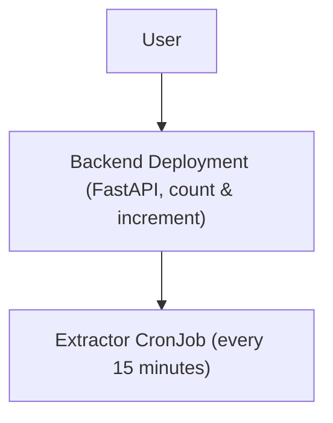

# GCP DevSecFinOps Challenge

This repository contains a simple FastAPI backend and an extractor CronJob, deployable across local, Docker, Minikube, and Google Kubernetes Engine (GKE) environments.  
It also contains the Terraform files necessary for deployment to the GCP.

---

## 📦 Initial Setup

### Git Setup
```bash
git clone <your-repo-url>
cd devops-test
```

### Editor Setup
- Install **Visual Studio Code**
- Recommended extensions:
  - Python
  - Docker
  - Kubernetes
  - YAML
- If using terminal, necessary services must be installed:
  - docker
  - kubectl
  - minikube
  - python / pip / uvicorn
  - terraform
  - Google CLI if testing kubernetes on GCP environments locally

---

## Terraform Setup

- Separated into staging and production(prod) environments.
- To run the configuration, enter the desired environment folder with either:
```
cd terraform/staging
cd terraform/prod
```
- Run necessary commands. These will in order:
  - Initialize the Terraform environment
  - Validate the configuration files
  - Allows you to see the services which will be created
  - Apply the configuration on the cloud and create the resources
```
terraform init
terraform validate
terraform plan --var-file=<environment>.tfvars
terraform apply --var-file=<environment>.tfvars
```
- After finishing tests, you can run this command to wipe the environment:
```
terraform destroy --var-file=<environment>.tfvars
```

---

### Minikube deployment

- When testing locally with minikube, always clean older docker images, this will prevent some building and execution errors. Assuming you don't have other images on your machine:
```
docker rm -vf $(docker ps -aq)
```
- Always start minikube for local testing with:
```
minikube start
eval $(minikube docker-env)    
```

## 🖥️ 1. Backend Deployment

### Local O.S. Environment Setup
```bash
cd backend
pip install -r requirements.txt
uvicorn app.main:app --reload
```

**Test:**
```bash
# This will give the current request count number
curl http://127.0.0.1:8000/count
# This will increment the current count
curl -X POST http://127.0.0.1:8000/increment
```

### Docker Environment Setup
```bash
docker build -t backend:local ./backend
docker run -p 8000:8000 backend:local
```
- Same testing as Local.

### Minikube Environment Setup
```bash
docker build -t fastapi-backend ./backend
kubectl apply -f k8s/local-backend.yaml
```

**Test:**
```bash
kubectl port-forward svc/backend 8000:8000
# Almost the same testing as local.
curl localhost:8000/count
curl -X POST localhost:8000/increment
```

---

## ⏱️ 2. Extraction CronJob

### Local O.S. Environment Setup
```bash
cd extractor
pip install requests
# This will execute the job manually, already testing it, you can use a cronjob to configure it to run each 15 minutes with the "*/15 * * * *" config
BACKEND_URL="http://127.0.0.1:8000/count" python extractor.py
```

### Docker Environment Setup
```bash
cd extractor
docker build -t extractor .
# This will test the extractor job
docker run --network host -e BACKEND_URL="http://127.0.0.1:8000/count" extractor
```

### Minikube Environment Setup
```bash
docker build -t extractor ./extractor
kubectl apply -f k8s/local-extractor.yaml
```

**Test:**
```bash
kubectl get jobs --watch 
# Real time job checking
kubectl get pods
kubectl logs <extractor-pod-name>
# Check logging to see if executions are being completed
kubectl create job --from=cronjob/extractor extractor-manual-$(date +%s)
# Runs a job manually
```


### Cloud Environment Setup (GKE)
Deployment is handled via Cloud Build:  
- Push code to 'main' branch - Cloud Build builds & deploys.
- CronJob runs every 15 minutes and calls backend.

- Other necessary actions in this environment, must include:
  -  Deployment, configuration and authentication of a GKE Cluster, so that the K8s pods can work.
  -  Can bind the gcloud kubernetes services via authentication and commands, due to ClusterIP configuration.
    ```
      gcloud container clusters get-credentials <gke-cluster-name> --region <region-location> --project <project-name>
      kubectl get svc backend
    ```
  - Can also change the configuration to expose a public IP for the services, although not recommended due to security and costs concerns.

---

##  Architectural Diagram



**On GKE:**
- **Backend** = Deployment + ClusterIP Service  
- **Extractor** = CronJob hitting backend-service  

---

## DevOps Brief Analysis

**Release Process:**
- Push to repo -> Cloud Build builds Docker image, pushes to Artifact Registry, applies Kubernetes manifests.
- Manifests templated with 'envsubst' -> no hardcoded project/region.

**Automation Pipeline:**
- Separate Cloud Build triggers for backend and extractor.
- Future improvements:
  - Unit tests
  - Linting
  - Vulnerability scanning before deployment
  - Secret Manager for sensitive data handling

---

## SecOps Brief Analysis

**Risks:**
- CronJob may call public backend if exposed - risk of abuse.
- Images may contain vulnerabilities.
- No authentication on backend API.

**Mitigations:**
- Keep backend as ClusterIP (internal-only) during tests, only enabling public IP for production.
- Use GCP’s Artifact Registry scanning.
- Add authentication (API keys / IAM).
- Better use of GCP Secret Manager for sensitive values.

---

## FinOps Brief Analysis

**Cost Estimate Assumptions:**
- The node needs may vary due to workload, but can be adjusted.
- On a staging environment, for example, costs would be much lower due to fewer pods running, and we can tears down clusters when not in use, etc.
- Configurations provided are not consistent, since machine templates assume you will use their default cpu/memory. I'll use the machine templates as the basis for the cost calculation.
- Taking in account southamerica-east1, which is the region closest to us, and also an eco region. Some costs may be higher than if deployesd on a cheaper alternative, such as us-central1.
- Also not taking in account storage, building and networking costs, which may ramp up these numbers depending on the application.

**I'll make 2 estimates**

- Scenario A - Using 5 Nodes on Backend, 2 on Extractor.
- Scenario B - Worst-case scenario, with node-pod mapping on 1:1.

- Backend - n1-highcpu-4 - 4 vCPUs, 3.6 GiB RAM
- Extraction - n1-highmem-2 - 2vCPUs, 13GiB RAM

*Scenario A*

**Estimated Costs (USD):**
- **30 days (~720h):**
  - Backend ≈ $1,073 
  - Extractor ≈ $350  
  - **Total ≈ $1,423 / month**
- **365 days:**
  - Backend ≈ $12,876  
  - Extractor ≈ $4,200  
  - **Total ≈ $17,076 / year**

*Scenario B*

**Estimated Costs (USD):**
- **30 days (~720h):**
  - Backend ≈ $9,244
  - Extractor ≈ $3,953
  - **Total ≈ $13,197 / month**
- **365 days:**
  - Backend ≈ $110,928
  - Extractor ≈ $47,436
  - **Total ≈ $158,364 / year**


---

## Future Implementations Plan

- Add PostgreSQL persistence layer.
- Implement authentication.
- Improve CI/CD with automated tests.
- Add monitoring with Prometheus/Grafana and better logging than raw GCP Cloud Logging.
- Optimize pod resource requests/limits for cost efficiency.
- Configure better Environment Variables usage, using Google Secret Manager and Cloud Build, to protect sensitive data, less hardcoding, and reduce code instability between local/production environments.
- Improve Terraform configuration files, to use Secret Manager, introduce necessary PostgreSQL and GKE Cluster configurations.

---
