# Architecture

Condition-monitoring application built for the Dynamox Full-Stack Developer Challenge.
This page is the architectural entry point: it explains what the system is, why it is shaped
this way, and where each mechanism lives. It links to the detailed engineering notes in
[`docs/analysis/`](./analysis/README.md) instead of repeating them.

Related: [Requirements coverage](./REQUIREMENTS.md) · [Setup & operations](./SETUP.md) ·
[Screenshots](../README.md#at-a-glance) ·
[Decision records](./analysis/06-decisions/README.md) · [Swagger](http://localhost:3000/api/docs)
(when the API is running).

## Overview

The system is one web application with three responsibilities:

1. **Registry** — machines, monitoring points and sensors, with the domain rules the challenge
   asks for (e.g. a `Pump` never accepts `TcAg`/`TcAs` sensors).
2. **Telemetry** — idempotent ingestion of acquisition cycles into raw time series (about
   10 million samples in the demo dataset) and their retrieval, metrics and deletion.
3. **Condition monitoring** — analytical queries that turn raw samples into operational
   answers (fleet condition, severity over time, inspection priority) and an alert engine that
   turns sustained deviations into persistent, explainable alert episodes.

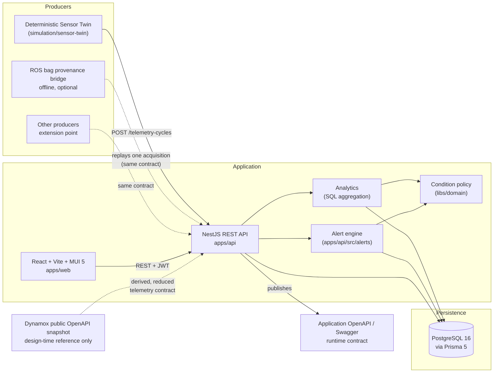

Solid arrows are runtime calls. Dotted arrows are design-time relationships or optional
producers. The application never calls Dynamox production services.

## Why this architecture

- **The backend is the authority.** Every rule that matters — uniqueness, sensor
  compatibility, payload contracts, authorization — is enforced and tested in the API and the
  database; the frontend only anticipates messages and mirrors state
  ([ADR-0001](./analysis/06-decisions/adr-0001-backend-authority.md)).
- **Millions of samples never cross the network.** Raw data stays in PostgreSQL; every screen
  receives an aggregate computed by a bounded SQL query. Raw samples are only paged on the last
  investigation level, one acquisition at a time
  ([ADR-0007](./analysis/06-decisions/adr-0007-server-side-query-contracts.md)).
- **Condition and alert are different things.** Condition is derived and recalculable; an alert
  is a persistent episode with evidence and a lifecycle
  ([ADR-0011](./analysis/06-decisions/adr-0011-condition-policy-and-alert-occurrences.md)).
- **Contracts are explicit.** The telemetry payload is a reduced, traceable derivation of the
  public Dynamox specification; the application's own OpenAPI is derived from the same schema
  the validator executes ([ADR-0005](./analysis/06-decisions/adr-0005-internal-contract-reduction.md),
  [ADR-0006](./analysis/06-decisions/adr-0006-single-source-contract.md)).
- **The demo is reproducible.** A deterministic producer, an idempotent ingestion path and a
  replayable alert backfill make the same 30 days appear on any machine
  ([ADR-0010](./analysis/06-decisions/adr-0010-history-through-contract.md)).

## System context

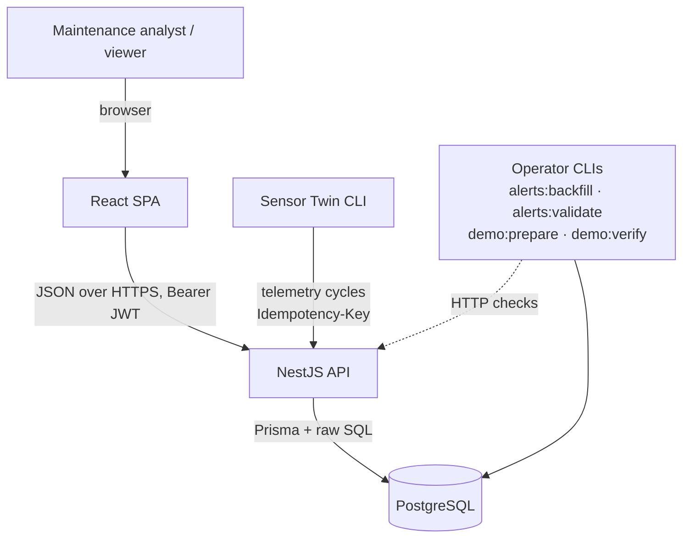

## Monorepo

Nx 20 on top of npm workspaces (package-based: every project is an independently runnable npm
package; Nx orchestrates `build`, `lint`, `typecheck` and `test` with `dependsOn: ["^build"]`).

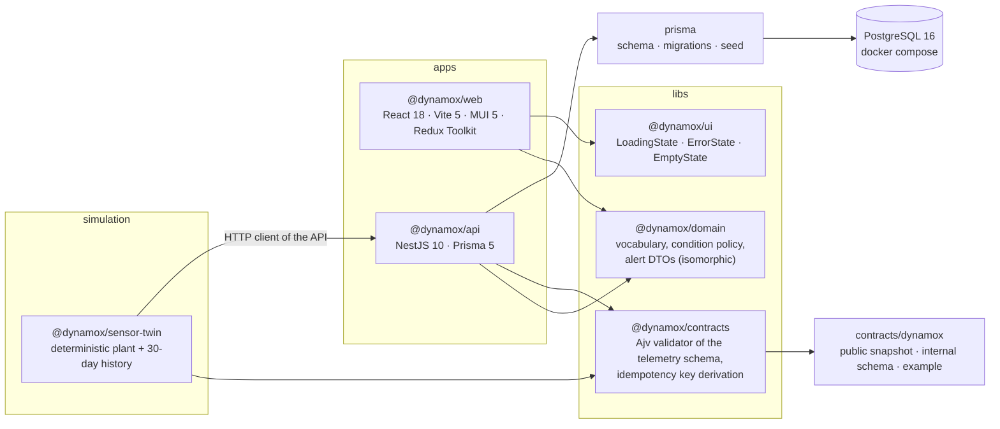

| Project | Path | Tests |
|---|---|---|
| `@dynamox/api` | `apps/api` | Jest — unit + e2e against a real PostgreSQL + contract suites |
| `@dynamox/web` | `apps/web` | Vitest + Testing Library (jsdom) |
| `@dynamox/domain` | `libs/domain` | covered through the API and web suites |
| `@dynamox/contracts` | `libs/contracts` | covered by `apps/api/test/contract.spec.ts` |
| `@dynamox/ui` | `libs/ui` | covered through the web suite |
| `@dynamox/sensor-twin` | `simulation/sensor-twin` | Jest — pure unit suite; integration/ROS suites are opt-in |

## Frontend

React 18 + TypeScript on Vite 5, Material UI 5, Redux Toolkit with thunks, React Router 7,
Recharts. Layers, from the outside in:

- **Shell and navigation** — `AppShell` (sidenav with grouped, collapsible sections; the
  active trail is computed by a single typed matcher in `features/navigation/navigation.ts`),
  `PageHeader` with breadcrumbs, `RequireAuth` guarding private routes.
- **Pages** — `pages/resources` (machines, points, sensors CRUD), `pages/alerts`,
  `pages/investigation` (time window → sensor → acquisition → raw samples), `LoginPage`.
- **Features** — one folder per domain (`auth`, `machines`, `monitoringPoints`, `dashboard`,
  `alerts`, `investigation`, `navigation`, `time`): slices, thunks, pure aggregations and
  formatters. Redux holds state that is genuinely global (session, dashboard data, registry
  lists); the query state of analytical pages (window, filters, page, sort) lives in the URL,
  so every screen is bookmarkable and survives refresh, back and forward.
- **API client** — `api/client.ts`: one typed function per endpoint, Bearer token from
  `sessionStorage`, a single central 401 handler, and a guard that refuses any base URL
  pointing at Dynamox domains.
- **Reusable building blocks** — `PageHeader`, `ConditionTag`, `ConditionFilter`,
  `AlertLevelTag`/`AlertStatusTag`, `AlertsSection`, `HelpTip`, `DashboardCard`,
  `MonitoringPointFilters`, `PageSkeleton`, and the `@dynamox/ui` states.

Details: [`analysis/01-dashboard/frontend-architecture.md`](./analysis/01-dashboard/frontend-architecture.md).

## Backend

NestJS 10 on Node.js 22 (TypeScript). Modules: `auth`, `machines`, `monitoring-points`,
`telemetry`, `time-series`, `analytics`, `alerts`, `health`, plus `prisma` and `common`
(API schema classes, mappers, error envelope).

- **Validation** — DTOs and query strings are parsed by hand into closed vocabularies:
  unknown properties are rejected with `400`, every error carries a stable `{ code, message }`
  envelope, and the telemetry body is validated by Ajv against the versioned JSON Schema.
- **Authorization** — a global JWT guard; `POST/PATCH/DELETE` and alert acknowledgement
  require the `ADMIN` role, `VIEWER` receives `403`.
- **Persistence access** — Prisma for CRUD, transactions and row locks; raw SQL (through
  Prisma's tagged templates) for analytics, where `LATERAL` joins, window functions and
  date bucketing are the point.
- **OpenAPI** — `/api/docs` and `/api/docs-json`, generated from decorators and from the
  telemetry schema itself; contract tests assert the published document, not the decorators.

Details: [`analysis/02-api/backend-architecture.md`](./analysis/02-api/backend-architecture.md),
[`analysis/02-api/auth-and-rbac.md`](./analysis/02-api/auth-and-rbac.md),
[`analysis/02-api/openapi.md`](./analysis/02-api/openapi.md).

### Request flow — dashboard load

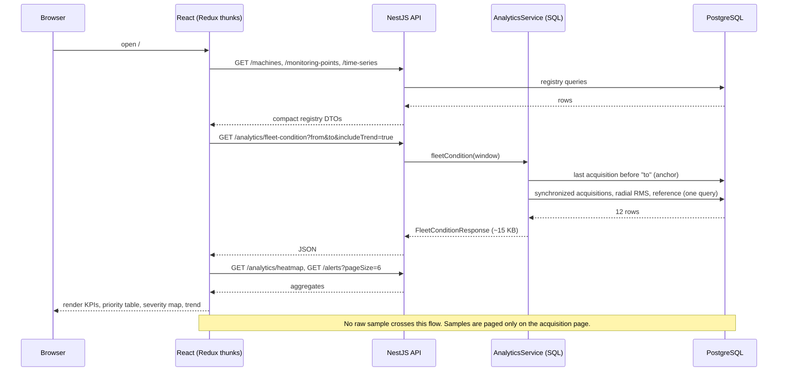

### Drill-down — every step narrows the dataset

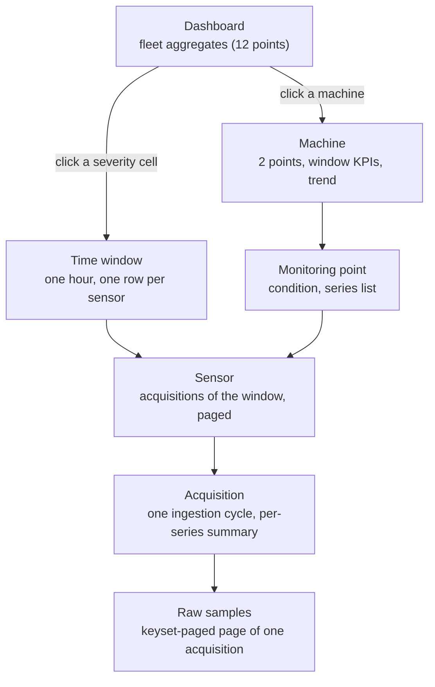

The window (`from`/`to`) travels in the URL from level to level, so a reviewer can leave the
dashboard and land on the same period elsewhere. Only the last level touches raw samples.

## Persistence

PostgreSQL 16 through Prisma 5: versioned migrations, an idempotent seed and unique indexes as
the final authority for uniqueness (`409` is the database saying no, not the application
guessing first).

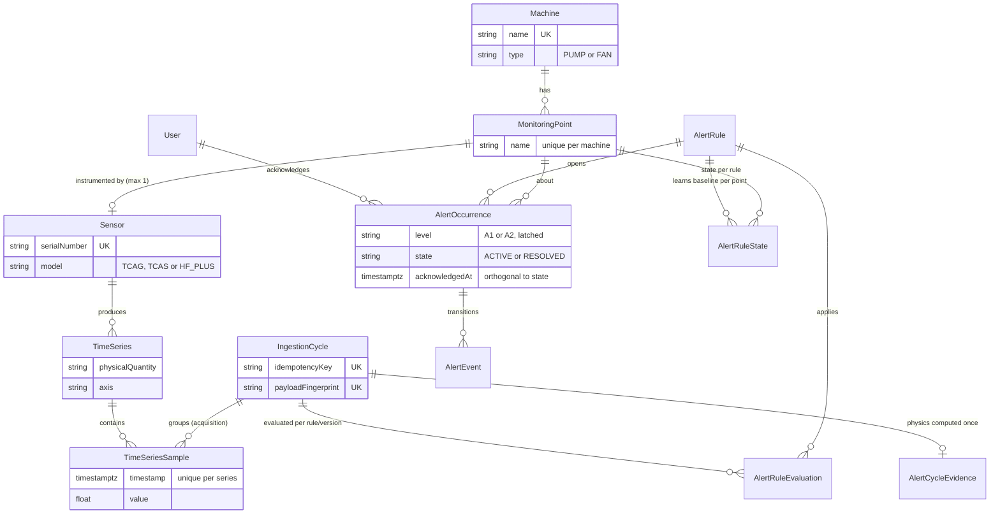

Details and deletion cascade: [`analysis/03-domain/domain-and-persistence.md`](./analysis/03-domain/domain-and-persistence.md).

## Time-series

- **Acquisition = ingestion cycle.** A `POST /telemetry-cycles` carries one cycle (60 one-second
  windows per series in the demo). It becomes one `IngestionCycle` row and its samples, in one
  transaction.
- **Idempotency by key and by content.** The `Idempotency-Key` header identifies the intent;
  a canonical SHA-256 fingerprint of the whole payload identifies the content. Same key + same
  content → `200 duplicate:true` with the original result; same key + different content →
  `409`; new key + known content → `200 duplicate:true` without a new cycle
  ([ADR-0004](./analysis/06-decisions/adr-0004-idempotent-ingestion.md)).
- **Retrieval.** `GET /time-series` lists every series with its last reading (the count of
  series is the size of that list); `GET /time-series/:id/samples?limit&offset` pages a full
  series with `total`; `GET /time-series/:id/metrics` returns count, min, max, average, last
  value and window; `DELETE /time-series/:id` removes the series and its samples (the cycle
  row is kept for audit).

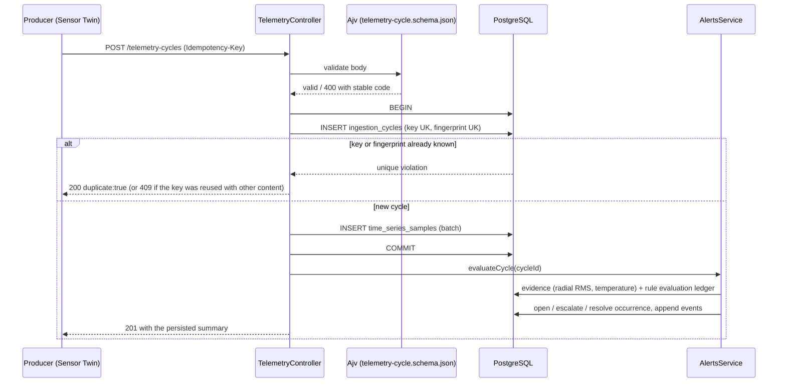

Details: [`analysis/02-api/telemetry-ingestion.md`](./analysis/02-api/telemetry-ingestion.md),
[`analysis/00-overview/end-to-end-flow.md`](./analysis/00-overview/end-to-end-flow.md).

## Analytics

All analytical endpoints live under `/api/analytics` and answer with small DTOs computed in
SQL: fleet condition, machine list and summary, point summary, time windows, sensor
acquisitions, series buckets and statistics, the severity heatmap and acquisition samples.

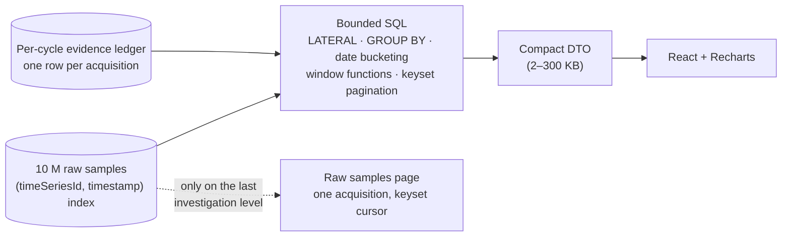

Two decisions keep these queries fast and honest:

- **Counting acquisitions uses the per-cycle ledger** (`alert_cycle_evidence`, one row per
  ingested cycle, indexed by sensor and instant) instead of `count(DISTINCT cycle)` over
  samples. When a window has no ledger rows (data loaded with the engine disabled and not yet
  backfilled, or inserted outside the API) the service switches to the sample-based variant —
  correct, just slower ([ADR-0012](./analysis/06-decisions/adr-0012-analytics-on-the-cycle-ledger.md)).
- **Windows are anchored on the last acquisition, not on the wall clock.** Condition is
  evaluated over the last 24 h *of acquisitions* inside the requested window; otherwise a stopped
  plant (or a frozen demo) would silently decay to "unclassified" as the clock moves
  ([ADR-0013](./analysis/06-decisions/adr-0013-windows-anchored-on-last-reading.md)).

## Condition monitoring

Condition is a **derived, recalculable** classification of each monitoring point, computed by
`fleetConditionSql` and the shared policy in `libs/domain/src/condition.ts`
(`DEFAULT_CONDITION_POLICY`, version 1).

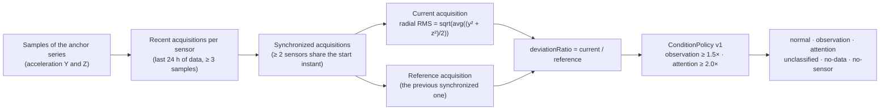

Freshness (`current` / `stale` / `future` / `unknown`) is a separate axis computed against the
real clock; the UI never mixes the two. Details:
[`analysis/01-dashboard/condition-monitoring.md`](./analysis/01-dashboard/condition-monitoring.md).

## Alert engine

An alert is a **persistent episode** opened by a versioned rule (Alert Policy v1) against the
*learned baseline* of the point — not against the previous acquisition. That is why the
dashboard can legitimately show a condition of 3.49× while the alert peak reads 3.77×: the two
numbers use different references, and the UI shows both side by side.

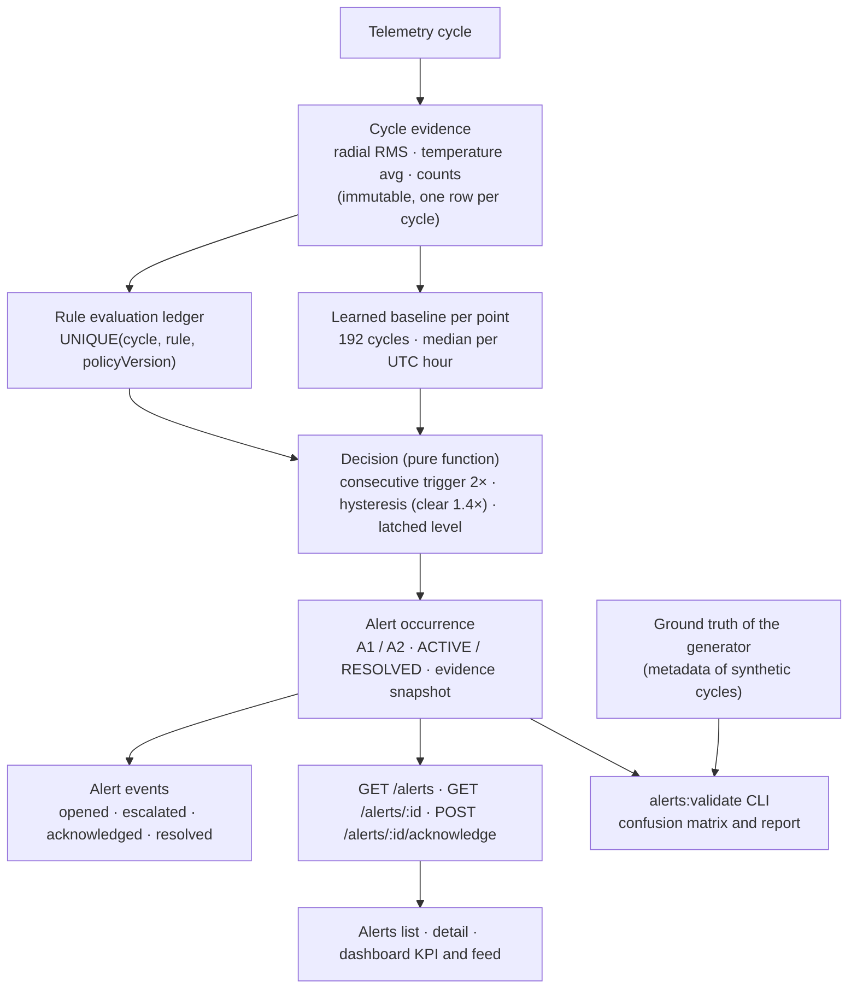

The engine never reads the generator's ground truth: a guard test (`leakage.spec.ts`) fails if
any file under `apps/api/src/alerts` mentions it. Only the validation CLI reads it, to measure
the engine.

Rules of Alert Policy v1 (this project's policy, informed by the literature and calibrated on
the measured dataset): vibration ratio to baseline A1 ≥ 1.5× / A2 ≥ 2.0× / clear < 1.4×;
temperature delta A1 ≥ +5 °C / A2 ≥ +10 °C / clear < +3 °C; telemetry presence A1 after 4
expected intervals without data, A2 after 96; fleet collapse when more than half of the
instrumented points go silent together. Two consecutive readings open, four consecutive
readings below the clear threshold resolve.

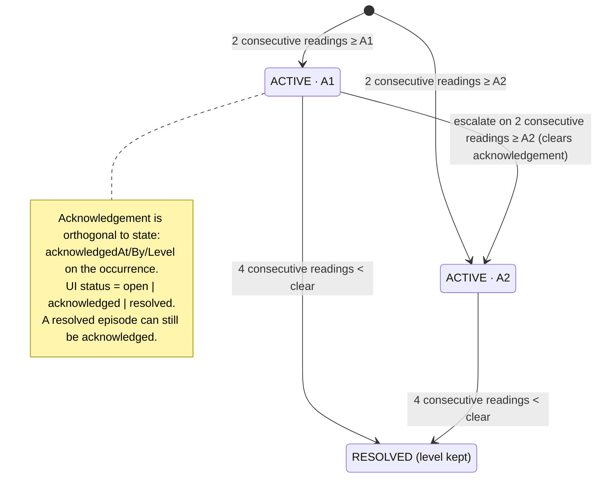

Exactly-once guarantees come from the database: evidence keyed by cycle, evaluations unique
per (cycle, rule, version), one active occurrence per (rule, point) via a unique `activeKey`.
Replaying `alerts:backfill` produces zero new evaluations. Details:
[`analysis/03-domain/alert-domain.md`](./analysis/03-domain/alert-domain.md),
[validation report](./analysis/07-validation/alert-validation.md).

## Simulation

The **Sensor Twin** (`simulation/sensor-twin`) is a deterministic producer that plays the role
of a real fleet: 6 rotating assets, 12 monitoring points, 12 sensors with fixed seeds. It
bootstraps the registry through the same REST endpoints a real client would use, generates
acquisition cycles and posts them through the same idempotent ingestion contract.

- **30-day history** (`npm run twin:history`): a fixed 15-minute grid per machine, a daily
  operating profile, a thermal cycle, planned Sunday stops, and labelled scenarios — a slow
  vibration ramp (SIM-HF-002), a one-cycle transient (SIM-HF-005), a thermal drift
  (SIM-HF-007), a silent sensor (SIM-TCAS-001) and a plant trip. About 10 million samples,
  33 thousand cycles.
- **Ground truth** travels in the cycle metadata and is read only by `alerts:validate`.
- **Guards**: the twin refuses any API URL that is not localhost or that points at Dynamox
  domains; synthetic origin is tagged on every cycle.

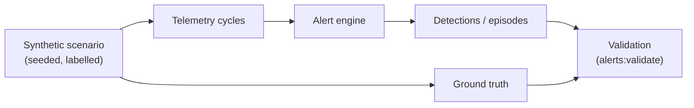

There is no arrow from ground truth to the engine — by construction and by test.

### Simulation port

The ingestion boundary is producer-agnostic: anything that speaks the telemetry-cycle contract
can feed the application.

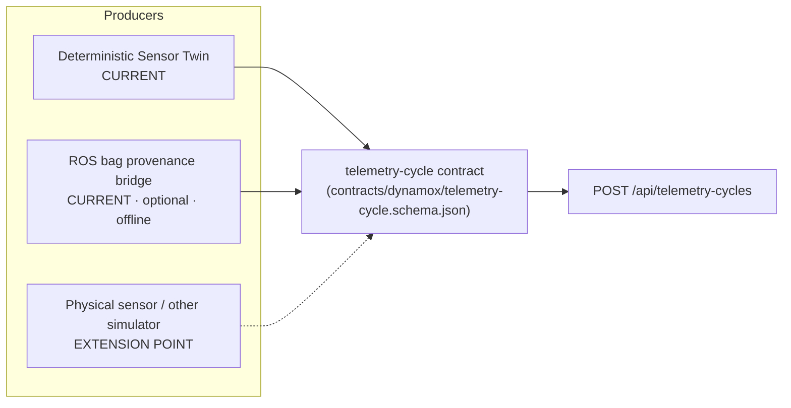

**ROS / Gazebo — what actually exists.** ROS is *not* a runtime dependency and Gazebo is not
implemented. The repository contains an offline provenance bridge
(`simulation/sensor-twin/ros/rosbag_bridge.py`, `src/rosbridge.ts`): one already-ingested
confirmatory acquisition is exported to a `.bag` (IMU, temperature, rpm and a provenance
topic), reconstructed back into the same payload and re-posted — the API answers
`200 duplicate:true` with the identical fingerprint, which proves that a portable ROS artefact
keeps its semantic identity. It runs only through `npm run twin:ros` / `plant rosbag` and
requires ROS Noetic; no conventional suite depends on it. A live ROS/Gazebo simulation would be
one more producer behind the same contract, without changes to the application core. Details:
[`analysis/05-simulation/ros-integration.md`](./analysis/05-simulation/ros-integration.md),
[`analysis/05-simulation/simulation-vs-real.md`](./analysis/05-simulation/simulation-vs-real.md).

## External contracts and ports

The code base is layered rather than formally hexagonal; "ports" below names the interfaces
that cross the application boundary.

| Direction | Interface | Where |
|---|---|---|
| Inbound | React web → REST API (JWT) | `apps/web/src/api/client.ts` → `apps/api/src/*` |
| Inbound | OpenAPI consumers (Swagger UI, generated clients) | `/api/docs`, `/api/docs-json` |
| Inbound | Telemetry ingestion (any producer) | `POST /api/telemetry-cycles` + `contracts/dynamox/telemetry-cycle.schema.json` |
| Inbound | Operator CLIs | `alerts:backfill`, `alerts:validate`, `alerts:seed-history`, `demo:prepare`, `demo:verify`, `perf:latency` |
| Outbound | PostgreSQL | Prisma client + raw SQL |
| Outbound (design-time) | Dynamox public OpenAPI snapshot | `contracts/dynamox/dynamox-public-api.openapi.json` |
| Outbound (optional tooling) | ROS Noetic (`rosbag`) | `simulation/sensor-twin/ros/` |

### Two OpenAPI documents, two roles

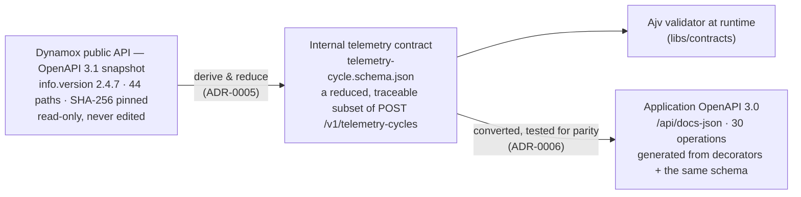

- The **Dynamox snapshot** is a design-time reference: it was fetched once from the public
  specification URL, is pinned by hash and is never edited. It grounds the telemetry domain and
  keeps the simulator/ingestion boundary explicit. **The application does not call any Dynamox
  service** and does not need credentials for one; the frontend and the twin refuse Dynamox
  domains by code.
- The **internal contract** only reduces the public body (numeric values, millisecond
  timestamps, explicit units and axes, closed physical quantities); every difference is
  classified in [`contracts/dynamox/README.md`](../contracts/dynamox/README.md).
- The **application OpenAPI** is the runtime contract of this API. Contract tests assert the
  published document: every 4xx is an `ErrorResponse`, request bodies carry executable
  examples, nullable fields are typed, and the telemetry schema published in Swagger gives the
  same verdicts as the validator.

## Security

- JWT issued by `POST /auth/login` (fixed seeded credentials, configurable by environment),
  validity `JWT_EXPIRES_IN` (8 h by default), no refresh token.
- Global guard: everything except `/api/health` and `/api/auth/login` requires a Bearer token
  (`401`). Roles `ADMIN` and `VIEWER`: mutations and alert acknowledgement are `ADMIN`-only
  (`403`, and the persisted state provably does not change).
- Frontend: token in `sessionStorage`, session restored via `GET /auth/me`, private routes
  redirect to `/login` and back to the requested URL, one central 401 handler.

Details: [`analysis/02-api/auth-and-rbac.md`](./analysis/02-api/auth-and-rbac.md).

## Performance

The challenge requires every request to answer below 350 ms. The benchmark
(`npm run perf:latency`, `tools/measure-latency.ts`) authenticates, discards 5 warm-up
requests per route, measures 30 sequential samples and **fails if the maximum of any route
reaches 350 ms**. It covers the core routes and the heaviest analytical routes at 7- and 30-day
windows over the demo dataset (10 M samples).

| Endpoint | Dataset / window | p50 | p95 | max | Payload (approx.) |
|---|---|---|---|---|---|
| `POST /auth/login` | — | 34 ms | 39 ms | 48 ms | 0.3 KB |
| `GET /machines` | 6 machines | 5 ms | 6 ms | 6 ms | 1 KB |
| `GET /monitoring-points` | page of 5 | 6 ms | 6 ms | 7 ms | 2 KB |
| `GET /time-series` | 60 series | 7 ms | 8 ms | 8 ms | 26 KB |
| `GET /time-series/:id/samples` | 500 samples | 24 ms | 25 ms | 35 ms | 28 KB |
| `GET /time-series/:id/metrics` | 172 k samples | 45 ms | 49 ms | 53 ms | 0.2 KB |
| `GET /analytics/fleet-condition` | 7 d | 23 ms | 27 ms | 39 ms | 15 KB |
| `GET /analytics/fleet-condition` | 30 d + trend | 66 ms | 78 ms | 78 ms | 16 KB |
| `GET /analytics/heatmap` | 7 d, hourly | 31 ms | 54 ms | 66 ms | 66 KB |
| `GET /analytics/heatmap` | 30 d, hourly | 106 ms | 114 ms | 115 ms | 280 KB |
| `GET /analytics/machines` | 30 d | 25 ms | 33 ms | 38 ms | 2 KB |
| `GET /analytics/machines/:key` | 30 d | 113 ms | 129 ms | 130 ms | 3 KB |
| `GET /analytics/series/:id/points` | 30 d, 4 h buckets | 165 ms | 172 ms | 198 ms | 30 KB |
| `GET /alerts?status=active` | 207 episodes | 8 ms | 10 ms | 10 ms | 4 KB |
| `GET /alerts?search=…` | 50 per page | 12 ms | 16 ms | 16 ms | 47 KB |
| `GET /alerts/:id` | — | 8 ms | 10 ms | 10 ms | 2 KB |
| `POST /machines` / `DELETE /machines/:id` | write path | 5 ms | 7 ms | 7 ms | 0.3 KB |

Measured locally (Node 22, Linux x64, Intel i5-13420H, PostgreSQL 16 in Docker); values are
from the last run of the benchmark and will differ by machine. All routes: **max < 350 ms**.

The story behind the numbers:

1. The first dashboard fetched raw radial series and classified in the browser — hundreds of
   requests and hundreds of megabytes for a 30-day history. It was replaced by one SQL query per
   question, returning classification and evidence together (`fleetConditionSql`).
2. Bucketed series (`/analytics/series/:id/points`) send ~170 points instead of ~170 000
   samples; the raw samples page uses a keyset cursor, never a deep `OFFSET`.
3. The severity heatmap reuses the per-cycle evidence and the learned baselines already
   computed by the alert engine — no re-aggregation of samples.
4. Acquisition counting moved from `count(DISTINCT cycle)` over samples to the per-cycle
   ledger (≈ 350 ms → ≈ 4 ms on a 30-day series), with an explicit fallback when the ledger is
   absent.
5. The latency benchmark is *not* a load test: requests are sequential from one client.

Why PostgreSQL: the data volume was not solved by hiding data but by relational algebra —
existing composite indexes, `LATERAL` joins, `GROUP BY` with date bucketing, window functions,
keyset pagination and bounded windows ([ADR-0002](./analysis/06-decisions/adr-0002-postgresql-prisma.md)).

## Testing

| Layer | Where | Runs against | What it proves |
|---|---|---|---|
| API unit | `apps/api/src/**/*.spec.ts` | nothing external | DTO/query parsers, mappers, pure engine (decision, baseline, presence), evaluation-window anchoring |
| Telemetry contract | `apps/api/test/contract.spec.ts` | real Ajv | the versioned example is valid, violations are refused, the fingerprint is canonical |
| OpenAPI contract + schema parity | `apps/api/test/openapi-contract.e2e-spec.ts`, `telemetry-schema-parity.e2e-spec.ts` | the published document | the served contract is well-formed and gives the same verdicts as the validator |
| API e2e | `apps/api/test/*.e2e-spec.ts` | **real PostgreSQL** | HTTP behaviour end to end: uniqueness, races, RBAC, idempotency, pagination, alert lifecycle |
| Web component | `apps/web/src/**/*.spec.tsx` | jsdom + stubbed `fetch` | reducers, thunks, aggregations, screens by role, navigation, URLs |
| Sensor twin | `simulation/sensor-twin/src/**/*.spec.ts` | nothing external | determinism, manifest invariants, generator math, boundary guards |
| Synthetic validation | `npm run alerts:validate` | database + ground truth | confusion matrix of the engine per sensor and family |
| Demo invariants | `npm run demo:verify -- --api` | database + API | 29 semantic checks (scenarios detected, transient not alerted, healthy sensors silent, routes answer) |
| Performance | `npm run perf:latency` | API | every route below 350 ms |
| Browser walkthrough | manual | Chrome | the integrated flow, screens and drill-down |

Conventional suite (`npm run test`): **353 API + 212 web + 124 sensor-twin = 689 tests**.
Opt-in suites: `twin:integration` (real API and database) and `twin:ros` (ROS Noetic).
What each suite proves and does not prove: [`analysis/07-validation/testing-strategy.md`](./analysis/07-validation/testing-strategy.md).

## Known limitations

- No cloud deployment, load balancer or load test; the latency benchmark is single-client.
- No Cypress end-to-end suite; browser flows are covered by component tests and manual
  walkthroughs.
- No forecast of time series; the alert engine detects sustained deviations, it does not
  predict.
- No notification delivery, snooze, assignee, SLA or manual resolution of alerts.
- No operating calendar: a planned stop and a gateway failure are the same observable fact
  (`FLEET_SILENT`); sensor silence means missing telemetry, never a diagnosed sensor failure.
- No spectral or RPM-based alerts; the contract carries windowed RMS, not spectra.
- The learned baseline assumes a healthy machine during commissioning.
- Responsive layout is implemented with Material UI breakpoints and validated for overflow at
  desktop resolution; device emulation was not part of the validation.
- ROS support is an offline provenance bridge, not a live integration; Gazebo is not implemented.

## Architecture decisions

| ADR | Decision |
|---|---|
| [0001](./analysis/06-decisions/adr-0001-backend-authority.md) | Backend as the authority for validation and authorization |
| [0002](./analysis/06-decisions/adr-0002-postgresql-prisma.md) | PostgreSQL + Prisma |
| [0003](./analysis/06-decisions/adr-0003-redux-toolkit-thunks.md) | Redux Toolkit with thunks, no RTK Query |
| [0004](./analysis/06-decisions/adr-0004-idempotent-ingestion.md) | Idempotent ingestion by header key + content fingerprint |
| [0005](./analysis/06-decisions/adr-0005-internal-contract-reduction.md) | Internal contract as a traceable reduction of the public one |
| [0006](./analysis/06-decisions/adr-0006-single-source-contract.md) | One source for the validator and the OpenAPI |
| [0007](./analysis/06-decisions/adr-0007-server-side-query-contracts.md) | Pagination, sorting, search and filters on the server |
| [0008](./analysis/06-decisions/adr-0008-synthetic-isolation.md) | Synthetic environment isolation enforced by code |
| [0009](./analysis/06-decisions/adr-0009-rest-source-of-truth.md) | REST as the source of truth; realtime deferred |
| [0010](./analysis/06-decisions/adr-0010-history-through-contract.md) | Synthetic history through the same ingestion contract |
| [0011](./analysis/06-decisions/adr-0011-condition-policy-and-alert-occurrences.md) | Centralized condition policy; alert as a persistent episode |
| [0012](./analysis/06-decisions/adr-0012-analytics-on-the-cycle-ledger.md) | Analytics count acquisitions from the per-cycle ledger |
| [0013](./analysis/06-decisions/adr-0013-windows-anchored-on-last-reading.md) | Analytical windows anchored on the last reading |

## Documentation map

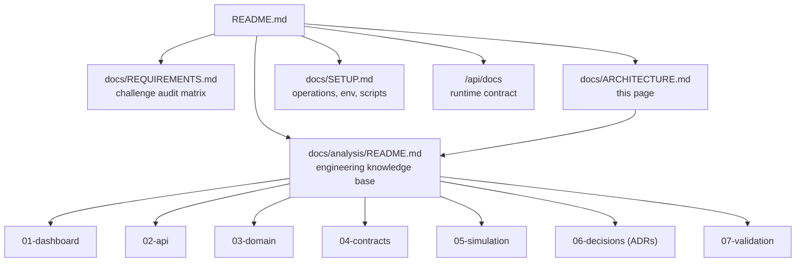
