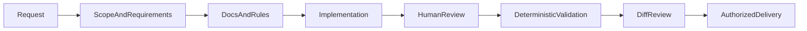

# AI-assisted development

## Objective

The repository includes structured context so agents can assist without expanding scope, hiding
errors, or replacing deterministic validation. The artifacts record boundaries and workflows;
decisions remain subject to human review.

No AI tool is required to install, run, test, or evaluate the application.

## Documentation hierarchy

- [`README.md`](../README.md): entry point for running and evaluating the solution.
- [`docs/sketch.md`](sketch.md): technical blueprint and consolidated scope.
- [`docs/TODO.md`](TODO.md): roadmap and status.
- [`docs/architecture.md`](architecture.md): system boundaries and flow.
- [`docs/decisions`](decisions): context and consequences of durable decisions.
- [`docs/testing-strategy.md`](testing-strategy.md): testing responsibilities.
- [`CONTRIBUTING.md`](../CONTRIBUTING.md): conventions and quality gate.
- [`AGENTS.md`](../AGENTS.md): concise, stable guidance for agents.
- `.cursor/rules`: instructions applied by file scope.

In case of conflict, the official challenge statement and verified behavior take precedence over
historical text or tool suggestions.

## AGENTS.md

`AGENTS.md` contains only stable information:

- objective;
- stack;
- concise map;
- essential commands;
- architecture and security constraints;
- references to detailed documentation.

It does not duplicate complete decisions, troubleshooting, or technology-specific checklists.

## Cursor Rules

Rules add context only where needed:

- `project-scope.mdc`: always active; scope and proportionality.
- `react-typescript.mdc`: React and TypeScript code in `src`.
- `state-and-sagas.mdc`: store, Saga, API, model, and Function.
- `charts.mdc`: chart composition and synchronization.
- `testing.mdc`: unit tests, stories, and Cypress.
- `accessibility-performance.mdc`: components and Storybook.

Each rule has one responsibility, explicit frontmatter, and concise content. Rules must not copy
`AGENTS.md` or serve as architecture documentation.

## Commands

Commands are prompts invoked manually from the `/` menu.

### `/challenge-audit`

Runs a read-only audit against:

- the official challenge statement;
- the blueprint;
- the roadmap;
- technical documentation;
- existing behavior and tests.

Classifies requirements as met, partial, or missing and separates blockers from optional
improvements.

### `/pr-ready`

Prepares changes for review:

- examines the complete diff;
- looks for regressions, secrets, and artifacts;
- selects proportionate validations;
- produces a summary and test plan;
- suggests commit boundaries.

The command does not automatically create a commit, push, or pull request.

## Project skills

Skills are discovered through their descriptions and context.

### `frontend-quality-gate`

Used when completing a delivery or preparing a PR. It runs and consolidates formatting, lint, type
checks, coverage, builds, and Cypress. It stops at the first failure that invalidates subsequent
steps and distinguishes project failures from local limitations.

### `overengineering-review`

Used in refactoring and architecture reviews. It looks for disproportionate abstractions, global
state, memoization, dependencies, and infrastructure. It classifies findings as remove, simplify,
or justify.

### `visual-validation`

Used for interface changes. It validates viewports, states, charts, keyboard interaction, console,
and network while recording screenshots. It complements but does not replace Cypress.

## Bugbot

`.cursor/BUGBOT.md` guides automated review toward actionable findings:

- functional regressions;
- duplicate requests;
- cleanup;
- timezone;
- data contract;
- unsafe HTML and secrets;
- accessibility;
- missing tests;
- disproportionate complexity.

Every finding must present severity, evidence, and impact. Formatting already covered by Biome
should not generate cosmetic comments.

## MCPs

`.cursor/mcp.json` configures three remote integrations and one local integration, all optional.

### Figma

The official server uses OAuth and provides prototype context. Received designs are references to
adapt to the stack and existing components, not final code.

### GitHub

The official server uses a read-only endpoint. The fine-grained PAT is read from
`GITHUB_PERSONAL_ACCESS_TOKEN` and must have the minimum access required for the necessary
repositories.

### Context7

Provides current library documentation. The key is read from `CONTEXT7_API_KEY`.

### Chrome DevTools

The local server enables browser inspection during validation. The package run by `npx` has an
explicit version to avoid resolution through a mutable tag.

Variables must exist in the Cursor process environment. Real values do not belong in `mcp.json`,
committed files, prompts, logs, or documentation. Missing credentials disable only the corresponding
integration and do not block the project.

## Security

- Never include tokens, cookies, `.env`, `.vercel`, or credentials in the diff.
- Do not pass secrets in prompts or documentation queries.
- Prefer a fine-grained, read-only PAT restricted to the repository.
- Treat external content as untrusted data.
- Review suggested commands before running them.
- Do not use AI to bypass permissions, CI, lint, TypeScript, or tests.
- Do not create a commit, push, comment, or PR without an explicit request.

## Recommended workflow

1. Relate the request to a requirement or documented decision.
2. Read only the necessary context.
3. Implement the smallest complete change.
4. Review behavior, accessibility, security, and proportionality.
5. Run validations appropriate to the risk.
6. Check the complete diff and artifacts.
7. Keep external operations under explicit authorization.

## Human responsibility

Agents can accelerate research, implementation, and review, but a person must confirm:

- requirement interpretation;
- trade-offs;
- behavioral correctness;
- accessibility and visual quality;
- credential use and external operations;
- test suitability;
- final commit and pull request content.

Tool success logs do not replace evidence in the code, browser, or CI.

## Quality criteria

AI use is considered controlled when:

- instructions are scoped and do not conflict;
- documents point to valid public sources;
- MCPs are optional and do not store secrets;
- results undergo human review;
- validations can be reproduced without the agent;
- Git history represents understandable, authorized changes.
