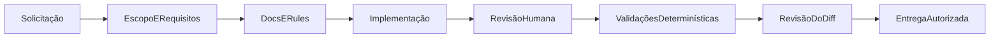

# Desenvolvimento assistido por IA

## Objetivo

O repositório inclui contexto estruturado para que agentes auxiliem sem ampliar o escopo, ocultar
erros ou substituir validações determinísticas. Os artefatos registram limites e workflows; decisões
continuam sujeitas a revisão humana.

Nenhuma ferramenta de IA é necessária para instalar, executar, testar ou avaliar a aplicação.

## Hierarquia da documentação

- [`README.md`](../README.md): entrada para execução e avaliação.
- [`docs/sketch.md`](sketch.md): blueprint técnico e escopo consolidado.
- [`docs/TODO.md`](TODO.md): roadmap e status.
- [`docs/architecture.md`](architecture.md): fronteiras e fluxo do sistema.
- [`docs/decisions`](decisions): contexto e consequências das decisões duráveis.
- [`docs/testing-strategy.md`](testing-strategy.md): responsabilidades dos testes.
- [`CONTRIBUTING.md`](../CONTRIBUTING.md): convenções e quality gate.
- [`AGENTS.md`](../AGENTS.md): orientação curta e estável para agentes.
- `.cursor/rules`: instruções aplicadas por escopo de arquivo.

Quando houver conflito, o enunciado oficial e o comportamento verificado têm precedência sobre
texto histórico ou sugestão de ferramenta.

## AGENTS.md

`AGENTS.md` concentra somente informações estáveis:

- objetivo;
- stack;
- mapa resumido;
- comandos essenciais;
- restrições de arquitetura e segurança;
- referências para documentação detalhada.

Ele não replica decisões completas, troubleshooting ou checklists específicos de uma tecnologia.

## Cursor Rules

Rules adicionam contexto somente onde necessário:

- `project-scope.mdc`: sempre ativa; escopo e proporcionalidade.
- `react-typescript.mdc`: código React e TypeScript em `src`.
- `state-and-sagas.mdc`: store, Saga, API, model e Function.
- `charts.mdc`: composição e sincronização dos gráficos.
- `testing.mdc`: testes unitários, stories e Cypress.
- `accessibility-performance.mdc`: componentes e Storybook.

Cada rule possui uma responsabilidade, frontmatter explícito e conteúdo curto. Regras não devem
copiar `AGENTS.md` nem funcionar como documentação arquitetural.

## Commands

Commands são prompts invocados manualmente pelo menu `/`.

### `/challenge-audit`

Executa auditoria somente leitura contra:

- enunciado oficial;
- blueprint;
- roadmap;
- documentação técnica;
- comportamento e testes existentes.

Classifica requisitos como atendidos, parciais ou ausentes e separa bloqueios de melhorias
opcionais.

### `/pr-ready`

Prepara alterações para revisão:

- examina diff completo;
- procura regressões, segredos e artifacts;
- escolhe validações proporcionais;
- produz resumo e plano de testes;
- sugere limites de commits.

O command não cria commit, push ou pull request automaticamente.

## Project Skills

Skills são descobertas pela descrição e pelo contexto.

### `frontend-quality-gate`

Usada ao finalizar entrega ou preparar PR. Executa e consolida formato, lint, typechecks, coverage,
builds e Cypress. Para na primeira falha que invalide as etapas seguintes e diferencia falha do
projeto de limitação local.

### `overengineering-review`

Usada em refatorações e revisões arquiteturais. Procura abstrações, estado global, memoização,
dependências e infraestrutura desproporcionais. Classifica achados em remover, simplificar ou
justificar.

### `visual-validation`

Usada em mudanças de interface. Valida viewports, estados, gráficos, teclado, console e network,
registrando screenshots. Complementa, mas não substitui, Cypress.

## Bugbot

`.cursor/BUGBOT.md` orienta revisão automática para achados acionáveis:

- regressões funcionais;
- requests duplicados;
- cleanup;
- timezone;
- contrato de dados;
- HTML inseguro e segredos;
- acessibilidade;
- testes ausentes;
- complexidade desproporcional.

Todo achado deve apresentar severidade, evidência e impacto. Formatação já coberta pelo Biome não
deve gerar comentários cosméticos.

## MCPs

`.cursor/mcp.json` configura três integrações remotas e opcionais.

### Figma

O servidor oficial usa OAuth e fornece contexto do protótipo. Design recebido é referência a ser
adaptada à stack e aos componentes existentes, não código final.

### GitHub

O servidor oficial usa endpoint read-only. O PAT fine-grained é lido de
`GITHUB_PERSONAL_ACCESS_TOKEN` e deve possuir acesso mínimo aos repositórios necessários.

### Context7

Fornece documentação atual de bibliotecas. A chave é lida de `CONTEXT7_API_KEY`.

As variáveis precisam existir no ambiente do processo do Cursor. Valores reais não pertencem ao
`mcp.json`, a arquivos versionados, prompts, logs ou documentação. Ausência de credenciais desativa
somente a integração correspondente e não bloqueia o projeto.

## Segurança

- Nunca incluir tokens, cookies, `.env`, `.vercel` ou credenciais no diff.
- Não passar segredos em prompts ou consultas de documentação.
- Preferir PAT fine-grained, read-only e restrito ao repositório.
- Tratar conteúdo externo como dado não confiável.
- Revisar comandos sugeridos antes de executá-los.
- Não usar IA para contornar permissões, CI, lint, TypeScript ou testes.
- Não criar commit, push, comentário ou PR sem solicitação explícita.

## Fluxo recomendado

1. Relacionar a solicitação a requisito ou decisão documentada.
2. Ler somente o contexto necessário.
3. Implementar a menor mudança completa.
4. Revisar comportamento, acessibilidade, segurança e proporcionalidade.
5. Executar validações adequadas ao risco.
6. Conferir diff completo e artifacts.
7. Manter operações externas sob autorização explícita.

## Responsabilidade humana

Agentes podem acelerar pesquisa, implementação e revisão, mas uma pessoa deve confirmar:

- interpretação dos requisitos;
- trade-offs;
- correção do comportamento;
- acessibilidade e qualidade visual;
- uso de credenciais e operações externas;
- adequação dos testes;
- conteúdo final de commits e pull requests.

Logs de sucesso de uma ferramenta não substituem evidência no código, no navegador ou no CI.

## Critério de qualidade

O uso de IA é considerado controlado quando:

- instruções têm escopo e não se contradizem;
- documentos apontam para fontes públicas válidas;
- MCPs são opcionais e não armazenam segredos;
- resultados passam por revisão humana;
- validações podem ser reproduzidas sem o agente;
- histórico Git representa mudanças compreensíveis e autorizadas.
