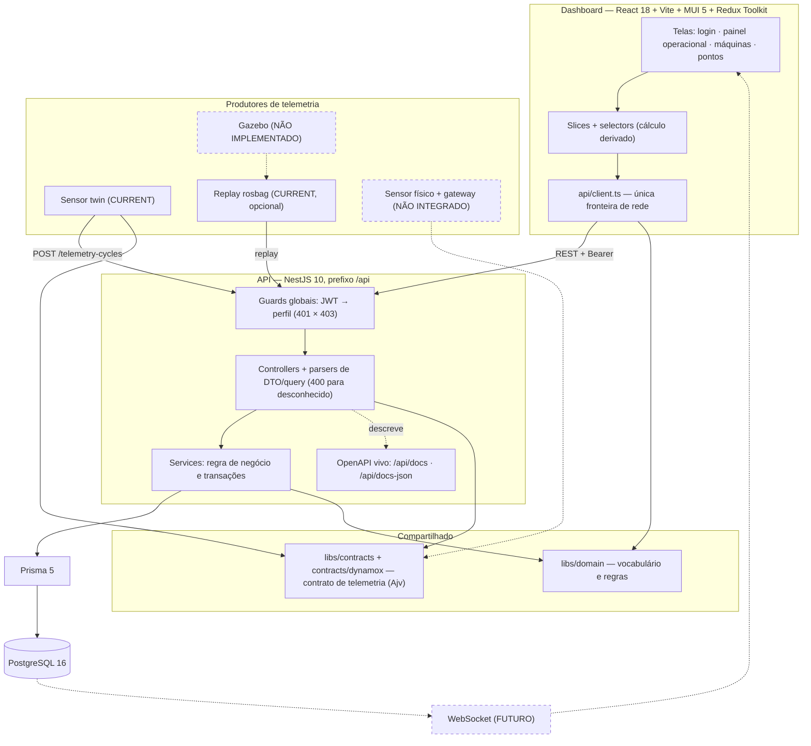

# Mapa da arquitetura

Leitura de ~5 minutos: o que existe, quem faz o quê e onde estão os limites. Cada bloco
linka para o documento que o detalha.

## O sistema em uma figura



Linha cheia = implementado. Tracejado = caminho de evolução, **sem código** — o dono desse
recorte é [`../05-simulation/simulation-vs-real.md`](../05-simulation/simulation-vs-real.md).

## Quem faz o quê

| Camada | Responsabilidade | Não faz |
|---|---|---|
| **Dashboard** | apresentar, agregar para exibição, refletir permissão | decidir permissão, validar regra de negócio |
| **Guards** | autenticar (`401`) e autorizar (`403`) | conhecer regra de domínio |
| **Controllers + parsers** | contrato HTTP; recusar entrada malformada com `400` | acessar banco |
| **Services** | regra de negócio, transações, tradução de conflito em `409`/`422` | formatar apresentação |
| **libs/domain** | vocabulário público e regras isomórficas | conhecer HTTP ou Prisma |
| **libs/contracts** | contrato de telemetria (Ajv), fingerprint, `resourceId` determinístico | persistir |
| **Prisma/PostgreSQL** | unicidade, cascatas, isolamento — a autoridade final | regra de apresentação |

Monorepo Nx sobre npm workspaces, com seis projetos: `apps/api`, `apps/web`, `libs/domain`,
`libs/contracts`, `libs/ui` e `simulation/sensor-twin`.

## O caminho do dado

**Entrada (ingestão)**

```
produtor → POST /api/telemetry-cycles (Bearer)
   → JwtAuthGuard → RolesGuard
   → Ajv (contrato interno)  → 400 com lista de violações
   → domínio (grandeza × eixo) → 422
   → idempotência (chave × fingerprint) → 200 duplicate | 409
   → transação: sensor → ponto → ciclo → séries → amostras
   → 201
```

**Saída (consulta)**

```
dashboard → GET /api/monitoring-points?page&sortBy&search&filtros
                (recorte resolvido no banco; total e página do mesmo snapshot)
          → GET /api/time-series, /:id/metrics, /:id/samples
   → thunks → slice → selectors (agregação derivada) → matriz, KPIs e gráficos
```

Detalhe passo a passo, com valores reais:
[`end-to-end-flow.md`](./end-to-end-flow.md).

## Onde estão as decisões

| Pergunta | Documento |
|---|---|
| Como o backend valida, autoriza e consulta? | [`../02-api/backend-architecture.md`](../02-api/backend-architecture.md) · [`../02-api/auth-and-rbac.md`](../02-api/auth-and-rbac.md) |
| Como a ingestão evita duplicar histórico? | [`../02-api/telemetry-ingestion.md`](../02-api/telemetry-ingestion.md) |
| O contrato é mesmo o da Dynamox? | [`../04-contracts/telemetry-contract.md`](../04-contracts/telemetry-contract.md) |
| Como o documento OpenAPI não mente? | [`../02-api/openapi.md`](../02-api/openapi.md) |
| O que o banco garante sozinho? | [`../03-domain/domain-and-persistence.md`](../03-domain/domain-and-persistence.md) |
| Como o frontend está organizado? | [`../01-dashboard/frontend-architecture.md`](../01-dashboard/frontend-architecture.md) |
| O que significa o "estado" na tela? | [`../01-dashboard/condition-monitoring.md`](../01-dashboard/condition-monitoring.md) |
| De onde vêm os dados? | [`../05-simulation/sensor-twin.md`](../05-simulation/sensor-twin.md) · [`../05-simulation/ros-integration.md`](../05-simulation/ros-integration.md) |
| Por que cada escolha estrutural? | [`../06-decisions/`](../06-decisions/) |
| O que as suítes provam? | [`../07-validation/testing-strategy.md`](../07-validation/testing-strategy.md) |

## Limites, em uma tela

- **Gazebo não existe** aqui: nenhum `.world`, `.urdf`, `.sdf` ou `.xacro` no repositório.
- **Nenhum sensor físico foi integrado**: toda telemetria é sintética e didática, e os
  clientes recusam por código qualquer host que não seja local.
- **Não há realtime**: a atualização é por consulta REST; WebSocket é caminho futuro
  ([ADR-0009](../06-decisions/adr-0009-rest-source-of-truth.md)).
- **Não há Fuzzy, forecast, RUL nem diagnóstico industrial**; os limiares de condição são
  didáticos.
- **Tudo roda localmente**: sem deploy, balanceador ou teste de carga.

A página que sustenta cada uma dessas afirmações é
[`../05-simulation/simulation-vs-real.md`](../05-simulation/simulation-vs-real.md).

## Para executar

Comandos, variáveis de ambiente, credenciais de demonstração e as verificações atuais estão
em [`docs/SETUP.md`](../../SETUP.md). O guia de entrega é o
[`README.md`](../../../README.md) da raiz.
