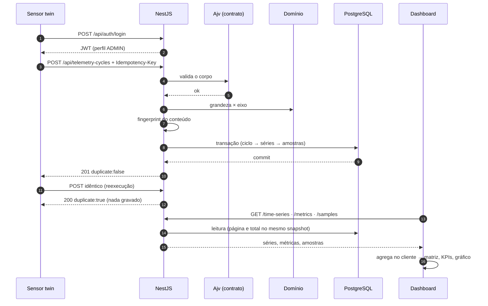

# Uma jornada ponta a ponta

Um ciclo real, do gerador ao gráfico: o sensor `SIM-HF-002`, instalado no mancal **NDE** da
bomba **P-101**, produz uma aquisição de 60 segundos que atravessa contrato, domínio,
transação e banco, e reaparece no dashboard como um desvio ≈3,49× em relação à baseline —
enquanto os outros onze sensores da frota ficam em ≈1,00×.

Cada passo aponta para o código que o executa.

## 1. O produtor gera o ciclo

A engine determinística sintetiza vibração a 1024 Hz, decima para 128 Hz e reduz cada
segundo a um valor RMS. Uma janela de 60 s vira **60 datapoints por métrica**, e o ciclo
carrega cinco métricas: aceleração RMS nos eixos x, y e z (em g), temperatura (°C) e
rotação (rpm).

O payload sai já no formato do contrato: `measuringSystemUniqueIdentifier` é o número de
série do sensor, cada medição traz o `resourceId` do ponto e `metadata.origin` declara
`simulation`. Mesma seed ⇒ mesmo payload, byte a byte.

> `simulation/sensor-twin/src/signal.ts`, `simulation/sensor-twin/src/windows.ts`,
> `simulation/sensor-twin/src/payload.ts`, `simulation/sensor-twin/src/fleet.ts` ·
> [`../05-simulation/sensor-twin.md`](../05-simulation/sensor-twin.md)

## 2. Autenticação

O twin faz login como qualquer cliente e usa o `Bearer` em todas as chamadas. Não existe
atalho: ele consome as mesmas rotas públicas da API que o dashboard consome.

Se o token faltasse: `401`. Se o perfil fosse VIEWER: `403` — ingestão altera estado.

> `apps/api/src/auth/*` · [`../02-api/auth-and-rbac.md`](../02-api/auth-and-rbac.md)

## 3. Contrato

O Ajv valida o corpo contra `contracts/dynamox/telemetry-cycle.schema.json`. Falha aqui
produz `400 CONTRACT_VIOLATION` **com a lista de violações** (caminho + mensagem), para o
produtor corrigir sem adivinhar.

É o mesmo arquivo do qual o schema publicado em `/api/docs-json` é derivado — por isso o
que a documentação promete é o que o runtime aplica.

> `libs/contracts/src/index.ts` ·
> [`../04-contracts/telemetry-contract.md`](../04-contracts/telemetry-contract.md) ·
> [`../02-api/openapi.md`](../02-api/openapi.md)

## 4. Regras de domínio

As medições são agrupadas por identidade de série (grandeza + eixo). Aceleração exige eixo;
temperatura e rotação não aceitam eixo e são persistidas com `Axis.NONE`. Violação aqui é
`422 QUANTITY_AXIS_MISMATCH` — payload íntegro, semanticamente impossível.

> `libs/domain/src/index.ts` · `apps/api/src/telemetry/telemetry.service.ts`

## 5. Idempotência

O backend calcula o `payloadFingerprint` (SHA-256 canônico do ciclo inteiro) e o compara
com o que já existe:

- conteúdo inédito → segue para a transação;
- conteúdo já ingerido → `200 duplicate:true`, sem gravar nada;
- mesma chave com conteúdo diferente → `409 IDEMPOTENCY_KEY_REUSED`.

A chave viaja no header porque o payload é fechado por contrato.

> [`../02-api/telemetry-ingestion.md`](../02-api/telemetry-ingestion.md) ·
> [ADR-0004](../06-decisions/adr-0004-idempotent-ingestion.md)

## 6. Transação

Dentro de uma única transação: o sensor é localizado pelo número de série (`404` se não
existir), verifica-se que ele está associado a um ponto (`422` se não), confere-se que todo
`resourceId` do ciclo corresponde ao `externalResourceId` **daquele** ponto (`422` se não),
cria-se o `IngestionCycle`, reusam-se ou criam-se as séries e inserem-se as amostras.

Antes de inserir, os instantes são checados: colisão com histórico existente aborta tudo com
`409`, em vez de sobrescrever. Ao final, o ciclo é atualizado com `sampleCount` e
`timeSeriesIds` — é o que faz uma repetição futura devolver exatamente a mesma resposta.

Resposta: **`201`**, com o header `Idempotency-Key` ecoado.

> `apps/api/src/telemetry/telemetry.service.ts`

## 7. O banco garante o resto

`@@unique([timeSeriesId, timestamp])` impede a mesma amostra duas vezes;
`@@unique([sensorId, physicalQuantity, axis])` impede duas séries para a mesma grandeza no
mesmo eixo. Não é a aplicação que evita duplicata — é o índice.

> `prisma/schema.prisma` ·
> [`../03-domain/domain-and-persistence.md`](../03-domain/domain-and-persistence.md)

## 8. Reexecução: a mesma requisição, de novo

Rodar o mesmo comando outra vez devolve **`200 duplicate:true`** para todos os ciclos, sem
nenhuma amostra nova. É o mesmo mecanismo que faz o replay de um artefato ROS provar que
reconstruiu a aquisição sem alterá-la
([`../05-simulation/ros-integration.md`](../05-simulation/ros-integration.md)).

## 9. Consulta

O dashboard carrega três fontes independentes (máquinas, pontos, séries) com
`Promise.allSettled` — falha em uma não derruba a tela — e depois busca métricas e amostras
das séries. A listagem de pontos vem paginada, ordenada e filtrada **pelo servidor**, com
`total` e `totalPages` do recorte e o eco dos filtros aplicados.

> `apps/web/src/features/dashboard/dashboardSlice.ts` ·
> [`../02-api/backend-architecture.md`](../02-api/backend-architecture.md)

## 10. Agregação e desenho

No cliente, funções puras pareiam os eixos Y e Z por timestamp, calculam
`radialRms = sqrt((y² + z²)/2)`, agrupam as amostras em janelas de aquisição e comparam a
janela recente com a baseline. `SIM-HF-002` aparece com razão ≈3,49× (rótulo "Atenção
demonstrativa", limiar didático de 2,0×); os demais ficam em ≈1,00× ("Normal
demonstrativo"). Em paralelo, o eixo de frescor classifica a idade da última leitura.

O gráfico plota amostra a amostra quando o volume permite, agrega em buckets quando não, e
representa lacuna como `null` — a linha se interrompe, nada é desenhado em zero.

> `apps/web/src/features/dashboard/dashboardAggregations.ts` ·
> [`../01-dashboard/condition-monitoring.md`](../01-dashboard/condition-monitoring.md)

## O que este passeio não incluiu

Fuzzy, forecast, diagnóstico de falha ou qualquer inferência sobre a máquina real: o
ranking prioriza inspeção e para aí. Também não houve WebSocket — a tela buscou os dados por
REST — nem qualquer contato com a plataforma Dynamox
([`../05-simulation/simulation-vs-real.md`](../05-simulation/simulation-vs-real.md)).
