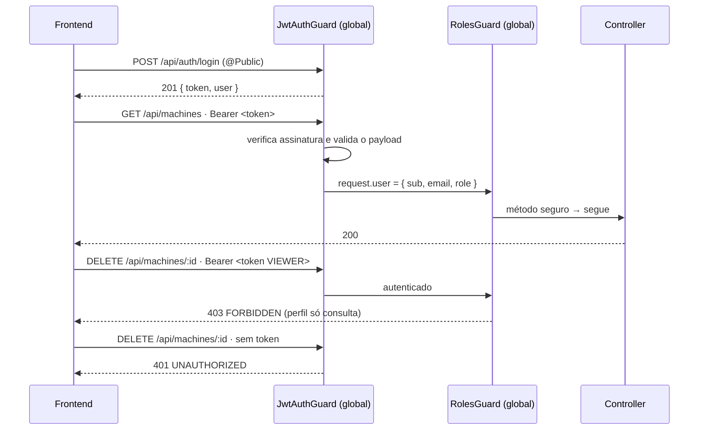

# Autenticação e autorização

Sessão JWT com credencial fixa (requisito do desafio) e dois perfis de acesso. O backend é
a autoridade: a interface espelha a permissão, não a decide
([ADR-0001](../06-decisions/adr-0001-backend-authority.md)).

## Ciclo de uma requisição



`401` e `403` respondem perguntas diferentes: **quem é você?** e **você pode?**. Trocar um
pelo outro faria o cliente tentar renovar a sessão quando o problema é permissão — ou
mostrar "faça login" para quem já está logado.

## Credenciais e senha

O desafio pede credencial fixa. O seed cria duas
([`prisma/seed.ts`](../../../prisma/seed.ts), valores em [`docs/SETUP.md`](../../SETUP.md)):
um perfil **ADMIN**, que consulta e altera, e um **VIEWER**, que só consulta. São
credenciais de demonstração, versionadas de propósito, para um banco local com dados
sintéticos.

A senha é guardada como `scrypt$<salt>$<hash>`: salt aleatório de 16 bytes, 64 bytes
derivados, verificação com `timingSafeEqual`
([`apps/api/src/auth/auth.service.ts`](../../../apps/api/src/auth/auth.service.ts)).
Nenhuma resposta da API expõe hash ou senha.

Duas defesas ficam explícitas no serviço:

- **`401` genérico**: e-mail inexistente e senha errada devolvem exatamente a mesma
  resposta. Distinguir os dois entrega um oráculo de e-mails cadastrados.
- **Custo constante**: quando o e-mail não existe, a verificação roda contra um hash de
  referência. Sem isso, a diferença de latência revelaria o que o corpo esconde.

## JWT

Emitido pela própria API (`@nestjs/jwt`) com `JWT_SECRET` e `JWT_EXPIRES_IN` do ambiente; a
API **recusa subir** sem segredo configurado. O payload carrega `sub`, `email` e `role`.

O guard trata esse payload como **dado externo**, mesmo tendo assinado o token
([`jwt-auth.guard.ts`](../../../apps/api/src/auth/jwt-auth.guard.ts)): `parseJwtPayload`
verifica os tipos e usa `isUserRole()` do domínio. Um token emitido *antes* da introdução
dos perfis é sintaticamente válido e não tem `role` — sem validação em runtime, a
autorização dependeria de um cast e um token antigo passaria com perfil indefinido. Sem
perfil reconhecível, a sessão não vale: `401`.

Mensagens de erro são genéricas de propósito — não se distingue token ausente, inválido,
adulterado ou expirado.

**Não existe logout no backend.** O JWT é stateless: encerrar sessão é descartar o token no
cliente. Sem blocklist e sem refresh token — a sessão dura o `JWT_EXPIRES_IN`. É uma
decisão de escopo, registrada aqui, não um esquecimento.

## Perfis (RBAC)

`UserRole` vive em [`libs/domain`](../../../libs/domain/src/index.ts), com a função
`canMutate(role)` — deliberadamente mínimo: o desafio usa credenciais fixas, não há
administração de usuários, e a única distinção que importa é **quem altera estado
persistido**.

No banco, a coluna `role` tem default `VIEWER` (menor privilégio) e a migração
`20260830120024_add_user_role` promove a usuários existentes o perfil ADMIN — preservando o
comportamento de quem administrava os dados antes de os perfis existirem
([`../03-domain/domain-and-persistence.md`](../03-domain/domain-and-persistence.md)).

### A regra do `RolesGuard`

```ts
allowed = required?.length
  ? required.includes(user.role)              // exceção declarada com @Roles(...)
  : SAFE_METHODS.has(request.method) || canMutate(user.role);
```

O padrão vem do **método HTTP**, não de uma lista de rotas: `GET`/`HEAD`/`OPTIONS` liberam
para qualquer autenticado; qualquer outro método exige perfil que possa alterar estado.
Consequência prática: **um endpoint de mutação criado amanhã já nasce restrito**, sem
depender de alguém lembrar de anotá-lo. `@Roles(...)` existe para exceções.

O guard também recusa quando `request.user` está ausente — isso significaria que a
autenticação não rodou, e assumir permissão nesse caso seria o pior default possível.

## Rotas públicas

Só duas, marcadas com `@Public()`: `GET /api/health` (probe usado *antes* do login) e
`POST /api/auth/login`. Todo o resto — inclusive telemetria e séries — exige `Bearer`.

## Frontend: espelho, não barreira

O frontend guarda o token em `sessionStorage` (`dynamox.jwt`) e injeta
`Authorization: Bearer` em todas as chamadas
([`apps/web/src/api/client.ts`](../../../apps/web/src/api/client.ts)).

Trade-off registrado: `sessionStorage` sobrevive ao reload da aba (a sessão é restaurada
por `GET /auth/me`), morre ao fechar o navegador; é mais simples que cookie httpOnly e
menos persistente que `localStorage` — porém legível por JavaScript, risco mitigado por não
haver conteúdo de terceiros na página. Sem refresh token.

O tratamento de `401` é centralizado no cliente HTTP e tem duas proteções contra corrida,
ambas achados de revisão:

1. um `401` **atrasado**, de uma requisição feita com o token antigo, não derruba um login
   novo — o handler só dispara se o token daquela requisição ainda for o atual;
2. na restauração de sessão, **só um `401` real** limpa o token; falha transitória (rede,
   `5xx`) preserva o JWT para o próximo reload.

`selectCanMutate` (em `authSlice`) esconde botões de alteração para o perfil VIEWER e os
painéis explicam por quê. Isso é **experiência**, não segurança: a barreira é o `403` do
servidor, e é ele que os testes cobrem.

## O que as suítes provam aqui

- `apps/api/test/auth.e2e-spec.ts` — login válido; `401` genérico idêntico para senha
  errada e e-mail inexistente; payload malformado; `/auth/me` sem campos sensíveis; rota
  privada sem token, com token inválido, adulterado e **expirado**; health público.
- `apps/api/test/rbac-and-query.e2e-spec.ts` — o perfil viaja no token e em `/auth/me`;
  VIEWER lê tudo e recebe `403` em **toda** mutação; a recusa **não altera o estado
  persistido**; ADMIN continua podendo alterar; sem token é `401`, distinto do `403`; token
  sem perfil reconhecível é recusado.
- `apps/api/test/openapi-contract.e2e-spec.ts` — o contrato publicado declara `401` em toda
  rota privada e `403` **apenas** em operações que alteram estado.
- Web: `authSlice.spec.ts` (reducer, thunks, sessão por perfil), `App.spec.tsx` (acesso
  direto sem sessão, reload com token, login → rota privada → logout → retorno bloqueado),
  `client.spec.ts` (as duas corridas de `401`) e os painéis em modo somente leitura.
