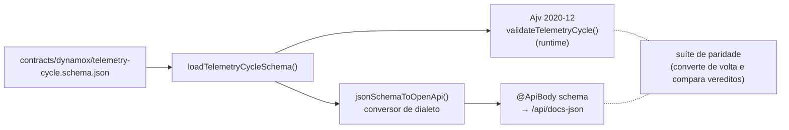

# OpenAPI — como o contrato publicado é gerado

A API publica a especificação em **`/api/docs`** (Swagger UI) e **`/api/docs-json`**
(documento OpenAPI 3 cru). Os dois vêm do mesmo objeto, montado por
`buildOpenApiDocument()` em [`apps/api/src/openapi.ts`](../../../apps/api/src/openapi.ts) —
a função é isolada justamente para que os testes gerem o documento **final** sem subir a
UI, e não avaliem decorators soltos.

## Peças

| Peça | Papel |
|---|---|
| `openapi.ts` | título, descrição, versão, `bearerAuth` e as tags das seções |
| `common/api-schemas.ts` | classes de resposta (`ErrorResponse`, `MachineResponse`, `MonitoringPointPageResponse`, `SeriesMetricsResponse`, `TelemetryIngestionResponse`, …) publicadas em `components.schemas` |
| decorators nos controllers | operação, corpo, parâmetros, exemplos e status por rota |
| `common/telemetry-request-schema.ts` | o corpo de `POST /telemetry-cycles`, **derivado** do contrato |
| `common/json-schema-to-openapi.ts` | conversor determinístico JSON Schema 2020-12 → OpenAPI 3.0 |

Os modelos de resposta são **classes**, e não interfaces, porque o gerador lê metadados em
tempo de execução: só assim cada rota publica um schema navegável em vez de uma frase
descrevendo o formato. Em `HealthResponse`, a classe documentada é também o tipo de retorno
do handler — uma definição só, sem risco de divergir.

## Fonte única para Ajv e OpenAPI

O corpo publicado **não é escrito à mão**: `telemetryCycleRequestSchema()` lê o mesmo
arquivo que alimenta o Ajv e o converte. O conversor trata exatamente as diferenças de
dialeto que este documento usa, e falha em vez de adivinhar quando encontra algo não
representável:

| JSON Schema 2020-12 | OpenAPI 3.0 |
|---|---|
| `type: ["string", "null"]` | `type: "string"` + `nullable: true` |
| `exclusiveMinimum: 0` (numérico) | `minimum: 0` + `exclusiveMinimum: true` |
| `$schema`, `$id`, `title` | removidos (descrevem o documento, não o dado) |

## O incidente que levou a isso

Vale registrar porque o aprendizado é o ponto, não o resultado.

O corpo de `POST /telemetry-cycles` era descrito no controller por um schema **escrito à
mão** — uma segunda cópia do contrato que o Ajv já aplicava. As duas cópias divergiram, e
a divergência não era cosmética:

| Campo | Contrato publicado dizia | Validador executado aplicava |
|---|---|---|
| `metadata.cycleId`, `metadata.synthetic`, `attributes.displayName` | obrigatórios | opcionais |
| `metadata.profile` | enum fechado | string livre |
| `measuringSystemModel.version` | `integer` | `number` |
| `configuration` | sete propriedades exigidas | só `monitoringLocationMap` |
| `resourceId` | string sem padrão | 24 hex minúsculos |
| `timestamp` | `date-time` genérico | milissegundos exatos com `Z` |

Uma revisão adversarial apontou o problema e ele foi **reproduzido em runtime**: um payload
que o contrato publicado declarava inválido era aceito pela API com `201`. Um cliente
gerado a partir daquele documento recusaria payloads bons e aceitaria payloads ruins.

A correção não foi transcrever melhor — transcrever de novo só adiaria o mesmo defeito. Foi
**eliminar a segunda cópia**: derivar o schema publicado do mesmo arquivo, apagar as
dezenas de linhas manuais e criar uma suíte que compara as duas portas. É a razão de
existir do [ADR-0006](../06-decisions/adr-0006-single-source-contract.md).

O mesmo episódio produziu correções menores no documento, todas com teste que as protege:
primitivos anuláveis publicados como `type: object` (uniões com `null` refletem como
`Object` em tempo de execução, e o tipo precisa ser declarado explicitamente); `403`
herdado por rotas `GET` do decorator de controller, embora VIEWER possa consultá-las; e o
header de idempotência publicado duas vezes porque o nome no decorator não batia, em caixa,
com o de `@Headers()` — e a segunda ocorrência, inferida, nascia como obrigatória.

## O que as suítes provam aqui

Duas suítes guardam o documento publicado — ambas contra o objeto **final**, o mesmo
servido em `/api/docs-json`:

**`apps/api/test/telemetry-schema-parity.e2e-spec.ts`** — paridade. Reconverte o schema
publicado para o dialeto do Ajv e exige que os dois cheguem ao **mesmo veredito** para cada
payload de um conjunto válido (ciclo mínimo, opcionais ausentes, `profile` como string
livre, `version` não inteiro, `configuration` completa, `mapValue` nulo) e de um conjunto
inválido (`resourceId` fora do padrão, `origin` ausente, `monitoringLocationMap` ausente,
propriedade extra, tipo errado, `measurements` vazio, `origin` fora do enum). Reintroduzir
qualquer uma das divergências da tabela acima quebra a suíte. Os exemplos publicados também
são validados pelo Ajv real — e há um teste que impede dois exemplos de colidirem no mesmo
instante da mesma série, para que executá-los pelo Swagger, em qualquer ordem, funcione.

**`apps/api/test/openapi-contract.e2e-spec.ts`** — forma do documento: toda resposta com
corpo aponta para um schema (`content[mediaType].schema`, não apenas `content`); nenhuma
propriedade primitiva é publicada como `object`, em qualquer profundidade (varre
propriedades, itens, combinadores e corpos de requisição); nenhum parâmetro é declarado
duas vezes; só parâmetros de rota são obrigatórios; toda rota privada publica `401`;
`403` aparece **apenas** em operações que alteram estado; erros referenciam
`ErrorResponse`, com a exceção consciente de `GET /api/health`, que responde `503` com o
mesmo corpo de saúde e `status: "degraded"`.

## Limites

- A UI é o Swagger padrão do NestJS. Nenhuma alternativa (Scalar, Redoc) foi adotada:
  seriam dependência e superfície novas para ganho estético.
- O documento descreve o comportamento; quem o **aplica** são os parsers dos DTOs e o Ajv.
  A garantia de que os dois concordam é a suíte de paridade — não a boa vontade de quem
  edita um decorator.
