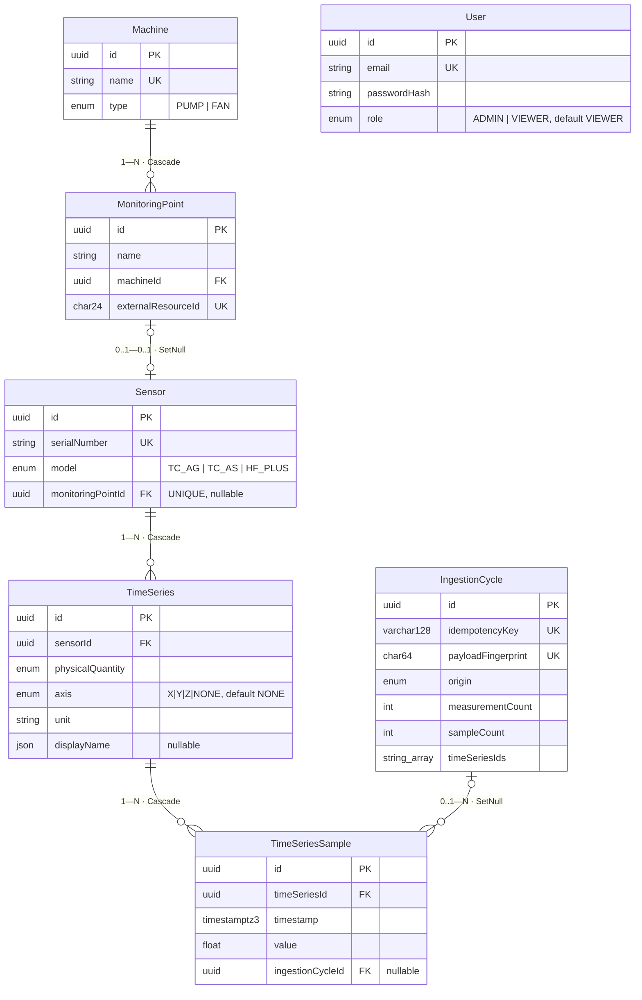

# Domínio e persistência

O que o sistema modela, como isso vira tabela no PostgreSQL e quais invariantes o banco
garante sozinho. Tudo aqui foi lido de [`prisma/schema.prisma`](../../../prisma/schema.prisma),
das migrações em [`prisma/migrations/`](../../../prisma/migrations/) e de
[`libs/domain/src/index.ts`](../../../libs/domain/src/index.ts) — nada é inferido por nome.

Decisão de fundo (por que PostgreSQL + Prisma, e não Mongo):
[ADR-0002](../06-decisions/adr-0002-postgresql-prisma.md).

## Vocabulário

O domínio isomórfico (`libs/domain`) é a fonte única do vocabulário **público**: `Pump` /
`Fan`, `TcAg` / `TcAs` / `HF+`, `acceleration` / `velocity` / `temperature` /
`rotationalSpeed`, eixos `x` / `y` / `z`. Ele é importado pela API, pelo frontend e pelo
sensor twin, então os três aplicam exatamente o mesmo critério.

O banco usa **outro** vocabulário, interno: `PUMP`, `TC_AG`, `HF_PLUS`, `ACCELERATION`,
`Axis.NONE`. A tradução vive nos mappers (`apps/api/src/common/*.mapper.ts`) e a razão
está declarada no próprio schema: enums do Prisma não aceitam `+`, então `HF+` não pode
ser um identificador de enum. A API nunca devolve o vocabulário interno — quem lê a
resposta vê `HF+`.

Regra de negócio central do desafio (`isSensorModelAllowedForMachine`, `libs/domain`):
uma máquina `Pump` recusa sensores `TcAg` e `TcAs`. A regra mora no domínio, não no
controller, para que a associação de sensor **e** a troca de tipo da máquina usem a mesma
função.

## Modelo



`User` não tem relação com o resto do grafo: a autenticação do desafio usa credenciais
fixas e nenhum dado é "de um usuário" — ver
[`../02-api/auth-and-rbac.md`](../02-api/auth-and-rbac.md).

## Chaves e unicidade

| Entidade | Identidade | Unicidade adicional |
|---|---|---|
| `Machine` | `id` (uuid) | `name` |
| `MonitoringPoint` | `id` | `externalResourceId`; `@@unique([machineId, name])` |
| `Sensor` | `id` | `serialNumber`; `monitoringPointId` (`@unique` — é o que limita a 1 sensor por ponto) |
| `TimeSeries` | `id` | `@@unique([sensorId, physicalQuantity, axis])` |
| `TimeSeriesSample` | `id` | `@@unique([timeSeriesId, timestamp])` |
| `IngestionCycle` | `id` | `idempotencyKey`; `payloadFingerprint` |
| `User` | `id` | `email` |

Todas essas restrições são do **banco**, não da aplicação: dois pedidos simultâneos de
criação da mesma máquina não viram duplicata porque o índice único rejeita o segundo, e o
serviço traduz o `P2002` do Prisma em `409` (`machines.service.ts`,
`monitoring-points.service.ts`). Nenhum fluxo faz "consulta antes de inserir" como
mecanismo de unicidade — isso seria uma corrida.

### `externalResourceId`

Identificador determinístico de 24 hexadecimais (`@db.VarChar(24)`) derivado por
`deterministicResourceId()` ([`libs/contracts`](../../../libs/contracts/src/index.ts)) do
**id imutável da máquina** + nome do ponto. Ele existe para que o ponto tenha, no formato
da API pública, um `resourceId` que produtores externos consigam recomputar sem consultar
o banco.

Ele é derivado do `id`, e não do nome da máquina, de propósito: renomear uma máquina — ou
criar outra com o nome antigo — não pode colidir com um `resourceId` já emitido
(`monitoring-points.service.ts`). Não é um ObjectId da Dynamox; ver
[`../04-contracts/telemetry-contract.md`](../04-contracts/telemetry-contract.md).

## Invariantes de série temporal

**Uma série por (sensor, grandeza, eixo).** `@@unique([sensorId, physicalQuantity, axis])`
é o que impede o mesmo sensor de acumular duas séries de "aceleração em Y" com unidades
diferentes.

**`Axis.NONE` em vez de `NULL`.** Temperatura e rotação não têm eixo. Se o eixo ausente
fosse `NULL`, a unicidade acima deixaria de funcionar: no PostgreSQL, dois `NULL` são
distintos, então `(sensor, temperature, NULL)` poderia ser inserido infinitas vezes. O
enum carrega um valor explícito para "não direcional" e o comentário está no próprio
schema. A tradução `axis: undefined ⇄ Axis.NONE` fica em `telemetry.mappers.ts`, e a
coerência grandeza × eixo (vetorial exige eixo; escalar recusa eixo) é validada no domínio
por `assertAxisValidForQuantity`, respondendo `422 QUANTITY_AXIS_MISMATCH`.

**Um instante, uma amostra.** `@@unique([timeSeriesId, timestamp])` faz a série ser um
histórico e não um saco de pontos: um replay do mesmo ciclo não consegue gravar a mesma
amostra de novo, e um ciclo *diferente* que tente ocupar um instante já ocupado recebe
`409 SAMPLE_TIMESTAMP_CONFLICT` em vez de sobrescrever histórico
([`../02-api/telemetry-ingestion.md`](../02-api/telemetry-ingestion.md)).

**Precisão temporal.** A coluna é `@db.Timestamptz(3)` — milissegundos. Por isso o
contrato de telemetria só aceita `YYYY-MM-DDTHH:mm:ss.SSSZ`: aceitar microssegundos faria
`…​.000100Z` e `…​.000200Z` colidirem na mesma linha depois do truncamento, que é perda
silenciosa de dado.

## Cadeia de deleção

As políticas `onDelete` são escolhas de modelagem, não defaults:

```
DELETE machine
   └─► monitoring_points        Cascade   (o ponto é uma posição NA máquina; sem máquina, não existe)
          └─► sensors           SetNull   (o sensor é um ativo físico; sobrevive desassociado)
                 └─► time_series          (permanecem: pertencem ao sensor, não ao ponto)
                        └─► samples       (permanecem)

DELETE sensor
   └─► time_series              Cascade
          └─► time_series_samples  Cascade

DELETE time_series
   └─► time_series_samples      Cascade   (é o que TS-05 usa)

DELETE ingestion_cycle
   └─► samples.ingestionCycleId SetNull   (a amostra continua; perde só a referência ao ciclo)
```

A consequência que costuma surpreender: **excluir uma máquina não apaga sensores nem
histórico**. O sensor é um equipamento que pode ser realocado; suas séries continuam
existindo, agora sem máquina e sem ponto associados. É por isso que
`TimeSeriesSummary.machineName`, `machineType` e `monitoringPointName` são
`string | null` no domínio — a API prefere devolver `null` a inventar um valor.

Na direção oposta, o ciclo de ingestão é preservado quando a série é apagada
(`telemetry.service.ts`, `removeTimeSeries`): o registro de que *aquela ingestão
aconteceu* é auditoria, e apagá-lo junto com os dados destruiria o rastro.

## Idempotência no modelo

`IngestionCycle` guarda duas identidades diferentes, ambas únicas:

- `idempotencyKey` (`VarChar(128)`) — a **intenção** do cliente (o header
  `Idempotency-Key`, ou o próprio fingerprint quando o header não vem);
- `payloadFingerprint` (`Char(64)`) — o **conteúdo**, SHA-256 canônico do ciclo inteiro.

Separar as duas é o que permite distinguir uma repetição legítima (mesmo conteúdo) de uma
chave reutilizada para outro conteúdo (`409`). O ciclo também guarda `timeSeriesIds`,
`measurementCount` e `sampleCount` para que a resposta de uma repetição seja **idêntica**
à da ingestão original sem recalcular nada. Mecanismo completo em
[`../02-api/telemetry-ingestion.md`](../02-api/telemetry-ingestion.md); o porquê, em
[ADR-0004](../06-decisions/adr-0004-idempotent-ingestion.md).

`origin` (`IngestionOrigin`: `SIMULATION`, `ROSBAG_REPLAY`, `SEED`, `MANUAL`) registra a
procedência de cada ciclo. É o que permite responder "de onde veio este dado?" olhando
apenas o banco — e é a razão de o contrato interno exigir `metadata.origin`
([`../04-contracts/telemetry-contract.md`](../04-contracts/telemetry-contract.md)).

## Migrações e seed

Três migrações versionadas, aplicadas com `prisma migrate deploy`:

1. `20260826195036_init_domain_and_telemetry` — domínio e telemetria;
2. `20260826200000_idempotency_fingerprint_and_series_invariants` — fingerprint e as
   unicidades de série/amostra;
3. `20260830120024_add_user_role` — coluna `role` com default `VIEWER` **e** um
   `UPDATE "users" SET "role" = 'ADMIN'` que promove quem já existia. O default é o menor
   privilégio; a linha de promoção preserva o comportamento do usuário legado, que
   administrava os dados antes de os perfis existirem.

O seed ([`prisma/seed.ts`](../../../prisma/seed.ts)) é idempotente (upsert por chave
natural) e cria: os dois usuários de demonstração (ADMIN e VIEWER), a bomba P-101 com dois
pontos (DE/NDE), sensores `SIM-HF-001/002` e séries com amostras determinísticas. Rodá-lo
duas vezes não duplica nada. Credenciais e comandos: [`docs/SETUP.md`](../../SETUP.md).
