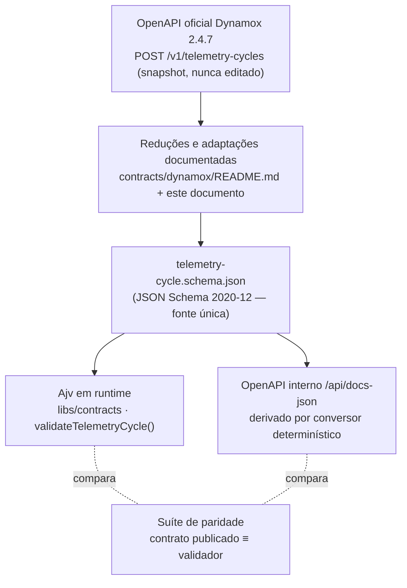

# Contrato interno de telemetria

> **A pergunta que este documento responde:** implementamos a Dynamox, ou inventamos um
> contrato nosso com nome parecido?
>
> Resposta curta: o corpo aceito por `POST /api/telemetry-cycles` é o corpo do
> `POST /v1/telemetry-cycles` da API pública Dynamox 2.4.7, **reduzido** — mais estrito em
> vários pontos, mais permissivo em nenhum. Um payload aceito pelo nosso backend é
> estruturalmente válido para o contrato público; o inverso não vale.

Fonte do lado deles: o snapshot em
[`contracts/dynamox/dynamox-public-api.openapi.json`](../../../contracts/dynamox/dynamox-public-api.openapi.json)
(proveniência em [`dynamox-upstream.md`](./dynamox-upstream.md)). Fonte do lado nosso:
[`contracts/dynamox/telemetry-cycle.schema.json`](../../../contracts/dynamox/telemetry-cycle.schema.json),
lido campo a campo.

## Linhagem

Um único arquivo define o contrato. O Ajv o aplica em runtime e o documento OpenAPI é
**derivado** dele — não transcrito ([`../02-api/openapi.md`](../02-api/openapi.md),
[ADR-0006](../06-decisions/adr-0006-single-source-contract.md)).

## Campo a campo

Classificação: **PRESERVADO** (idêntico ao público) · **REDUÇÃO** (aceitamos um
subconjunto do que o público aceita) · **ADAPTAÇÃO** (mesma intenção, forma ajustada ao
protótipo). Não há nenhuma linha em que o contrato interno aceite algo que o público
recusa.

| Campo | Público 2.4.7 | Interno | Classificação |
|---|---|---|---|
| raiz `required` | `[telemetryCycleData, configuration]` | idem | PRESERVADO |
| raiz `additionalProperties` | não declarado (aberto) | `false` | REDUÇÃO |
| `telemetryCycleData.additionalProperties` | `false` | `false` | PRESERVADO |
| `telemetryCycleData.required` | 5 campos | os mesmos 5 | PRESERVADO |
| `measuringSystemUniqueIdentifier` | `string` | `string` 1–128 | REDUÇÃO |
| `measuringSystemModel` | objeto fechado, `required [name, version]` | idem | PRESERVADO |
| `measuringSystemModel.version` | `number` (o corpo; a *resposta* 201 diz `integer`) | `number` | PRESERVADO |
| `measurements` | array sem `minItems` | `minItems: 1` | REDUÇÃO |
| `measurements[].additionalProperties` | `false` | `false` | PRESERVADO |
| `measurements[].required` | `[resourceId, attributes, dataPoints]` | idem | PRESERVADO |
| `resourceId` | `^[0-9a-fA-F]{24}$` | `^[0-9a-f]{24}$` | ADAPTAÇÃO |
| `attributes.additionalProperties` | `true` | `true` | PRESERVADO |
| `attributes.required` | `[physicalQuantity]` | `[physicalQuantity, unit]` | REDUÇÃO |
| `attributes.physicalQuantity` | `string` livre | enum de 4 valores | REDUÇÃO |
| `attributes.axis` | não declarado (permitido pelo objeto aberto) | enum `x\|y\|z`, opcional | ADAPTAÇÃO |
| `attributes.unit` | não declarado (permitido) | `string` 1–32, obrigatória | REDUÇÃO |
| `attributes.displayName` | não declarado (existe no Metric Descriptor) | objeto de strings | ADAPTAÇÃO |
| `dataPoints` | array `minItems: 1` | idem | PRESERVADO |
| `dataPoints[].additionalProperties` | não declarado (aberto) | `false` | REDUÇÃO |
| `dataPoints[].timestamp` | `date-time` (fração livre) | `date-time` **+** `YYYY-MM-DDTHH:mm:ss.SSSZ` | REDUÇÃO |
| `dataPoints[].value` | `number \| boolean` | `number` | REDUÇÃO |
| `metadata` | objeto livre, sem `required` | aberto, `required [origin, generator]`, opcionais tipados | REDUÇÃO |
| `metadata.origin` | inexistente | enum `simulation\|rosbag-replay\|seed\|manual` | ADAPTAÇÃO |
| `tags` | array `minItems: 0` de `string` | idem, itens `minLength: 1` | REDUÇÃO |
| `configuration` | objeto livre | aberto, `required [monitoringLocationMap]` | REDUÇÃO |
| `monitoringLocationMap` | declarado em `POST /v1/configuration-slots` como `monitoringLocationMapSchema`, itens sem `required` | `minItems: 1`, itens fechados com `required [mapLabel, mapValue]` | ADAPTAÇÃO + REDUÇÃO |
| `mapValue` | `string(24 hex) \| null` | `string \| null` com o mesmo padrão | PRESERVADO |

### Por que cada redução existe

A decisão de reduzir em vez de espelhar ou inventar está em
[ADR-0005](../06-decisions/adr-0005-internal-contract-reduction.md).

- **Fechar a raiz e `dataPoints`** — a política de toda a API é recusar propriedade
  desconhecida com `400` em vez de ignorá-la ([`../02-api/backend-architecture.md`](../02-api/backend-architecture.md));
  aceitar um campo que ninguém lê faz o cliente acreditar que ele significa alguma coisa.
- **Limites de string** (`1–128`, `1–32`, `1–256`) — o identificador do sistema de medição
  vira chave de busca (`serialNumber`) e a unidade vira rótulo de gráfico; texto sem teto
  é abuso de índice, não consulta.
- **`measurements.minItems: 1`** — um ciclo sem medição nenhuma não tem o que persistir; o
  público permite, mas para nós seria um `201` sem efeito.
- **`value` só número** — o protótipo gera apenas grandezas contínuas, e a coluna
  correspondente é `Float`. Aceitar booleano exigiria um segundo caminho de persistência
  sem nenhum produtor que o use.
- **Timestamp canônico em milissegundos** — a coluna é `TIMESTAMPTZ(3)`. Aceitar
  microssegundos truncaria dois instantes distintos para a mesma linha: perda silenciosa
  de dado, e uma amostra "desaparecida" na unicidade `(série, instante)`.
- **`physicalQuantity` como enum e `unit` obrigatória** — cada medição vira uma série com
  `@@unique(sensor, grandeza, eixo)` e uma unidade imutável; grandeza livre tornaria a
  identidade da série indeterminada.
- **`configuration.monitoringLocationMap` obrigatório** — decisão registrada sobre uma
  inconsistência da própria especificação pública (ela exige `monitoringLocationMap` no
  `required` e declara `monitoringLocationMapSchema` em `properties`); o campo canônico
  interno é `monitoringLocationMap`, e um teste garante que o alias não vaza. Detalhe em
  [`dynamox-contract-drift.md`](./dynamox-contract-drift.md) §1.1.

### `metadata.required: [origin, generator]` — o ponto sensível

Esta é a única linha em que o contrato interno **acrescenta obrigatoriedade** onde o
público não declara nada: `metadata` é, lá, um objeto livre.

- **`origin` — `CONFIRMADO`.** A obrigatoriedade é forçada pela persistência:
  `IngestionCycle.origin` é uma coluna `NOT NULL` do enum `IngestionOrigin`
  (`prisma/schema.prisma`) e o serviço a preenche traduzindo `metadata.origin`
  (`apps/api/src/telemetry/telemetry.service.ts`, mapa `ORIGIN_TO_PRISMA`). Sem o campo,
  não há ciclo a gravar. É o que permite responder "de onde veio este dado?" —
  simulação, replay de rosbag, seed ou entrada manual — consultando só o banco.
- **`generator` — racional `DESCONHECIDO`.** Nenhum consumidor lê este campo: ele é
  gravado dentro do JSON de `metadata` e nada no backend o interpreta (busca em
  `apps/`, `libs/` e `prisma/` só encontra produtores e exemplos). A intenção declarada
  do bloco no schema é "procedência do ciclo", coerente com `origin`, mas o motivo de
  torná-lo **obrigatório** não pode ser recuperado com segurança a partir do repositório.
  Trate como **assumption explícita do projeto**, não como exigência derivada de fonte.

Consequência prática: um produtor que respeite o contrato público mas não envie
`metadata.generator` recebe `400 CONTRACT_VIOLATION` aqui. Isso é uma decisão de projeto,
está registrado, e é o tipo de item que deve ser reconfirmado (ou relaxado) antes de
qualquer uso fora do desafio.

## O que este contrato não promete

- **Não é o contrato oficial.** O próprio schema declara isso na `description`: aceitação
  por um workspace produtivo dependeria do *Resource Model* correspondente, que não é
  público. Nenhuma chamada foi feita à API da Dynamox — ver
  [`../05-simulation/simulation-vs-real.md`](../05-simulation/simulation-vs-real.md).
- **`resourceId` e `mapValue` não são ObjectIds da Dynamox.** São identificadores internos
  determinísticos (SHA-256 truncado a 24 hex minúsculos) que apenas *coincidem* com o
  formato público; ver [`../03-domain/domain-and-persistence.md`](../03-domain/domain-and-persistence.md).
- **A idempotência é nossa.** O `Idempotency-Key` viaja no header HTTP justamente porque
  `telemetryCycleData` é fechado e não aceitaria um campo novo. Vale notar que a própria
  API pública tem uma semântica de duplicata por conteúdo — o `200` dela responde
  *"TelemetryCycleV2 with same hash already exists"* —, o que torna nosso `200
  duplicate:true` uma extensão coerente, e não uma invenção. Ver
  [ADR-0004](../06-decisions/adr-0004-idempotent-ingestion.md).
- **`NormalizedMetric` nunca foi construído.** A análise de origem propunha um formato
  analítico intermediário com esse nome ([`dynamox-sensor-api-mapping.md`](./dynamox-sensor-api-mapping.md)
  §5). Ele não existe: o papel de "formato único validado" ficou com este contrato, e o
  documento antigo permanece como registro da alternativa considerada.

## Onde isto é verificado

Sem contagens (política do [README](../README.md) desta base) — o que importa é o que cada
suíte prova:

- `apps/api/test/contract.spec.ts` — o exemplo versionado é válido; campo extra no topo,
  `resourceId` fora do formato e `configuration` sem `monitoringLocationMap` são
  recusados; o alias `monitoringLocationMapSchema` **não** existe no contrato interno.
- `apps/api/test/telemetry-schema-parity.e2e-spec.ts` — para cada payload de um conjunto
  válido e de um conjunto inválido, o schema **publicado** e o validador **executado**
  chegam ao mesmo veredito. Reintroduzir uma divergência quebra a suíte.
- `apps/api/test/telemetry.e2e-spec.ts` — o comportamento HTTP correspondente (400 com
  lista de violações, 409, 422) contra PostgreSQL real.
