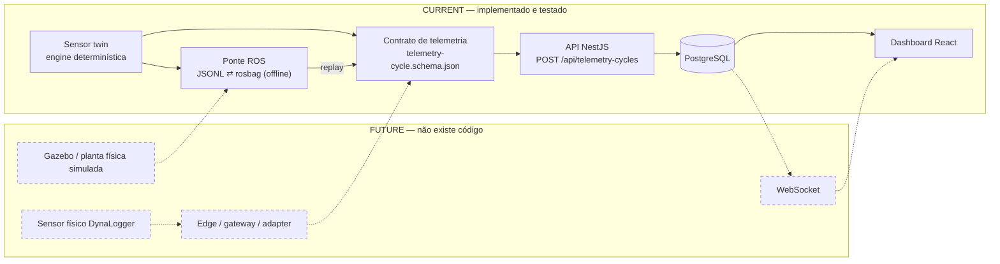

# Simulação × mundo real

Este é o **documento dono** da separação entre o que existe e o que não existe. Se algum
outro texto desta base parecer sugerir que Gazebo, um sensor físico Dynamox ou atualização
em tempo real fazem parte do sistema, é este documento que prevalece.

| Componente | Status |
|---|---|
| Sensor twin determinístico (frota sintética) | **CURRENT** |
| Ponte de proveniência ROS (rosbag offline) | **CURRENT**, opcional |
| Contrato de telemetria + API + PostgreSQL | **CURRENT** |
| Dashboard React | **CURRENT** |
| **Gazebo** (mundo/URDF/SDF/Xacro simulado) | **NÃO IMPLEMENTADO** |
| **Sensor físico Dynamox integrado** | **NÃO INTEGRADO** |
| **Realtime / WebSocket** | **FUTURO** |
| Fuzzy, forecast, RUL, diagnóstico industrial | **NÃO IMPLEMENTADO** |

## A cadeia que existe hoje



Linha cheia = existe. Linha tracejada = **caminho de evolução, sem código**.

O ponto de convergência é sempre o mesmo: **o contrato de telemetria**. Qualquer produtor
— twin, replay de bag, gateway de um sensor real — entra pelo mesmo endpoint, com o mesmo
schema, a mesma validação e a mesma idempotência. É o que torna a substituição do produtor
uma troca, e não uma reescrita.

## Guards de código: por que dados sintéticos não chegam à Dynamox

A separação não é convenção nem aviso em documento: está no código, nos **dois** clientes
que poderiam falar com a rede.

| Guard | Arquivo | O que recusa |
|---|---|---|
| `assertLocalApiBaseUrl` | [`apps/web/src/api/client.ts`](../../../apps/web/src/api/client.ts) | URL inválida e qualquer host `*.dynamox.solutions` / `*.dynamox.net` |
| `assertLocalBaseUrl` | [`simulation/sensor-twin/src/ingest.ts`](../../../simulation/sensor-twin/src/ingest.ts) | os mesmos domínios **e** qualquer host que não seja `localhost` / `127.0.0.1` |

Ambos rodam na inicialização e lançam erro — a aplicação não sobe apontando para o lugar
errado. Da API pública, este repositório usa apenas o **documento** de especificação,
capturado uma vez e versionado
([`../04-contracts/dynamox-upstream.md`](../04-contracts/dynamox-upstream.md)). Nenhum
endpoint produtivo foi chamado; nenhuma credencial existe aqui. Ver
[ADR-0008](../06-decisions/adr-0008-synthetic-isolation.md).

## Gazebo — NÃO IMPLEMENTADO

**Não existe nenhum artefato de Gazebo neste repositório**: nenhum `.world`, `.urdf`,
`.sdf`, `.xacro` ou `.launch`; nenhum pacote, nenhuma dependência.

Houve planejamento histórico: a primeira versão do plano do bônus previa ROS 1 Noetic +
Gazebo 11 com modelagem do ativo. Isso foi **cortado por decisão de escopo** — o valor
demonstrado por um mundo 3D era desproporcional ao custo, e o que o desafio pede é a
cadeia de dados, não a física da máquina. Os planos permanecem em
[`../archive/planning/`](../archive/planning/) como registro da decisão, não como intenção
corrente.

**Onde Gazebo entraria, se um dia entrar:** como *produtor* alternativo, antes da ponte
ROS — uma planta simulada publicando tópicos que a mesma ponte converteria para o mesmo
contrato de telemetria. Nada abaixo do contrato (validação, idempotência, domínio,
persistência) mudaria. É por isso que a ausência dele não é dívida arquitetural: o encaixe
já existe.

## Sensor físico — NÃO INTEGRADO

Nenhum sensor real foi conectado. Nenhum dado deste repositório vem de equipamento; toda
telemetria é sintética e didática, e o twin declara isso no próprio payload
(`metadata.origin`, `metadata.synthetic`).

**Como um sensor real entraria:**

```
sensor físico (ex.: DynaLogger)
   → coletor / gateway na borda
   → adapter que traduz o formato do fabricante
   → o MESMO contrato de telemetria
   → POST /api/telemetry-cycles
```

O que o gateway precisaria prover, e que o contrato já exige:

- `measuringSystemUniqueIdentifier` correspondente a um sensor **cadastrado e associado** a
  um ponto (senão `404`/`422`);
- `resourceId` igual ao `externalResourceId` do ponto — a amarração que impede gravar dado
  no lugar errado;
- timestamps em UTC canônico com milissegundos exatos, com relógio sincronizado;
- `Idempotency-Key` (ou aceitar que o fingerprint do conteúdo seja a chave), para que
  retransmissão por falha de rede não duplique histórico;
- `metadata.origin` — hoje o enum não tem um valor para aquisição física; integrar exigiria
  acrescentá-lo ao contrato e ao enum `IngestionOrigin` do banco.

O que **não** mudaria: contrato, validação, idempotência, modelo de domínio, persistência,
consultas e dashboard. A troca é de produtor.

O que ainda seria necessário e não existe: credenciais e homologação junto ao fabricante,
o *Resource Model* correspondente na plataforma real, calibração e limiares reais (os
nossos são didáticos), e um caminho de reconciliação para dados atrasados ou fora de ordem.

## Realtime / WebSocket — FUTURO

Não há WebSocket no repositório: nenhuma dependência, nenhum gateway, nenhum canal. A
atualização do dashboard é por consulta REST.

O desenho pretendido, quando for a hora
([ADR-0009](../06-decisions/adr-0009-rest-source-of-truth.md)): REST + PostgreSQL
permanecem a **fonte de verdade**; o socket seria um canal de *notificação* — "a série X
mudou" — e o cliente continuaria buscando o dado pelo mesmo contrato. A costura natural é a
publicação de um evento **após** a transação de ingestão em
[`apps/api/src/telemetry/telemetry.service.ts`](../../../apps/api/src/telemetry/telemetry.service.ts):
antes do commit, o evento poderia anunciar algo que ainda pode ser desfeito.

Um socket que empurrasse o dado como fonte primária criaria um segundo caminho de leitura,
com semântica própria de ordem e reentrega, competindo com o histórico do banco. É
exatamente o que não se quer.

## Limites e não-alegações desta fronteira

- Os limiares de condição (1,5× e 2,0×) são **didáticos**, calibrados contra o gerador
  sintético; não derivam de norma nem de hardware
  ([`../01-dashboard/condition-monitoring.md`](../01-dashboard/condition-monitoring.md)).
- O ranking do supervisor prioriza inspeção; **não** é diagnóstico, predição de falha nem
  vida útil remanescente.
- O formato do payload coincide com o da API pública, mas **compatibilidade com um
  workspace produtivo não é prometida** — ela dependeria do *Resource Model*
  correspondente, que não é público.
- `resourceId` e `mapValue` são identificadores internos determinísticos, não ObjectIds
  emitidos pela Dynamox.
- Não há deploy, balanceador, teste de carga nem ambiente em nuvem: tudo roda localmente.
