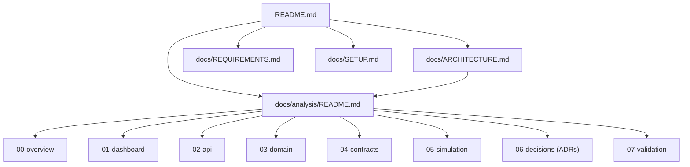

# Engineering Knowledge Base — Desafio Full-Stack Dynamox

> **Entrada da entrega (em inglês):** [`README.md`](../../README.md) →
> [`docs/ARCHITECTURE.md`](../ARCHITECTURE.md) (história arquitetural, diagramas Mermaid) →
> [`docs/REQUIREMENTS.md`](../REQUIREMENTS.md) (matriz requisito × evidência). Esta pasta é o
> aprofundamento: cada documento abaixo é o dono canônico de um assunto.

Esta pasta é a **base de conhecimento de engenharia** do projeto: arquitetura, domínio,
contratos, decisões, fronteiras e limitações do sistema **como ele é hoje**. Um
engenheiro que nunca viu o repositório deve conseguir entender o sistema aqui, sem
precisar de nenhuma outra ferramenta.

## Notion × esta base

| Pergunta | Onde se responde |
|---|---|
| O que ainda falta? Qual o status? De quem é a tarefa? Qual o prazo? | **Notion** (board operacional) |
| Como o sistema funciona? Por que foi feito assim? O que ele não faz? | **Aqui** |

O board do Notion é a verdade **operacional** (tarefas, sprint, status, prioridades,
blockers, user stories, checklist de entrega). Esta base é a verdade **técnica durável**.
Nada aqui repete o board: não há status de tarefa, sprint, responsável ou data de
entrega nesta pasta — e os documentos técnicos não são relatórios de progresso.

## Como navegar

| Pasta | Conteúdo | Comece por |
|---|---|---|
| [`00-overview/`](./00-overview/) | visão geral do sistema, jornada ponta a ponta e FAQ técnico | [`architecture-map.md`](./00-overview/architecture-map.md) |
| [`01-dashboard/`](./01-dashboard/) | frontend React/Redux e o modelo de condição exibido | [`frontend-architecture.md`](./01-dashboard/frontend-architecture.md) |
| [`02-api/`](./02-api/) | backend NestJS: módulos, autenticação/RBAC, ingestão, OpenAPI | [`backend-architecture.md`](./02-api/backend-architecture.md) |
| [`03-domain/`](./03-domain/) | modelo de domínio e persistência (Prisma/PostgreSQL) | [`domain-and-persistence.md`](./03-domain/domain-and-persistence.md) |
| [`04-contracts/`](./04-contracts/) | API pública Dynamox (snapshot) × contrato interno de telemetria | [`telemetry-contract.md`](./04-contracts/telemetry-contract.md) |
| [`05-simulation/`](./05-simulation/) | sensor twin, ponte ROS e a fronteira simulação × mundo real | [`simulation-vs-real.md`](./05-simulation/simulation-vs-real.md) |
| [`06-decisions/`](./06-decisions/) | ADRs — por que cada decisão estrutural foi tomada | [`README.md`](./06-decisions/README.md) |
| [`07-validation/`](./07-validation/) | o que as suítes provam, validação do motor e rastreabilidade das capacidades além do enunciado (a matriz do desafio está em [`docs/REQUIREMENTS.md`](../REQUIREMENTS.md)) | [`testing-strategy.md`](./07-validation/testing-strategy.md) |
| [`archive/`](./archive/) | material histórico; **não** descreve o sistema atual | [`README.md`](./archive/README.md) |

Fora desta pasta: [`docs/SETUP.md`](../SETUP.md) (guia operacional — como subir, rodar e
verificar), [`README.md`](../../README.md) da raiz (entrega),
[`contracts/dynamox/README.md`](../../contracts/dynamox/README.md) (proveniência do
snapshot público) e [`simulation/sensor-twin/README.md`](../../simulation/sensor-twin/README.md)
(guia de operação do twin).

## Convenções

### 1. Estado: CURRENT · FUTURE · HISTORICAL

Todo componente citado carrega um destes rótulos quando há qualquer risco de confusão:

| Rótulo | Significado |
|---|---|
| **CURRENT** | existe no repositório, roda e é coberto por teste |
| **FUTURE / NÃO IMPLEMENTADO** | descrito apenas como caminho de evolução; **não existe código** |
| **HISTORICAL** | descreve um desenho anterior; foi superado |

O dono canônico dessa separação é
[`05-simulation/simulation-vs-real.md`](./05-simulation/simulation-vs-real.md): Gazebo,
sensor físico Dynamox e realtime/WebSocket são discutidos lá, sempre marcados como não
implementados. Os demais documentos referenciam esse documento em vez de repetir a
narrativa.

### 2. Taxonomia de evidência

Herdada da análise de origem
([`04-contracts/dynamox-sensor-api-mapping.md`](./04-contracts/dynamox-sensor-api-mapping.md))
e usada sempre que houver ambiguidade:

| Nível | Significado |
|---|---|
| `CONFIRMADO` | declarado diretamente pelo código, schema, migração, teste ou contrato versionado |
| `DERIVADO` | deduzido de algo confirmado, com a derivação explícita |
| `HIPÓTESE` | escolha nossa de projeto, sem fonte externa que a imponha |
| `DESCONHECIDO` | não é possível concluir com as fontes disponíveis — e isso é dito |

Racional histórico que não pode ser recuperado com segurança é registrado como
`DESCONHECIDO`. Não se inventa justificativa retroativa.

### 3. Números voláteis

Contagens de teste **não** aparecem nesta base. Elas mudam a cada suíte nova e
apodrecem em silêncio dentro de documentos que ninguém revisita. O número atual vive em
um lugar só: [`docs/SETUP.md`](../SETUP.md) (seção *Verificações*).

Aqui documenta-se **o que cada suíte prova** — ver
[`07-validation/testing-strategy.md`](./07-validation/testing-strategy.md). O mesmo vale
para hashes de commit, datas de auditoria e métricas de execução: cita-se o método e a
ordem de grandeza, nunca uma tabela congelada.

### 4. ADR × documento arquitetural

- **ADR** ([`06-decisions/`](./06-decisions/)) responde **por quê**: contexto,
  alternativas rejeitadas e consequências.
- **Documento arquitetural** responde **como** e **o que é hoje**.

Quando os dois tratam do mesmo assunto, o documento arquitetural descreve o mecanismo e
linka o ADR; o ADR não repete o mecanismo.

### 5. Links e caminhos

Links são sempre relativos e apontam para arquivos versionados. Todo caminho citado como
evidência (`apps/api/src/...`) existe no repositório — é verificável com um `ls`.

### 6. Casa única por assunto

Cada limitação tem um dono: limitações de **fronteira** (o que não é real) ficam em
[`simulation-vs-real.md`](./05-simulation/simulation-vs-real.md); limitações de
**verificação** (o que não é testado) ficam em
[`testing-strategy.md`](./07-validation/testing-strategy.md); limitações **por requisito**
ficam em [`docs/REQUIREMENTS.md`](../REQUIREMENTS.md) e, para as capacidades além do
enunciado, em [`traceability.md`](./07-validation/traceability.md).

### 7. Arquivo histórico

Nada é apagado. Documentos superados vão para [`archive/`](./archive/) com um banner
`HISTÓRICO` no topo. Estar no arquivo não significa estar errado — significa que aquele
texto descreve uma etapa anterior do projeto.

## Mapa dos documentos

