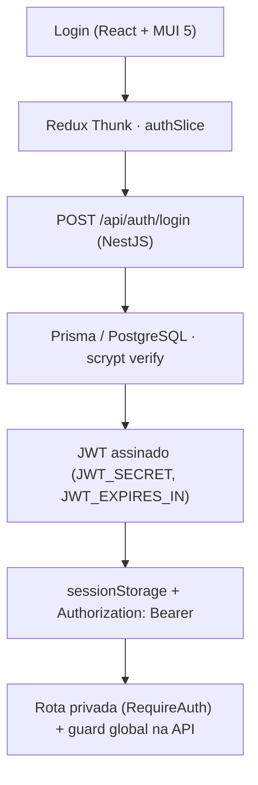

# Autenticação — arquitetura implementada (AUT-01 · AUT-02 · AUT-03)

> **HISTÓRICO — este documento descreve uma etapa anterior do projeto e não
> representa a arquitetura atual.** Seu conteúdo técnico ainda válido foi migrado para
> [`../../02-api/auth-and-rbac.md`](../../02-api/auth-and-rbac.md), que também cobre os
> perfis de acesso — inexistentes quando este texto foi escrito.
> Para o sistema como ele é hoje, comece por
> [`../../00-overview/architecture-map.md`](../../00-overview/architecture-map.md).

> **Nota de auditoria (29/08/2026).** Documento fiel ao ciclo de 27/08; a arquitetura
> descrita segue em produção no repo. Contagens atuais (152 API + 82 web, tudo verde,
> revalidado em clone limpo) na [matriz de evidências](../../07-validation/traceability.md).

Registro do que **está implementado e testado** — não é proposta.



## Usuário seed

Criado por `npm run seed` (idempotente — upsert por e-mail; rodar duas vezes não duplica):
`analista@dynamox.local` / `Dynamox@2026` (valores de demonstração, definidos em
`.env.example`). Senha armazenada como `scrypt$<salt>$<hash>` (`scryptSync`, salt aleatório
de 16 bytes, 64 bytes derivados); verificação com `timingSafeEqual`.

## Backend (AUT-01)

- `POST /api/auth/login` — valida DTO (400 para payload malformado), devolve
  `{ token, user }` com o usuário **sem** senha/hash. Credencial inválida → **401
  genérico**, mesma mensagem para e-mail inexistente e senha errada.
- `GET /api/auth/me` — usuário da sessão a partir do `sub` do JWT.
- JWT emitido pela própria API (`@nestjs/jwt` v10) com `JWT_SECRET` e `JWT_EXPIRES_IN`
  vindos do ambiente; a API **recusa subir** sem `JWT_SECRET`.
- **Guard global** (`APP_GUARD` + `JwtAuthGuard`): toda rota exige `Bearer` válido, exceto
  as marcadas com `@Public()`. Públicas hoje: `GET /api/health` (probe de disponibilidade,
  usado antes de login) e `POST /api/auth/login`. Telemetria e séries
  (`/api/telemetry-cycles`, `/api/time-series*`) estão protegidas — o backend é a
  autoridade; o frontend só espelha.
- Não existe endpoint de logout no backend: o JWT é stateless e o encerramento de sessão é
  descarte do token no cliente (decisão registrada; sem blocklist no MVP).

## Frontend (AUT-02 / AUT-03)

- `LoginPage` (Material UI 5) integrada à API real; sem mock, Firebase ou Google.
- `authSlice` (Redux Toolkit + thunks): estados `idle | loading | authenticated |
  unauthenticated | error`; `login`, `restoreSession`, `logout`, `sessionExpired`.
- Token no **`sessionStorage`** (`dynamox.jwt`). Trade-off registrado: sobrevive a reload
  da aba (restauração via `GET /auth/me`), morre ao fechar o navegador; mais simples que
  cookie httpOnly, menos exposto que localStorage a persistência indevida — porém legível
  por JS (XSS é mitigado por não haver conteúdo de terceiros). **Sem refresh token**: a
  sessão dura o `JWT_EXPIRES_IN`.
- Cliente HTTP único (`api/client.ts`) injeta `Authorization: Bearer` em toda chamada e
  centraliza o **401**: resposta não autorizada (exceto o próprio login) dispara
  `sessionExpired` — limpa token e estado, e o `RequireAuth` redireciona ao login. Duas
  proteções contra corrida (achados de revisão externa, corrigidos): um 401 **atrasado**
  de requisição feita com token antigo não derruba o login novo (o handler só dispara se o
  token daquela requisição ainda for o atual), e na restauração **só um 401 real** limpa o
  token — falha transitória (rede/5xx) preserva o JWT para o próximo reload.
- `RequireAuth` protege as rotas privadas do React Router: acesso direto por URL e reload
  em rota privada passam por restauração de sessão (`idle/loading` → spinner) e caem no
  `/login` sem sessão, preservando o destino (`state.from`).
- **Logout** (botão "Sair"): limpa Redux + `sessionStorage`; voltar à rota privada depois
  do logout é bloqueado pelo `RequireAuth`.

## Variáveis de ambiente

| Variável | Uso | Default local |
| --- | --- | --- |
| `JWT_SECRET` | assinatura do JWT (obrigatória) | `dev-only-change-me` |
| `JWT_EXPIRES_IN` | expiração do token | `8h` |
| `SEED_USER_EMAIL` / `SEED_USER_PASSWORD` | credencial fixa do seed | `analista@dynamox.local` / `Dynamox@2026` |

## Comandos

```bash
npm run db:up && npm run prisma:deploy && npm run seed   # banco + usuário fixo
npm run dev:api && npm run dev:web                        # API :3000 · web :5173
npm test                                                  # 61 API + 30 web
```

## Testes que cobrem a autenticação

- **API** (`apps/api/test/auth.e2e-spec.ts`, contra PostgreSQL real): login válido;
  401 genérico idêntico para senha errada e e-mail inexistente; payload malformado (400);
  `/auth/me` sem campos sensíveis; rota privada sem token, com token válido, com token
  inválido, adulterado e **expirado** (todos 401); health público.
- **API** (`telemetry.e2e-spec.ts`): toda a suíte de telemetria roda autenticada.
- **Web** (`authSlice.spec.ts`): reducer (loading/sucesso/erro/sessionExpired/logout) e
  thunks contra fetch stubado (login 200/401, restauração com token válido, expirado e
  ausente — este último sem chamar a API).
- **Web** (`App.spec.tsx`): acesso direto sem sessão cai no login; reload com token
  restaura via `/auth/me`; **login → rota privada → logout → retorno bloqueado**; erro de
  credencial exibido no formulário.

## Decisões e limitações

- JWT stateless sem revogação/blocklist e sem refresh token — escopo do desafio.
- `sessionStorage` em vez de cookie httpOnly — trade-off aceito e documentado acima.
- Rate limiting de login não implementado (fora do escopo desta fase).
- O guard aplica mensagens genéricas: não distingue token ausente/expirado/adulterado.
