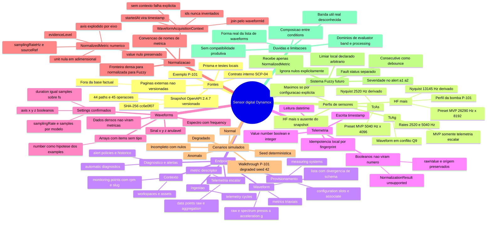

# Mapa mental — Sensor digital Dynamox

> **HISTÓRICO — este documento descreve uma etapa anterior do projeto e não
> representa a arquitetura atual.** O papel de mapa de navegação passou a ser do
> mapa da arquitetura; Fuzzy e forecast **não existem** no sistema.
> Para o sistema como ele é hoje, comece por
> [`../../00-overview/architecture-map.md`](../../00-overview/architecture-map.md).

> **⚠️ Nota de auditoria (29/08/2026).** O "futuro sensor digital" deste mapa foi
> entregue com outra forma: `simulation/sensor-twin/` (BON-06 v3.1). Fuzzy e forecast
> **não existem**. Estado atual: [matriz de evidências](../../07-validation/traceability.md).

Mapa de navegação da análise SCP-05 e do futuro sensor digital. Compatível com Obsidian
(bloco Mermaid `mindmap`). Os detalhes vivem nos relatórios técnicos linkados ao final —
este mapa não os substitui. Para uma demonstração concreta, comece pelo
[walkthrough da P-101](./dynamox-p101-visual-walkthrough.md).

## Navegação

- [Comece aqui — README da análise](../../README.md)
- [Walkthrough visual da P-101](./dynamox-p101-visual-walkthrough.md) — a demonstração
  concreta: máquina → mancal → sensor HF+ → waveform → métricas → Fuzzy.
- [Mapeamento Sensor × API](../../04-contracts/dynamox-sensor-api-mapping.md) — inventário, perfis, matriz
  de campos, `NormalizedMetric`, política booleana, decisão GO COM RESTRIÇÕES.
- [Auditoria de drift](../../04-contracts/dynamox-contract-drift.md) — inconsistências da spec, nulabilidade,
  arrays não tipados, fonte canônica por assunto.
- [Blueprint do sensor digital](./dynamox-digital-sensor-blueprint.md) — perfis, presets do
  MVP, `WaveformAcquisitionContext`, cenários, seed, regras de nulos, entradas do Fuzzy.
- [Inventário de endpoints](../../04-contracts/dynamox-endpoint-inventory.json) — extração fiel e
  reproduzível (`npm run analysis:inventory`).
- [Contratos SCP-04](../../../../contracts/dynamox/README.md) — snapshot, schema interno e
  decisões de idempotência.
