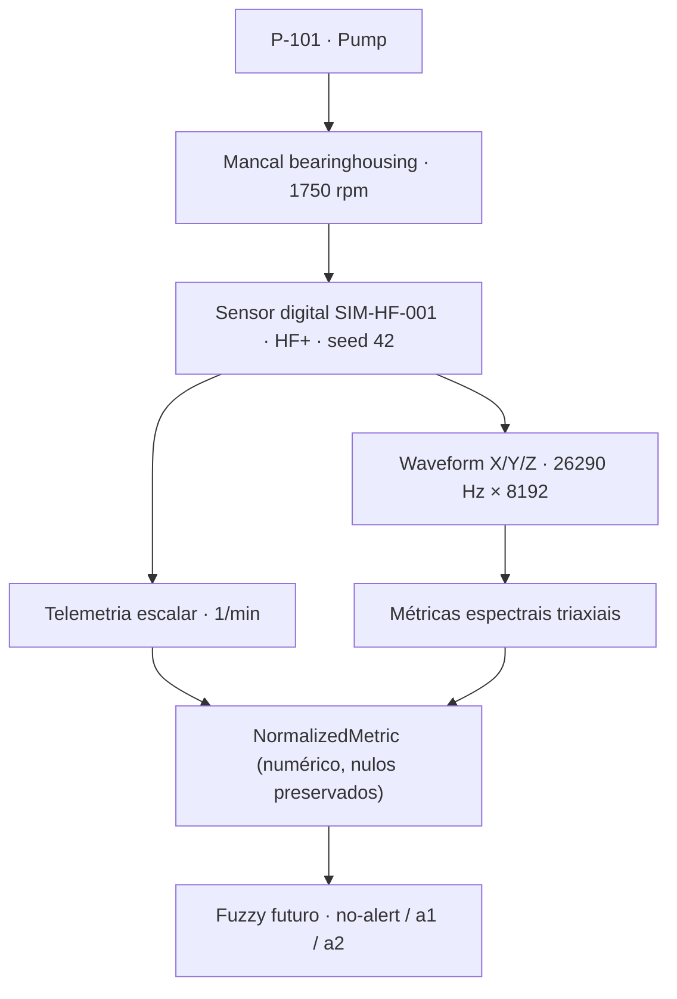

# Walkthrough visual — Bomba P-101 com sensor digital HF+

> **HISTÓRICO — este documento descreve uma etapa anterior do projeto e não
> representa a arquitetura atual.** Todos os números desta página são ilustrativos, escritos à mão
> antes de o simulador existir; a jornada real está em
> [`../../00-overview/end-to-end-flow.md`](../../00-overview/end-to-end-flow.md).
> Para o sistema como ele é hoje, comece por
> [`../../00-overview/architecture-map.md`](../../00-overview/architecture-map.md).

> **Nota de auditoria (29/08/2026).** Walkthrough conceitual da análise SCP-05. A P-101
> real do produto hoje tem 2 pontos com SIM-HF-001/002 (seed) e faz parte da frota
> sintética do BON-06 — ver [matriz de evidências](../../07-validation/traceability.md).

Uma passada concreta, do ativo até o futuro Fuzzy, usando o cenário de referência do
projeto. **Todos os valores numéricos desta página são ILUSTRATIVOS** (escritos à mão para
leitura, não gerados pelo simulador — que ainda não existe); a *estrutura* de cada bloco
segue os contratos congelados. Rótulos de evidência: `CONFIRMADO` · `DERIVADO` ·
`HIPÓTESE_DE_SIMULAÇÃO` · `DESCONHECIDO` — definidos no
[mapeamento](../../04-contracts/dynamox-sensor-api-mapping.md).

## O cenário

| Parâmetro | Valor | Evidência |
| --- | --- | --- |
| Máquina | `P-101`, tipo `Pump` | domínio local do desafio |
| Ponto de monitoramento | mancal — `bearinghousing` | slug `CONFIRMADO` no enum público de `monitoringPositionSlug` |
| Rotação | `1750 rpm` → 1× = 29,167 Hz | rpm anulável `CONFIRMADO`; valor escolhido — `HIPÓTESE_DE_SIMULAÇÃO`; 1× — `DERIVADO` |
| Sensor | `SIM-HF-001`, perfil `HF+` | identidade — `HIPÓTESE_DE_SIMULAÇÃO`; `Pump → apenas HF+` é regra do desafio |
| Cenário | `degraded` (desbalanceamento progressivo) | `HIPÓTESE_DE_SIMULAÇÃO` |
| Seed | `42` | determinismo — regra local |
| Aquisição | `26290 Hz` × `8192` amostras (preset MVP) | taxa e amostras `CONFIRMADO` como opções válidas do HF+; o preset é `HIPÓTESE_DE_SIMULAÇÃO` |
| Instante inicial | `2026-08-26T12:00:00.000Z` (fixo e explícito) | regra local: tempo entra por parâmetro, nunca por relógio |

## O fluxo



## 1. Configuração do sensor

```jsonc
{
  "serialNumber": "SIM-HF-001",
  "profile": "HF+",
  "machine": "P-101",
  "monitoringPointId": "42d726ba50f8645df08dba9f",   // id determinístico já usado no seed do repo
  "monitoringPositionSlug": "bearinghousing",
  "axesOrientation": { "x": "axial", "y": "tangential", "z": "radial" },
  "rpm": 1750,
  "scenario": "degraded",
  "seed": 42
}
```

`axesOrientation` usa o enum público (`CONFIRMADO`); a orientação escolhida é
`HIPÓTESE_DE_SIMULAÇÃO`.

## 2. Metadados da aquisição (`WaveformAcquisitionContext`)

```jsonc
{
  "waveformId": "wf-p101-000001",              // ILUSTRATIVO
  "startedAt": "2026-08-26T12:00:00.000Z",
  "samplingRateHz": 26290,
  "samples": 8192,
  "monitoringPointId": "42d726ba50f8645df08dba9f",
  "sensorId": "SIM-HF-001",
  "sensorProfile": "HF+"
}
```

Derivações: duração = 8192 / 26290 ≈ **0,312 s**; resolução espectral df = 26290 / 8192 ≈
**3,21 Hz**; Nyquist = **13 145 Hz** (`DERIVADO`). Sem esse contexto, nenhuma métrica
espectral é normalizada — a normalização **falha explicitamente** em vez de inventar ids.

## 3. Um ciclo de telemetria escalar (contrato SCP-04)

```jsonc
{
  "telemetryCycleData": {
    "measuringSystemUniqueIdentifier": "SIM-HF-001",
    "measuringSystemModel": { "name": "HF+", "version": 1 },
    "measurements": [
      {
        "resourceId": "42d726ba50f8645df08dba9f",
        "attributes": { "physicalQuantity": "acceleration", "axis": "z", "unit": "g" },
        "dataPoints": [ { "timestamp": "2026-08-26T12:00:00.000Z", "value": 0.0512 } ]
      },
      {
        "resourceId": "42d726ba50f8645df08dba9f",
        "attributes": { "physicalQuantity": "temperature", "unit": "degC" },
        "dataPoints": [ { "timestamp": "2026-08-26T12:00:00.000Z", "value": 41.3 } ]
      }
    ],
    "metadata": {
      "origin": "simulation",
      "generator": { "name": "industrial-condition-sensor-sim", "version": "0.1.0" },
      "profile": "HF+", "seed": 42, "synthetic": true
    },
    "tags": ["simulated", "pump-p101", "hf-plus", "scenario:degraded"]
  },
  "configuration": {
    "monitoringLocationMap": [
      { "mapLabel": "P-101 / Mancal lado acoplamento", "mapValue": "42d726ba50f8645df08dba9f" }
    ],
    "rpm": 1750, "scenario": "imbalance", "seed": 42
  }
}
```

Este payload valida contra o schema interno e é aceito pelo `POST /api/telemetry-cycles`
que já existe no backend (com idempotência).

> **Mapeamento de cenário (regra local):** o enum do contrato interno em
> `configuration.scenario` aceita apenas `normal | imbalance`. O cenário do **simulador**
> chama-se `degraded` e é mapeado para `imbalance` no payload (o desbalanceamento
> progressivo é exatamente o mecanismo do cenário degradado); o nome do simulador viaja em
> `tags` (`scenario:degraded`). `HIPÓTESE_DE_SIMULAÇÃO` — detalhes no blueprint, seção 6.

## 4. Trecho da waveform (ILUSTRATIVO — 6 de 8192 amostras)

```jsonc
{
  "physicalQuantity": "acceleration",   // enum CONFIRMADO no canal público
  "unit": "g",                          // enum CONFIRMADO
  "time": [0.000000, 0.000038, 0.000076, 0.000114, 0.000152, 0.000190],  // passo 1/26290 s
  "x":    [0.0021, -0.0043, 0.0087,  0.0154,  0.0102, -0.0068],
  "y":    [0.0134, -0.0291, 0.0405,  0.0388, -0.0129, -0.0447],
  "z":    [0.0187, -0.0342, 0.0521,  0.0489, -0.0156, -0.0583]
  // … 8186 amostras omitidas — nunca gere a janela inteira em Markdown
}
```

A forma `array | null` é `CONFIRMADO`; o conteúdo numérico é `HIPÓTESE_DE_SIMULAÇÃO`
apoiada pelos `examples` do snapshot (o schema declara `items: {}`).

## 5. Três `NormalizedMetric` — um por eixo (RMS da janela)

```jsonc
[
  {
    "timestamp": "2026-08-26T12:00:00.000Z",
    "machineId": "P-101", "monitoringPointId": "42d726ba50f8645df08dba9f",
    "sensorId": "SIM-HF-001", "sensorProfile": "HF+",
    "metric": "acceleration/rms/10-1000Hz", "value": 0.0181, "unit": "g", "axis": "x",
    "source": "spectrum", "statisticalProcessing": "rms", "band": "10-1000Hz",
    "samplingRateHz": 26290,
    "window": { "from": "2026-08-26T12:00:00.000Z", "to": "2026-08-26T12:00:00.312Z" },
    "sourceRef": { "waveformId": "wf-p101-000001" },
    "evidenceLevel": "simulation-assumption"
  },
  { "…igual, mudando…": "axis: 'y', value: 0.0468" },
  { "…igual, mudando…": "axis: 'z', value: 0.0512" }
]
```

No cenário `degraded`, o RMS radial (`z`) e tangencial (`y`) sobem com o desbalanceamento
em 1× (29,167 Hz); o axial (`x`) sobe menos — física simplificada, `HIPÓTESE_DE_SIMULAÇÃO`.

## 6. Exemplo com eixo nulo

Numa aquisição com o eixo `y` **desabilitado** (`settings.axis.y = false`), o registro do
eixo **existe** e carrega `null` — nunca é omitido, nunca vira array vazio:

```jsonc
{
  "metric": "acceleration/rms/10-1000Hz", "axis": "y",
  "value": null, "unit": "g",
  "sourceRef": { "waveformId": "wf-p101-000002" },
  "evidenceLevel": "simulation-assumption"
}
```

E telemetria **booleana**, se aparecer, não vira número:

```jsonc
{ "kind": "unsupported", "reason": "boolean-telemetry", "rawValue": true,
  "sourceRef": { "metricDescriptorId": "…" } }
```

## 7. O que veio do contrato (`CONFIRMADO`)

Slug `bearinghousing` e orientações de eixo; taxas/amostras válidas do HF+ (26290 Hz e
8192 estão na tabela do snapshot); enums `acceleration`/`g` do canal denso; forma
`array | null` dos eixos; `unit: string | null` e `value.{x,y,z}: number | null` nas
métricas espectrais; severidade `no-alert/a1/a2` separada de
`detected/notDetected/notEvaluated`; formato do ciclo de telemetria.

## 8. O que é hipótese nossa (`HIPÓTESE_DE_SIMULAÇÃO` / `DERIVADO`)

Preset 26290×8192 como padrão (DERIVADO: Nyquist 13 145 Hz, janela 0,312 s); rpm 1750 e a
física do cenário `degraded`; conteúdo numérico dos arrays; regra "eixo desabilitado ⇒
null"; booleano ⇒ `unsupported`; nomes `rms`/`10-1000Hz` (domínios reais `DESCONHECIDO`);
cadência 1/min; toda a identidade `SIM-HF-001`.

## 9. O que o futuro Fuzzy receberá

Somente o array de `NormalizedMetric` numéricos (nulos ignorados **explicitamente**), com
`evidenceLevel` em cada valor. Saída: `no-alert | a1 | a2` + `faultStatus` separado, com
debounce imitando `consecutive`. Limiares locais declarados arbitrários enquanto não houver
fonte (Q6).

## 10. O que ainda não foi implementado

O simulador (`libs/sensor-sim`), os tipos `NormalizedMetric`/`NormalizationResult`/
`WaveformAcquisitionContext` em código, o gerador de waveform, o normalizador e o Fuzzy.
Esta página é o alvo visual; o backend de ingestão e a validação de contrato **já
existem** e aceitariam o ciclo da seção 3 hoje.
