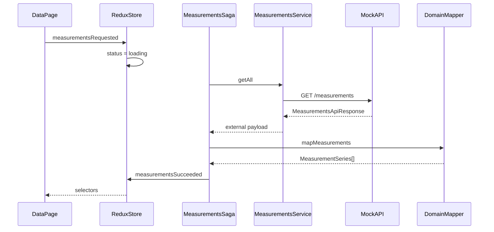
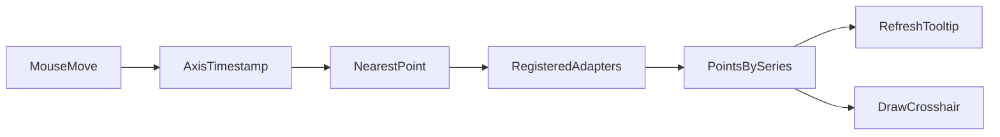
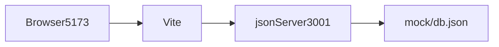
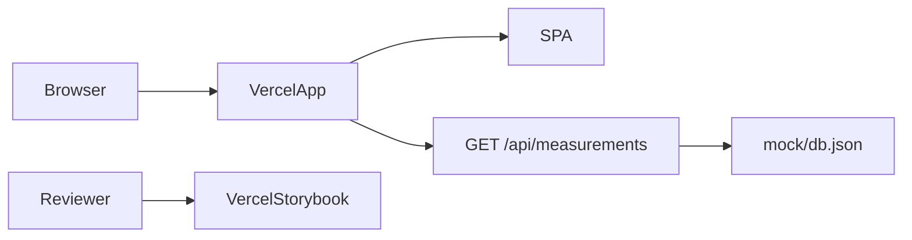

# Architecture

## Overview

The project is a React SPA organized around the measurement domain. The architecture separates:

- application composition and routes;
- HTTP contract and internal model;
- global state and asynchronous effects;
- domain and cross-cutting components;
- local mock runtime and production Function;
- imperative Highcharts interaction and Redux state.

The goal is to keep boundaries explicit without creating layers or infrastructure beyond the scale
of the challenge.

## Directory map

```text
api/
  measurements.ts                  GET /api/measurements on Vercel
cypress/
  e2e/                             end-to-end flows
  support/                         commands and setup
mock/
  db.json                          single dataset source
src/
  app/
    App.tsx                        application shell
    providers.tsx                  Redux and theme
    routes.tsx                     /data and fallback
  components/
    EmptyState/
    ErrorBoundary/
    ErrorState/
    LoadingState/
    icons/
  features/measurements/
    api/                            external types and Axios service
    components/                     summary, cards, and charts
    model/                          internal types and mapper
    store/                          slice, selectors, and sagas
  lib/                              HTTP client and helpers
  pages/
    DataPage/                       main route composition
    NotFoundPage/
  store/                            typed store and root saga
  test/                             test environment
  theme/                            Material UI theme
tests/api/                          Function test
```

## Loading flow



On mount, `DataPage` dispatches `measurementsRequested`. The saga watches the action with
`takeLatest`, calls the service, and transforms the response before publishing success. A new
request replaces the previous effect. Failures are converted into a message and published by
`measurementsFailed`.

## State

`MeasurementsState` contains only shared, serializable data:

```ts
interface MeasurementsState {
	data: MeasurementSeries[];
	status: "idle" | "loading" | "success" | "error";
	error: string | null;
}
```

The page interprets the states:

- `idle` and `loading`: loading indicator;
- `error`: message and retry action;
- `success` without series: empty state;
- `success` with series: summary and charts.

Memoized selectors derive acceleration, velocity, and temperature without duplicating those
groupings in the store.

## HTTP boundary

The `httpClient` receives `VITE_API_BASE_URL`. The service requests `/measurements`:

- local: base `http://localhost:3001`, resulting in
  `http://localhost:3001/measurements`;
- production: base `/api`, resulting in `/api/measurements`.

The frontend does not know whether the response came from `json-server` or the Function.

## External contract

```ts
interface MeasurementDataPoint {
	datetime: string;
	max: number;
}

interface MeasurementRaw {
	id: string;
	name: string;
	data: MeasurementDataPoint[];
}

type MeasurementsApiResponse = MeasurementRaw[];
```

The dataset contains seven series: three acceleration, three velocity, and one temperature series.
Names with `/x`, `/y`, or `/z` carry the axis; temperature has no axis.

The official file contains only `name` and `data`. `mock/db.json` adds a stable, unique `id` per
series for `json-server`, fully preserving all other fields. A SHA-256 hash of the representation
without IDs protects this parity in the Function test.

## Internal model

```ts
type Metric = "accelerationRms" | "velocityRms" | "temperature";
type Axis = "x" | "y" | "z" | null;

interface DataPoint {
	timestamp: number;
	value: number;
}

interface MeasurementSeries {
	id: string;
	name: string;
	metric: Metric;
	axis: Axis;
	unit: string;
	data: DataPoint[];
}
```

`mapMeasurements` performs four transformations:

1. separates the metric and axis using `/` in the name;
2. associates a unit by metric type;
3. converts `datetime` to a timestamp with `Date#getTime`;
4. renames `max` to `value`.

The mapper is pure and keeps payload details out of the UI.

## Time and units

The absolute instant is kept as a UTC timestamp. Axis and tooltip formatting occurs only in chart
options and follows the browser's local timezone. The implementation does not alter the timestamp
to simulate a timezone.

Units belong to the domain:

- RMS acceleration: `g`;
- RMS velocity: `mm/s`;
- temperature: `°C`.

## Interface composition

`DataPage` orchestrates state and layout. `MachineSummary` receives static metadata defined in
`constants.ts` because the official contract contains only measurements.

`ChartsPanel` selects the metrics and composes three `MetricChartCard` components. Each card hosts a
`TimeSeriesChart`, which translates `MeasurementSeries` into Highcharts options.

## Chart synchronization

Synchronization is isolated in pure functions and adapters:



`useChartSynchronization` keeps adapters and cleanup functions in refs. Each chart registers:

- event-to-timestamp conversion;
- reading visible points by series;
- tooltip updates and hiding;
- crosshair drawing and hiding.

On mouse movement, `findClosestPoint` selects the nearest instant in each visible series. On
`mouseleave`, all indicators are hidden. When an instance is replaced or unmounted, listeners are
removed.

This interaction remains outside Redux because it:

- occurs at high frequency;
- is not business state;
- contains non-serializable references;
- uses an imperative API that avoids React renders on each movement.

## Accessibility and responsiveness

Material UI centralizes breakpoints, spacing, typography, and contrast. Components preserve HTML
semantics and named regions. Asynchronous states expose accessible information, and charts receive
labels associated with card titles.

Grid containers use width constraints that allow Highcharts to resize without overflow. Validation
combines automated tests, Storybook, axe-core, and visual review.

Each series keeps all 181 points available for keyboard navigation and screen readers. This decision
increases the SVG DOM but preserves point-by-point exploration; the performance audit treats this
cost as a deliberate trade-off. Roboto fonts are self-hosted only for the Latin subset used by the
interface.

## Local runtime

`pnpm dev` runs Vite and `json-server` in parallel:



The `.env.example` file provides only the public local URL. `.env` is ignored.

## Production runtime



The application has an SPA rewrite. The Function imports the same JSON used locally and responds
with `Response.json`. Storybook is deployed to a separate Vercel project.

Assets generated by Vite have hashed names and immutable one-year caching. HTML and API responses
remain revalidatable. Vercel also applies CSP, HSTS, a permissions policy, MIME-sniffing protection,
and framing restricted to the same origin; the CSP allows the internal iframe used by Storybook.

## CI/CD

The `ci.yml` workflow contains:

- `quality`: frozen install, formatting, lint, type checks, tests, and builds;
- `e2e`: Cypress caching/installation and headless execution;
- `deploy`: invocation of the reusable workflow only after both pass.

`cd.yml` builds and deploys the application and Storybook in parallel. Then `production-smoke`
validates the three endpoints, the contract with `jq`, and two Cypress flows in production.

## Decisions and boundaries

- Vite remains the build tool; Nx would add no value to a single package.
- Redux Saga meets the requirement and centralizes effects; requests do not live in components.
- Highcharts supports time-series charts and provides the APIs required for synchronization.
- `json-server` reproduces the local contract; the Function replaces only the production runtime.
- There is no real backend, persistence, or authentication.
- There is no runtime validation because the payload is a controlled fixture; contract changes must
  update all consumers and tests.

See the [decision records](decisions) for the context and consequences of each choice.
