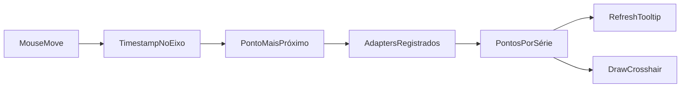
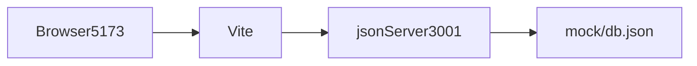
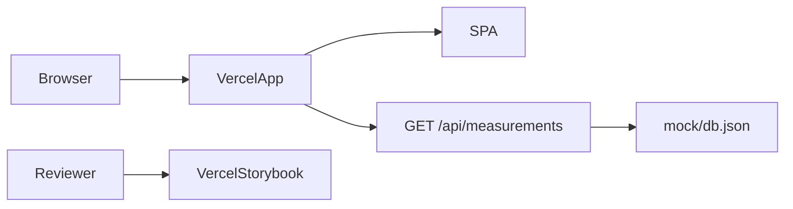

# Arquitetura

## Visão geral

O projeto é uma SPA React orientada ao domínio de medições. A arquitetura separa:

- composição da aplicação e rotas;
- contrato HTTP e modelo interno;
- estado global e efeitos assíncronos;
- componentes de domínio e componentes transversais;
- runtime mock local e Function de produção;
- interação imperativa do Highcharts e estado Redux.

O objetivo é manter fronteiras explícitas sem criar camadas ou infraestrutura além do tamanho do
desafio.

## Mapa de diretórios

```text
api/
  measurements.ts                  GET /api/measurements na Vercel
cypress/
  e2e/                             fluxos end-to-end
  support/                         commands e setup
mock/
  db.json                          fonte única do dataset
src/
  app/
    App.tsx                        shell da aplicação
    providers.tsx                  Redux e tema
    routes.tsx                     /data e fallback
  components/
    EmptyState/
    ErrorBoundary/
    ErrorState/
    LoadingState/
    icons/
  features/measurements/
    api/                            tipos externos e serviço Axios
    components/                     resumo, cards e gráficos
    model/                          tipos internos e mapper
    store/                          slice, selectors e sagas
  lib/                              cliente HTTP e helpers
  pages/
    DataPage/                       composição da rota principal
    NotFoundPage/
  store/                            store tipada e root saga
  test/                             ambiente de testes
  theme/                            tema Material UI
tests/api/                          teste da Function
```

## Fluxo de carregamento


Ao montar, `DataPage` dispara `measurementsRequested`. A saga observa a action com `takeLatest`,
chama o serviço e transforma a resposta antes de publicar sucesso. Uma nova solicitação substitui
o efeito anterior. Falhas são convertidas em mensagem e publicadas por `measurementsFailed`.

## Estado

`MeasurementsState` contém somente dados compartilhados e serializáveis:

```ts
interface MeasurementsState {
	data: MeasurementSeries[];
	status: 'idle' | 'loading' | 'success' | 'error';
	error: string | null;
}
```

A página interpreta os estados:

- `idle` e `loading`: indicador de carregamento;
- `error`: mensagem e ação de retry;
- `success` sem séries: estado vazio;
- `success` com séries: resumo e gráficos.

Selectors memoizados derivam aceleração, velocidade e temperatura sem duplicar esses agrupamentos
no store.

## Fronteira HTTP

O `httpClient` recebe `VITE_API_BASE_URL`. O serviço solicita `/measurements`:

- local: base `http://localhost:3001`, resultando em
  `http://localhost:3001/measurements`;
- produção: base `/api`, resultando em `/api/measurements`.

O frontend não conhece se a resposta veio do `json-server` ou da Function.

## Contrato externo

```ts
interface MeasurementDataPoint {
	datetime: string;
	max: number;
}

interface MeasurementRaw {
	id: string;
	name: string;
	data: MeasurementDataPoint[];
}

type MeasurementsApiResponse = MeasurementRaw[];
```

O dataset possui sete séries: três de aceleração, três de velocidade e uma de temperatura. Nomes
com `/x`, `/y` ou `/z` carregam o eixo; temperatura não possui eixo.

## Modelo interno

```ts
type Metric = 'accelerationRms' | 'velocityRms' | 'temperature';
type Axis = 'x' | 'y' | 'z' | null;

interface DataPoint {
	timestamp: number;
	value: number;
}

interface MeasurementSeries {
	id: string;
	name: string;
	metric: Metric;
	axis: Axis;
	unit: string;
	data: DataPoint[];
}
```

`mapMeasurements` executa quatro transformações:

1. separa métrica e eixo pelo `/` do nome;
2. associa unidade pelo tipo de métrica;
3. converte `datetime` para timestamp com `Date#getTime`;
4. renomeia `max` para `value`.

O mapper é puro e mantém detalhes do payload fora da UI.

## Tempo e unidades

O instante absoluto é mantido como timestamp UTC. Formatação de eixo e tooltip ocorre somente nas
options do gráfico e segue o timezone local do navegador. A implementação não altera o timestamp
para simular timezone.

Unidades pertencem ao domínio:

- aceleração RMS: `g`;
- velocidade RMS: `mm/s`;
- temperatura: `°C`.

## Composição da interface

`DataPage` orquestra estado e layout. `MachineSummary` recebe metadados estáticos definidos em
`constants.ts`, pois o contrato oficial contém apenas medições.

`ChartsPanel` seleciona as métricas e compõe três `MetricChartCard`. Cada card hospeda um
`TimeSeriesChart`, que traduz `MeasurementSeries` em options do Highcharts.

## Sincronização dos gráficos

A sincronização é isolada em funções puras e adapters:



`useChartSynchronization` mantém adapters e cleanups em refs. Cada gráfico registra:

- conversão do evento em timestamp;
- leitura dos pontos visíveis por série;
- atualização e ocultação de tooltip;
- desenho e ocultação de crosshair.

No movimento do mouse, `findClosestPoint` seleciona o instante mais próximo em cada série visível.
No `mouseleave`, todos os indicadores são ocultados. Ao substituir ou desmontar uma instância, os
listeners são removidos.

Essa interação permanece fora do Redux porque:

- ocorre em alta frequência;
- não é estado de negócio;
- contém referências não serializáveis;
- a API imperativa evita renders React por movimento.

## Acessibilidade e responsividade

Material UI concentra breakpoints, espaçamento, tipografia e contraste. Os componentes preservam
semântica HTML e regiões nomeadas. Estados assíncronos expõem informação acessível, e gráficos
recebem rótulos associados aos títulos dos cards.

Contêineres de grid usam limites de largura que permitem o resize do Highcharts sem overflow. A
validação combina testes automatizados, Storybook, axe-core e revisão visual.

## Runtime local

`pnpm dev` executa Vite e `json-server` em paralelo:



O arquivo `.env.example` fornece somente a URL pública local. `.env` é ignorado.

## Runtime de produção



A aplicação possui rewrite de SPA. A Function importa o mesmo JSON usado localmente e responde
com `Response.json`. O Storybook é publicado em projeto Vercel independente.

## CI/CD

O workflow `ci.yml` possui:

- `quality`: install frozen, formato, lint, typechecks, testes e builds;
- `e2e`: cache/instalação do Cypress e execução headless;
- `deploy`: chamada ao workflow reutilizável somente após ambos passarem.

`cd.yml` constrói e publica aplicação e Storybook em paralelo. Depois, `production-smoke` valida
os três endpoints, o contrato com `jq` e dois fluxos Cypress em produção.

## Decisões e limites

- Vite permanece como build tool; Nx não agregaria valor a um único pacote.
- Redux Saga atende ao requisito e centraliza efeitos; requests não vivem nos componentes.
- Highcharts atende gráficos temporais e fornece APIs necessárias à sincronização.
- `json-server` reproduz o contrato local; a Function substitui apenas o runtime em produção.
- Não existe backend real, persistência ou autenticação.
- Não há validação runtime porque o payload é um fixture controlado; mudança de contrato deve
  atualizar todos os consumidores e testes.

Consulte os [registros de decisão](decisions) para contexto e consequências de cada escolha.
