# Technical blueprint for the solution

## Objective

This document records the consolidated technical plan for the dashboard developed for the
[Dynamox front-end challenge](https://github.com/dynamox-s-a/developer-challenges/blob/main/front-end-challenge-v2.md).
It describes the scope, decisions, and boundaries of the final implementation.
[`docs/TODO.md`](TODO.md) tracks delivery progress; operational details are in
[`README.md`](../README.md), the current state is in [`docs/architecture.md`](architecture.md), and
durable rationale is recorded in the [ADRs](decisions).

## Challenge scope

The solution meets the core requirements:

- `/data` route with a machine summary and time series;
- RMS acceleration, temperature, and RMS velocity charts;
- data loaded from a mock REST API each time the page is entered;
- tooltip and crosshair synchronized by the nearest timestamp;
- React, TypeScript, Redux, Redux Saga, Vite, Material UI 5, and Highcharts;
- automated logic and behavior tests.

The implemented bonus items are:

- component documentation in Storybook;
- end-to-end tests with Cypress;
- application, mock API, and Storybook deployed to Vercel.

## Assumptions

- The provided dataset is a known contract containing seven series.
- Machine metadata is static because it is not part of the official payload.
- The API is read-only; the challenge does not require authentication, persistence, or writes.
- Dates are converted to timestamps at the domain boundary and formatted in presentation.
- The interface must work on mobile, tablet, and desktop without changing the data hierarchy.
- AI tools and MCPs assist development but are optional for running the project.

## Stack

- React 19 and React Router 7
- TypeScript 6 in strict mode
- Vite 8
- Material UI 5 and Roboto
- Redux Toolkit, React Redux, and Redux Saga
- Axios
- Highcharts and `highcharts-react-official`
- Vitest, Testing Library, axe-core, and `redux-saga-test-plan`
- Storybook and the accessibility addon
- Cypress
- Biome
- pnpm 9 and Node.js 24
- GitHub Actions and Vercel

## Organization

```text
api/                         Function used on Vercel
cypress/                     end-to-end tests
mock/                        json-server dataset
src/
  app/                       providers, routes, and application composition
  components/                cross-cutting states and components
  features/measurements/
    api/                     contract and HTTP service
    components/              summary, cards, and charts
    model/                   domain types and mapper
    store/                   slice, selectors, and sagas
  pages/                     routable pages
  store/                     Redux configuration and root saga
  test/                      test setup and utilities
  theme/                     Material UI tokens and configuration
tests/api/                   Function contract test
```

The domain-oriented organization keeps the measurement API, model, state, and interface together
without creating a monorepo or layers that have no current use.

## Data contract and model

The official response contains `name` and `data`. The mock adds only a stable `id` per series so
that `json-server` can represent REST resources without changing names or measurements:

```ts
interface MeasurementRaw {
	id: string;
	name: string;
	data: Array<{
		datetime: string;
		max: number;
	}>;
}
```

The mapper converts each series to the internal model:

```ts
interface MeasurementSeries {
	id: string;
	name: string;
	metric: "accelerationRms" | "velocityRms" | "temperature";
	axis: "x" | "y" | "z" | null;
	unit: string;
	data: Array<{ timestamp: number; value: number }>;
}
```

The name identifies the metric and axis, `datetime` becomes a timestamp, and `max` becomes a value.
Units are defined by the domain: `g`, `mm/s`, and `°C`.

The same contract is served by two runtimes:

- locally, `json-server` reads [`mock/db.json`](../mock/db.json);
- in production, [`api/measurements.ts`](../api/measurements.ts) returns the same extended mock.

## State flow

```mermaid
flowchart LR
    DataPage["DataPage /data"] --> Requested[measurementsRequested]
    Requested --> Saga[Redux Saga]
    Saga --> Service[measurementsService]
    Service --> Api[Mock API]
    Api --> Mapper[mapMeasurements]
    Mapper --> Slice[measurementsSlice]
    Slice --> Selectors[MemoizedSelectors]
    Selectors --> View[SummaryAndCharts]
```



The slice represents `idle`, `loading`, `success`, and `error`. The saga uses `takeLatest` so a new
attempt replaces the previous load. Selectors separate series by metric, and the page chooses
between loading, retryable error, empty, and content states.

## Interface and charts

The page contains:

- analysis header;
- summary with machine, monitored point, rotation, range, and acquisition interval;
- RMS acceleration card with `x`, `y`, and `z` axes;
- temperature card;
- RMS velocity card with `x`, `y`, and `z` axes.

Highcharts options are produced from the internal model. Tooltip, crosshair, and Highcharts
instances do not enter Redux.

Each chart registers an imperative adapter. On `mousemove`, the source axis timestamp is calculated,
the nearest point is located in each visible series, and all charts update their tooltip and
crosshair. On `mouseleave`, the indicators are hidden. Listeners and references are removed during
cleanup, including under React StrictMode.

## Responsiveness and accessibility

- Layout, padding, and typography respond to Material UI breakpoints.
- Containers and charts preserve `min-width: 0` and avoid horizontal overflow.
- Loading, error, and empty states have semantics and accessible messages.
- The structure uses `header`, `main`, headings, and named regions.
- Visible focus, keyboard support, contrast, and accessible names are verified.
- Storybook and component tests use axe-core as support; manual review remains necessary.

## Testing strategy

- Vitest covers the mapper, reducers, selectors, sagas, and pure synchronization functions.
- Testing Library validates components through behavior and accessible queries.
- Highcharts is mocked at the component boundary; options and adapters are tested separately.
- The Function test confirms status, JSON, and dataset equivalence.
- Storybook documents isolated states and runs accessibility checks.
- Cypress uses the real `json-server` in success scenarios and `cy.intercept` for controlled failures.
- The production smoke test validates endpoints and essential flows against the published API.

Coverage can be generated locally, with no mandatory threshold or claim of complete coverage. See
[`docs/testing-strategy.md`](testing-strategy.md).

## CI/CD and Vercel

CI runs on pull requests, pushes to `leonardo-jacomussi`, and manual triggers. The `quality` and
`e2e` jobs run separately. The first validates formatting, lint, types, tests, the application
build, and Storybook; the second runs Cypress.

The CD workflow is invoked only on pushes or manual runs on the solution branch after both jobs
pass. Application/API and Storybook use separate Vercel projects and do not depend on automatic Git
integration. After deployment, the smoke test checks `/data`, `/api/measurements`, Storybook, and
essential Cypress scenarios.

## AI-assisted development

The project includes guidance in `AGENTS.md`, scoped Rules, Commands, Skills, Bugbot criteria, and
optional MCPs. These artifacts reduce ambiguity but do not replace human review, tests, lint,
TypeScript, or CI. Credentials are never committed. See
[`docs/ai-assisted-development.md`](ai-assisted-development.md).

## Deliberate boundaries

- There is no Nx: the project has a small application and a single package.
- There is no real backend: production reproduces only the requested mock contract.
- There is no runtime payload validation: the boundary trusts the challenge's known fixture.
- There is no machine data in the API: the summary uses explicit constants.
- There is no hover state in Redux: it is transient and Highcharts-specific.
- There is no minimum coverage target: the report supports review but is not presented as a guarantee.

## Definition of done

A delivery is considered done only when:

- requirements and documentation remain aligned;
- TypeScript strict, Biome, and tests pass;
- the application and Storybook build successfully;
- Cypress validates the essential flows;
- accessibility and responsiveness are reviewed;
- no secrets or generated artifacts enter the diff;
- contract changes update the mock, Function, mapper, tests, and documentation.
