# Blueprint técnico da solução

## Objetivo

Este documento registra o plano técnico consolidado do dashboard desenvolvido para o
[desafio front-end da Dynamox](https://github.com/dynamox-s-a/developer-challenges/blob/main/front-end-challenge-v2.md).
Ele descreve o escopo, as decisões e os limites da implementação final. O
[`docs/TODO.md`](TODO.md) acompanha o progresso das entregas; detalhes operacionais ficam no
[`README.md`](../README.md), o estado atual em [`docs/architecture.md`](architecture.md) e as
justificativas duráveis nos [ADRs](decisions).

## Escopo do desafio

A solução atende aos requisitos centrais:

- rota `/data` com resumo de uma máquina e séries temporais;
- gráficos de aceleração RMS, temperatura e velocidade RMS;
- dados carregados por uma API REST mock a cada entrada na página;
- tooltip e crosshair sincronizados pelo timestamp mais próximo;
- React, TypeScript, Redux, Redux Saga, Vite, Material UI 5 e Highcharts;
- testes automatizados da lógica e do comportamento.

Os bônus implementados são:

- documentação de componentes no Storybook;
- testes end-to-end com Cypress;
- aplicação, API mock e Storybook publicados na Vercel.

## Premissas

- O dataset fornecido é um contrato conhecido e contém sete séries.
- Os metadados da máquina são estáticos porque não fazem parte do payload oficial.
- A API é somente leitura; o desafio não exige autenticação, persistência ou escrita.
- Datas são convertidas em timestamps na fronteira do domínio e formatadas na apresentação.
- A interface precisa funcionar em mobile, tablet e desktop sem alterar a hierarquia dos dados.
- Ferramentas de IA e MCPs auxiliam o desenvolvimento, mas são opcionais para executar o projeto.

## Stack

- React 19 e React Router 7
- TypeScript 6 em modo strict
- Vite 8
- Material UI 5 e Roboto
- Redux Toolkit, React Redux e Redux Saga
- Axios
- Highcharts e `highcharts-react-official`
- Vitest, Testing Library, axe-core e `redux-saga-test-plan`
- Storybook e addon de acessibilidade
- Cypress
- Biome
- pnpm 9 e Node.js 24
- GitHub Actions e Vercel

## Organização

```text
api/                         Function usada na Vercel
cypress/                     testes end-to-end
mock/                        dataset do json-server
src/
  app/                       providers, rotas e composição da aplicação
  components/                estados e componentes transversais
  features/measurements/
    api/                     contrato e serviço HTTP
    components/              resumo, cards e gráficos
    model/                   tipos e mapper do domínio
    store/                   slice, selectors e sagas
  pages/                     páginas roteáveis
  store/                     configuração Redux e root saga
  test/                      setup e utilitários de teste
  theme/                     tokens e configuração Material UI
tests/api/                   teste de contrato da Function
```

A organização orientada ao domínio mantém API, modelo, estado e interface de medições próximos,
sem criar um monorepo ou camadas sem uso atual.

## Contrato e modelo de dados

A resposta oficial possui `name` e `data`. O mock acrescenta somente um `id` estável por série para
que o `json-server` represente recursos REST sem alterar nomes ou medições:

```ts
interface MeasurementRaw {
	id: string;
	name: string;
	data: Array<{
		datetime: string;
		max: number;
	}>;
}
```

O mapper converte cada série para o modelo interno:

```ts
interface MeasurementSeries {
	id: string;
	name: string;
	metric: "accelerationRms" | "velocityRms" | "temperature";
	axis: "x" | "y" | "z" | null;
	unit: string;
	data: Array<{ timestamp: number; value: number }>;
}
```

O nome identifica métrica e eixo, `datetime` vira timestamp e `max` vira valor. As unidades são
definidas pelo domínio: `g`, `mm/s` e `°C`.

O mesmo contrato é servido por dois runtimes:

- localmente, `json-server` lê [`mock/db.json`](../mock/db.json);
- em produção, [`api/measurements.ts`](../api/measurements.ts) entrega o mesmo mock estendido.

## Fluxo de estado

```mermaid
flowchart LR
    DataPage["DataPage /data"] --> Requested[measurementsRequested]
    Requested --> Saga[Redux Saga]
    Saga --> Service[measurementsService]
    Service --> Api[API mock]
    Api --> Mapper[mapMeasurements]
    Mapper --> Slice[measurementsSlice]
    Slice --> Selectors[Selectors memoizados]
    Selectors --> View[Resumo e gráficos]
```



O slice representa `idle`, `loading`, `success` e `error`. A saga usa `takeLatest` para que uma
nova tentativa substitua o carregamento anterior. Selectors separam as séries por métrica, e a
página escolhe entre loading, erro com retry, vazio e conteúdo.

## Interface e gráficos

A página contém:

- header da análise;
- resumo com máquina, rotação, intervalo de aquisição e período;
- card de aceleração RMS com eixos `x`, `y` e `z`;
- card de temperatura;
- card de velocidade RMS com eixos `x`, `y` e `z`.

As options do Highcharts são produzidas a partir do modelo interno. Tooltip, crosshair e
instâncias do Highcharts não entram no Redux.

Cada gráfico registra um adapter imperativo. No `mousemove`, o timestamp do eixo da origem é
calculado, o ponto mais próximo é localizado em cada série visível e todos os gráficos atualizam
tooltip e crosshair. No `mouseleave`, os indicadores são ocultados. Listeners e referências são
removidos no cleanup, inclusive sob React StrictMode.

## Responsividade e acessibilidade

- Layout, paddings e tipografia respondem aos breakpoints do Material UI.
- Contêineres e gráficos preservam `min-width: 0` e evitam overflow horizontal.
- Estados de loading, erro e vazio possuem semântica e mensagens acessíveis.
- A estrutura usa `header`, `main`, headings e regiões nomeadas.
- Foco visível, teclado, contraste e nomes acessíveis são verificados.
- Storybook e testes de componentes usam axe-core como apoio; revisão manual continua necessária.

## Estratégia de testes

- Vitest cobre mapper, reducers, selectors, sagas e funções puras de sincronização.
- Testing Library valida componentes pelo comportamento e por queries acessíveis.
- Highcharts é mockado na fronteira dos componentes; options e adapters são testados separadamente.
- O teste da Function confirma status, JSON e equivalência com o dataset.
- Storybook documenta estados isolados e executa verificações de acessibilidade.
- Cypress usa o `json-server` real nos cenários de sucesso e `cy.intercept` para falhas controladas.
- O smoke de produção valida endpoints e os fluxos essenciais contra a API publicada.

Coverage pode ser gerado localmente, sem threshold obrigatório e sem alegação de cobertura total.
Consulte [`docs/testing-strategy.md`](testing-strategy.md).

## CI/CD e Vercel

O CI executa em pull requests, pushes para `leonardo-jacomussi` e disparos manuais. Os jobs
`quality` e `e2e` rodam separadamente. O primeiro valida formato, lint, tipos, testes, build da
aplicação e Storybook; o segundo executa Cypress.

O workflow de CD só é chamado em push ou execução manual na branch da solução depois dos dois jobs
passarem. Aplicação/API e Storybook usam projetos Vercel distintos e não dependem da integração Git
automática. Após o deploy, o smoke verifica `/data`, `/api/measurements`, Storybook e os cenários
essenciais do Cypress.

## Desenvolvimento assistido por IA

O projeto inclui orientação em `AGENTS.md`, Rules por escopo, Commands, Skills, critérios do Bugbot
e MCPs opcionais. Esses artefatos reduzem ambiguidades, mas não substituem revisão humana, testes,
lint, TypeScript ou CI. Credenciais nunca são versionadas. Consulte
[`docs/ai-assisted-development.md`](ai-assisted-development.md).

## Limites deliberados

- Não há Nx: o projeto possui uma aplicação pequena e um único pacote.
- Não há backend real: produção reproduz somente o contrato mock solicitado.
- Não há validação runtime do payload: a fronteira confia no fixture conhecido do desafio.
- Não há dados de máquina na API: o resumo usa constantes explícitas.
- Não há estado de hover no Redux: é transitório e específico do Highcharts.
- Não há meta mínima de coverage: o relatório apoia revisão, mas não é apresentado como garantia.

## Definição de pronto

Uma entrega só é considerada pronta quando:

- requisitos e documentação continuam alinhados;
- TypeScript strict, Biome e testes passam;
- aplicação e Storybook geram builds;
- Cypress valida os fluxos essenciais;
- acessibilidade e responsividade são revisadas;
- nenhum segredo ou artefato gerado entra no diff;
- alterações de contrato atualizam mock, Function, mapper, testes e documentação.
