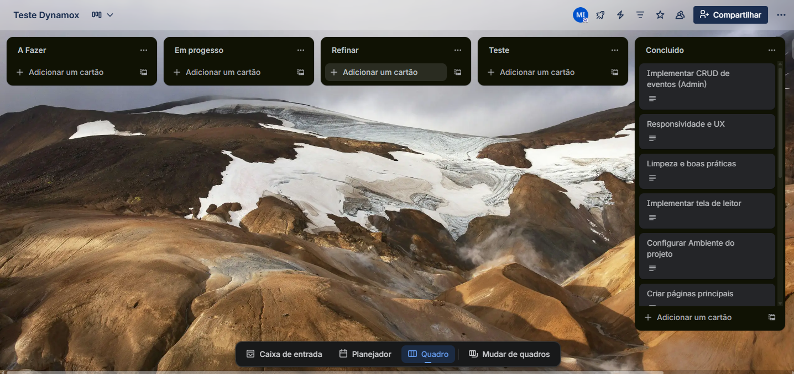

# Dynamox Event Manager

Sistema completo de **gestão de eventos**, desenvolvido como parte do desafio técnico da **Dynamox**.  
O projeto foi construído com foco em **performance, UX e arquitetura escalável**, utilizando **Next.js, TypeScript e Material UI**, além de integração com **Redux Toolkit** e **React Query**.

---

## Stack Principal

<p align="left">
  
  
  
  
  
  
  
</p>

---

## 🚀 Funcionalidades Principais

- **Autenticação e Autorização** com usuários pré-configurados (admin e leitor)
- **CRUD completo de eventos** (criar, editar, excluir e visualizar)
- **Dark/Light Mode** com tema dinâmico via Context API e MUI Theme
- **Filtragem e organização de eventos** (futuros e passados)
- **Proteção de rotas** baseada em roles (Admin / Leitor)
- **Componentes reutilizáveis** e documentados via Storybook
- **Animações com Framer Motion** e transições suaves de interface
- **Design responsivo** otimizado para desktop e mobile

---

## Usuários de Teste

| Função | E-mail | Senha |
|:--|:--|:--|
|  Administrador | `admin@events.com` | `admin123` |
| Leitor | `reader@events.com` | `reader123` |

---

## Tecnologias Utilizadas

- **Next.js 16** (App Router)
- **TypeScript**
- **Material UI 6** com customização de tema
- **Redux Toolkit** para gerenciamento global de autenticação
- **React Query** para cache e sincronização automática dos dados
- **Framer Motion** para animações suaves
- **React Hook Form + Yup** (validação dos formulários)
- **json-server** como backend mock local

---

## Decisões de Implementação

- As **operações de edição e exclusão** são realizadas por **modais**, em vez de rotas dinâmicas.  
  Essa decisão prioriza a **experiência do usuário**, evitando navegações desnecessárias e mantendo o **contexto da página**.
  
- O **Context API** foi utilizado para gerenciar o tema (dark/light) pela sua leveza e simplicidade.  
  Para o estado global de autenticação, optou-se pelo **Redux Toolkit**, pela previsibilidade e compatibilidade com middlewares.

- As animações foram aplicadas com **Framer Motion**, garantindo transições sutis sem comprometer performance.

- O **Storybook** foi utilizado como **defesa de UI**, documentando os componentes de maior impacto visual e arquitetural, como:
  - `EventCardExpandable`
  - `EventGrid`
  - `AdminEventsCards`

---

## Sobre o Deploy

O deploy público foi **omitido propositalmente**.

O sistema utiliza um backend **simulado com `json-server`**, responsável por gerenciar os dados de eventos e autenticação mockada.  
Como a **Vercel não executa processos persistentes**, o deploy público não refletiria o comportamento real do sistema — resultando em erros de rede (Network Error).

Para fins de avaliação técnica, o projeto deve ser executado localmente:

```bash
# Inicia o backend mock
npm run server   # Porta 4000

# Inicia o frontend
npm run dev      # Porta 3000
```

Essa decisão garante a **fidelidade do comportamento completo**, permitindo que o avaliador veja todas as funcionalidades (login, CRUD, filtragem e roles).

---

## Storybook Coverage

O Storybook documenta os principais componentes visuais do sistema, priorizando **clareza e impacto arquitetural**:

- **EventCardExpandable** — animação de expansão com Framer Motion  
- **EventGrid** — renderização responsiva de cards com filtragem e paginação  
- **AdminEventsCards** — exibição e controle de eventos para administradores  

A cobertura foi planejada para evitar redundâncias e demonstrar consistência visual e técnica.

---

## Estrutura de Pastas

```
📦 src
 ┣ 📂 app
 ┃ ┣ 📂 admin
 ┃ ┣ 📂 reader
 ┃ ┗ 📂 api (rotas internas futuras)
 ┣ 📂 components
 ┃ ┗ 📂 events
 ┣ 📂 context
 ┣ 📂 hooks
 ┣ 📂 services
 ┣ 📂 store
 ┣ 📂 dto
 ┣ 📂 theme
 ┗ 📜 types.ts
```

---

## Gestão Ágil

O desenvolvimento do projeto foi conduzido de forma **ágil**, com acompanhamento contínuo através de um **quadro no Trello**, organizando as etapas de implementação, refinamento e testes.

<p align="center">
  
</p>

Esse controle visual permitiu acompanhar o progresso das tarefas, mantendo **clareza nas prioridades**, **foco no valor de entrega** e **transparência nas iterações** do processo.

---

## Observações Técnicas

- O sistema foi totalmente **tipado em TypeScript** e segue padrões de **Clean Code** e **Atomic Design**.
- Utiliza **validação reativa** nos formulários com **Yup**.
- Possui **animações e microinterações** para realçar UX e navegação intuitiva.
- Todos os estados (login, erro, loading) foram tratados com **feedback visual**.
- Tema e responsividade foram testados em ambos os modos (dark/light).

---

## Autor

**Maruan Moussa**  
💼 Desenvolvedor Front-End  
📍 Palhoça - SC
