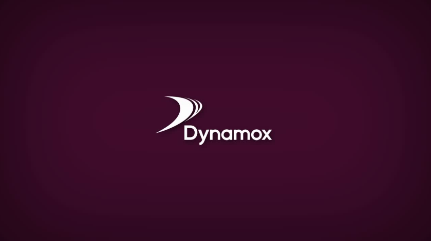

<br>

# 🧱 Dynamox Challenge - Frontend

[](https://reactjs.org/)
[](https://nextjs.org/)
[](https://www.typescriptlang.org/)
[](https://redux.js.org/)
[](https://mui.com/)
[](https://axios-http.com/)
[](https://www.docker.com/)


This is a directory that contains the web plataform of the Dynamox Full-Stack challenge.

## 💻 Tech Stack
- **Next.js 16 (App Router):** Choised for web performance & SEO.

- **Redux Toolkit:** Global State Management for ``Machines``, ``Monitoring Point``, ``Sensor Data``, ``Sensor``, ``SnackBar`` & ``User``;

- **Material UI 5:** Mandatory implementation to the interface, granting responsitivity to resuable Components.

- **TypeScript:** Language type wrote to all project.

- **Jest & React Testing Libary:** Garantee business logic by tests.

## ⚙️ Performance & Interceptors (6.9)
- **Axios Timeout:** A global instance of Axios was configured with a strict ``timeout`` of 350ms.

- **Request Interceptors:** Request are monitorated to ensure the UI remains responsive, even if the backend faces high load.

## 📄 Assumptions & Business Rules
- **Sensor Validation (Pump vs TcAg/TcAs):** To prevent invalid configurations, the system  validates the machine type nefore assignment. If user attemps to sign a pair of "Pump" with "TcAg" or "TcAs", the system defaults the sensor field to "None" on Database it register as ``null``.

- **Pagination:** Monitoring Points are displayed in a paginated list (5 items per page) to optimize rendering and data fetching.

## 🧪 Testing Strategy
**Unit tests:** Validating the `canMachineReceiveSensor` logic.

**Run tests:** 
```bash 
 npm run test 
 ```

## 📂 Project Structure
The frontend architecture:

- ``src/app/api``: Api calls for CRUDs.

- ``src/app/component``: Reusable components for example: ``SensorDataGraph`` & ``TablePoints``.

- ``src/app/dashboard``: Page of dashboard.

- ``src/app/redux``: Redux Toolkits, where store all the global variables.

- ``src/app/theme``: Configuration of Material UI 5 theme color.

- ``src/app/types``: All the Types and Enums of the system.

- ``src/app/utils``: Unit tests of frontend.

## ⚙️ Configuration and Environment Variables
To facilitate evaluation, the project comes pre-configured for the local development environment via **Docker**.

**Default Execution:** The necessary ``environment`` variables (such as ``DATABASE_URL`` and ``JWT_SECRET``) already have default values ​​defined in the ``docker-compose.yml`` file.

**Customization:** If you wish to change the ports or security keys, you can directly edit the variables in the ``environment`` section of the services in ``docker-compose.yml``.

**Persistence:** The PostgreSQL database uses a Docker volume to ensure that sensor and machine data is not lost between container restarts.

## 📺 Instalation & Setup
```markdown
1. Clone the Repository.
2. Install dependencies: npm install
3. Set enviroment variables: Create a .env pointing to the backend.
4. Run development server: npm run dev
```