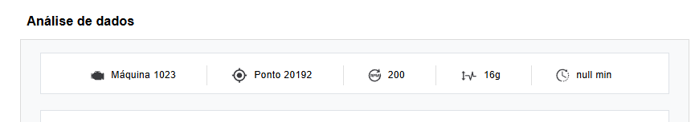
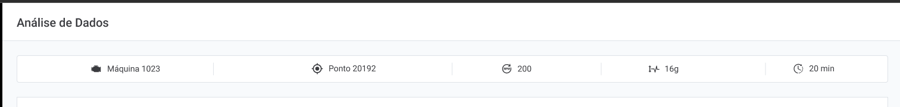

# BUG-001 - Header apresenta `null min` como intervalo

## Informações gerais

- **Área:** Header da máquina
- **Ambiente:** Aplicação web
- **Navegador:** Google Chrome
- **Resolução testada:** 1366 × 768
- **URL:** https://frontend-test-for-qa.vercel.app/
- **Severidade:** Média
- **Prioridade:** Alta
- **Status:** Aberto

## Descrição

O campo de intervalo apresentado no header da máquina exibe `null min`. O protótipo do Figma apresenta o valor `20 min` para esse campo.

## Pré-condições

- A aplicação deve estar disponível.
- O usuário deve possuir acesso à página principal.

## Passos para reproduzir

1. Acessar a aplicação.
2. Aguardar o carregamento da página.
3. Localizar o header com as informações da máquina.
4. Observar o campo de intervalo ao lado do ícone de relógio.

## Resultado obtido

O header apresenta o texto `null min`.

## Resultado esperado

O header deve apresentar um intervalo válido. Conforme o protótipo do Figma, o valor esperado é `20 min`.

## Impacto

O usuário recebe uma informação inválida sobre o intervalo de monitoramento. Isso pode reduzir a confiança nos metadados apresentados pela aplicação.

## Evidências

### Resultado obtido na aplicação

### Resultado esperado no Figma

## Observações técnicas

A requisição para `/metadata` retorna o campo de intervalo com valor nulo. A interface concatena esse valor com a unidade `min`, resultando em `null min`.

O frontend deveria validar a ausência do valor antes de apresentá-lo. Também deve ser confirmado com o time responsável se a API deveria retornar o intervalo `20` ou se a interface deveria apresentar um estado como `Não informado`.

## Automação

O defeito está coberto por:

`cypress/e2e/ui/header-interval.cy.js`

O teste deve falhar enquanto a aplicação apresentar `null min`.

## Sugestão de correção

Validar o campo recebido de `/metadata` antes da renderização e definir com Produto qual comportamento deve ser adotado quando o intervalo não estiver disponível.