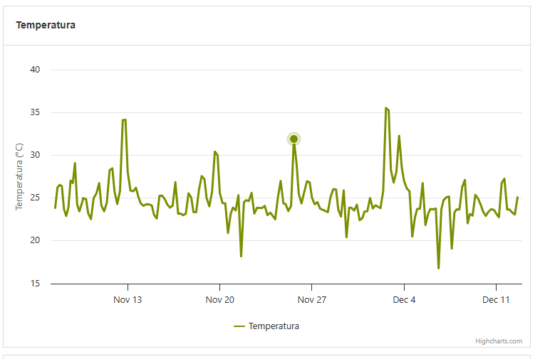
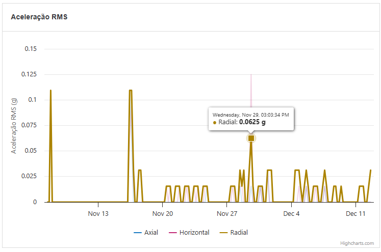

# BUG-002 - Tooltip não é apresentado no gráfico de Temperatura

## Informações gerais

- **Área:** Gráfico de Temperatura
- **Ambiente:** Aplicação web
- **Navegador:** Google Chrome
- **Resolução testada:** 1366 × 768
- **URL:** https://frontend-test-for-qa.vercel.app/
- **Severidade:** Média
- **Prioridade:** Alta
- **Status:** Aberto

## Descrição

Ao passar o cursor sobre a série do gráfico de Temperatura, o ponto correspondente é destacado, mas o tooltip com a data e o valor não é apresentado.

O comportamento funciona corretamente nos gráficos de Aceleração RMS e Velocidade RMS.

## Pré-condições

- A aplicação deve estar disponível.
- Os dados dos gráficos devem estar carregados.

## Passos para reproduzir

1. Acessar a aplicação.
2. Localizar o gráfico de Temperatura.
3. Posicionar o cursor sobre diferentes pontos da série.
4. Observar o comportamento do gráfico.

## Resultado obtido

O ponto da série reage à passagem do cursor, mas nenhum tooltip é apresentado.

## Resultado esperado

Um tooltip deve ser apresentado contendo a data ou horário e o valor correspondente ao ponto selecionado, conforme definido no requisito funcional.

## Impacto

O usuário não consegue consultar o valor exato de temperatura em determinado momento. Isso prejudica a análise detalhada dos dados de monitoramento.

## Evidências

### Resultado obtido no gráfico de Temperatura

### Comportamento funcional no gráfico de Aceleração RMS

## Observações técnicas

A série de Temperatura responde à interação visual, pois o ponto é destacado quando o cursor passa sobre ele. Entretanto, o elemento `.highcharts-tooltip` não é apresentado.

A mesma estratégia de interação apresenta o tooltip nos gráficos de Aceleração RMS e Velocidade RMS. Isso indica uma possível diferença na configuração do tooltip ou da série de Temperatura.

## Automação

O defeito está coberto por:

`cypress/e2e/ui/tooltip.cy.js`

Os testes de tooltip de Aceleração RMS e Velocidade RMS passam. O teste de Temperatura falha enquanto o defeito está presente.

## Sugestão de correção

Revisar a configuração do Highcharts para a série de Temperatura, especialmente as propriedades relacionadas ao `tooltip`, ao `formatter` e à interação da série.

Após a correção, validar se o tooltip apresenta uma data ou horário e um valor numérico de temperatura.