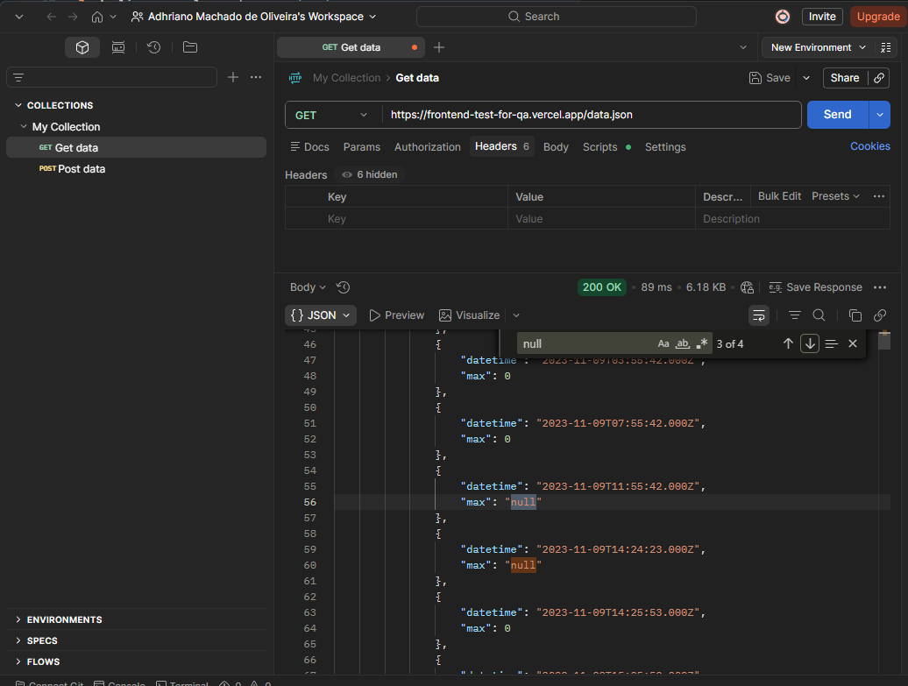
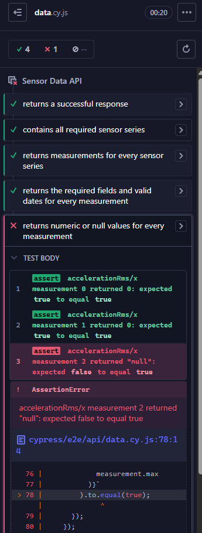

# BUG-003 - API retorna `"null"` como texto em valores de medição

## Informações gerais

- **Área:** API de dados dos sensores
- **Endpoint:** `/data.json`
- **Ambiente:** Aplicação web
- **URL:** https://frontend-test-for-qa.vercel.app/data.json
- **Severidade:** Média
- **Prioridade:** Alta
- **Status:** Aberto

## Descrição

Alguns registros retornados pela API apresentam o campo `max` com a string `"null"`, enquanto outros apresentam valores numéricos.

Isso torna o tipo do campo inconsistente dentro da mesma série de dados.

## Pré-condições

- O endpoint `/data.json` deve estar disponível.

## Passos para reproduzir

1. Realizar uma requisição `GET` para `/data.json`.
2. Localizar a série `accelerationRms/x`.
3. Analisar os valores do campo `max`.
4. Observar o terceiro registro da série, correspondente ao índice 2.

## Resultado obtido

O campo é retornado como uma string:

```json
{
  "datetime": "2023-11-07T19:59:08.000Z",
  "max": "null"
}
```

## Resultado esperado

Quando existir uma medição, `max` deve ser numérico:

```json
{
  "max": 0
}
```

Quando a medição estiver ausente, deve ser utilizado `null` JSON:

```json
{
  "max": null
}
```

## Impacto

A inconsistência de tipo pode causar falhas em cálculos, filtros, gráficos e consumidores da API que esperam um valor numérico ou nulo.

Em um contexto de monitoramento, também pode dificultar a diferenciação entre ausência de medição e uma medição com valor zero.

## Evidências

### Resposta observada no Postman



### Falha do teste automatizado



## Observações técnicas

O teste de contrato aceita valores numéricos ou `null` JSON, mas rejeita a string `"null"`.

A primeira inconsistência detectada está na série `accelerationRms/x`, no índice 2. Outros registros também podem apresentar o mesmo comportamento.

## Automação

O defeito está coberto por:

`cypress/e2e/api/data.cy.js`

O teste `returns numeric or null values for every measurement` deve falhar enquanto existirem valores `"null"` serializados como texto.

## Sugestão de correção

Padronizar a serialização de medições ausentes utilizando `null` JSON.

O valor não deve ser convertido para `0`, pois zero representa uma medição válida e possui significado diferente de um dado ausente.