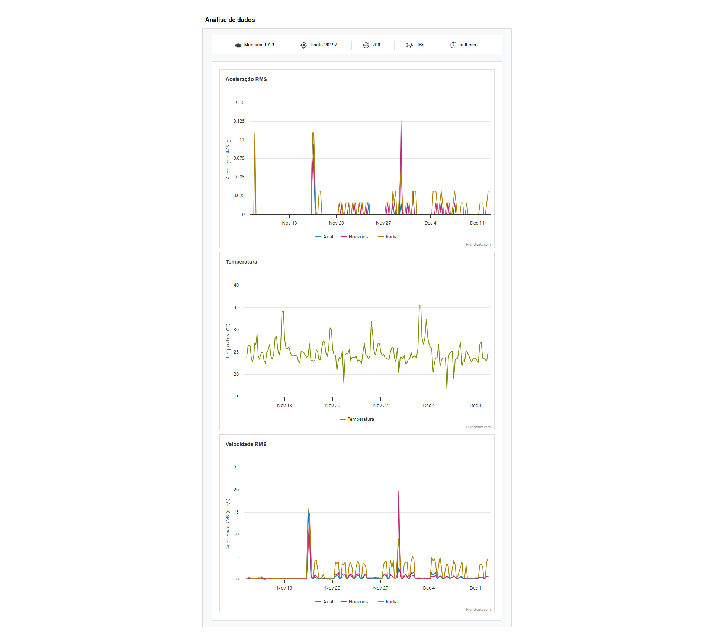
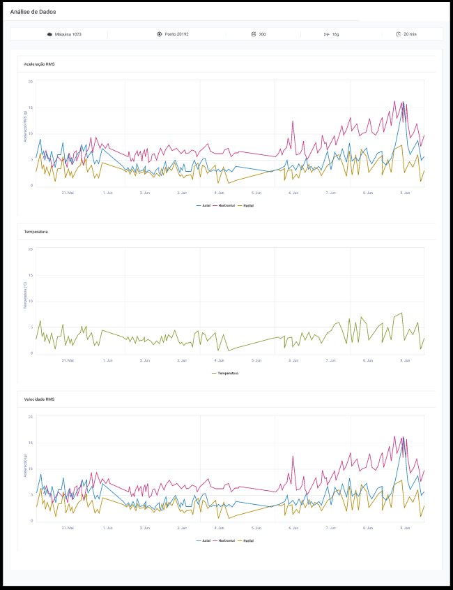
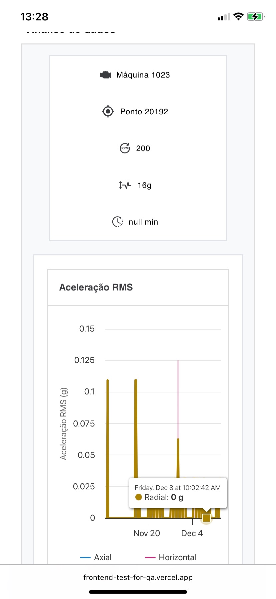
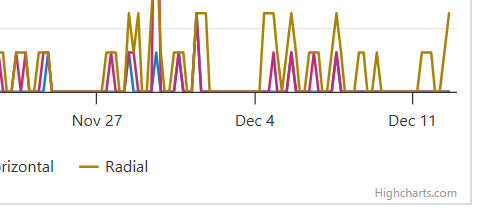
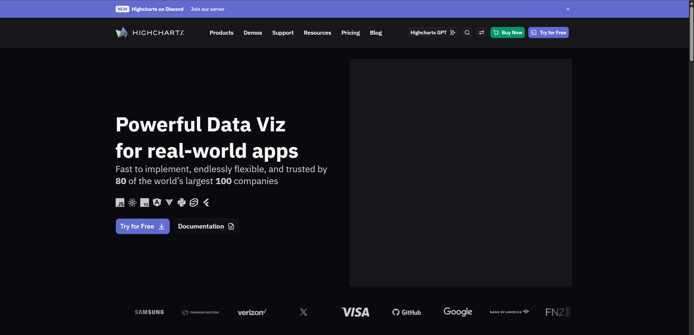

# Revisão de Produto e Design

## Objetivo

Este documento registra diferenças e ambiguidades encontradas durante a comparação entre os requisitos funcionais, o protótipo do Figma e a aplicação implementada.

Os itens abaixo não são classificados automaticamente como defeitos. Eles precisam de validação com Produto ou Design para definir o comportamento esperado.

## Resumo

| ID | Observação | Tipo | Impacto |
|---|---|---|---|
| PD-001 | Unidade do gráfico de Velocidade RMS divergente | Ambiguidade de design | Médio |
| PD-002 | Comportamento responsivo não especificado | Requisito não definido | Médio |
| PD-003 | Largura da área de conteúdo diferente do protótipo | Diferença visual | Baixo |
| PD-004 | Crédito externo do Highcharts visível | Decisão de produto/licenciamento | Baixo |
| PD-005 | Capitalização diferente no título | Inconsistência textual | Baixo |

---

## PD-001 - Unidade do gráfico de Velocidade RMS

### Contexto

O requisito funcional solicita um gráfico de Velocidade RMS.

### Comportamento atual

A aplicação apresenta a unidade:

`Velocidade RMS (mm/s)`

Essa unidade é semanticamente coerente com uma medição de velocidade.

### Protótipo

O gráfico correspondente no Figma apresenta:

`Aceleração (g)`

### Ambiguidade

Não está claro se o protótipo contém uma legenda incorreta ou se a implementação deveria utilizar outra unidade.

### Impacto

Uma unidade incorreta pode causar interpretação equivocada dos dados apresentados no gráfico.

### Pergunta para Produto/Design

Qual unidade deve ser apresentada no eixo vertical do gráfico de Velocidade RMS: `mm/s` ou `g`?

### Sugestão

Confirmar a unidade com o responsável pelos dados e manter o Figma e a implementação com a mesma nomenclatura.

### Evidências de comparação

## PD-002 - Comportamento responsivo não especificado

### Contexto

O protótipo disponibilizado apresenta somente uma visualização desktop. Não foi identificado um layout específico para dispositivos móveis.

### Comportamento atual

Em uma viewport de dispositivo móvel:

- as informações do header são organizadas verticalmente;
- o header ocupa uma área considerável da tela;
- os gráficos ficam estreitos;
- a leitura das séries e legendas fica prejudicada.

### Ambiguidade

Não está definido se a aplicação precisa oferecer suporte a dispositivos móveis nem qual deve ser o comportamento dos gráficos em telas menores.

### Impacto

Usuários em dispositivos móveis podem ter dificuldade para interpretar os dados de monitoramento.

### Perguntas para Produto/Design

- A aplicação deve oferecer suporte a dispositivos móveis?
- Quais são os breakpoints esperados?
- Os gráficos devem permitir rolagem horizontal, redimensionamento ou outra forma de visualização?

### Sugestão

Criar uma variação mobile no Figma ou registrar explicitamente que a aplicação possui suporte apenas para desktop.

### Evidência

## PD-003 - Largura da área de conteúdo

### Contexto

Durante a comparação visual, a área dos gráficos parece mais estreita na aplicação do que no protótipo.

### Comportamento atual

A aplicação utiliza uma área centralizada e limitada horizontalmente, reduzindo o espaço disponível para os gráficos.

### Protótipo

O Figma apresenta os gráficos ocupando uma proporção maior da largura disponível.

### Impacto

A redução de largura pode dificultar a leitura de pontos próximos em séries temporais extensas.

### Observação

A diferença pode ser influenciada pela resolução, escala ou zoom utilizados durante a comparação. Por isso, o item precisa de validação antes de ser considerado um defeito.

### Pergunta para Design

Existe uma largura máxima ou proporção de tela definida para o conteúdo principal?

### Evidências de comparação

#### Aplicação

#### Figma

## PD-004 - Crédito externo do Highcharts

### Contexto

Os três gráficos apresentam o texto `Highcharts.com` no canto inferior direito.

### Comportamento atual

Ao selecionar o texto, o usuário é direcionado para uma página externa do Highcharts.

### Protótipo

O crédito externo não está representado no Figma.

### Impacto

O link pode retirar o usuário da aplicação sem que essa navegação faça parte do fluxo do produto.

### Consideração

A remoção do crédito pode depender da licença utilizada pelo projeto. Portanto, ele não deve ser removido sem confirmar as condições de licenciamento do Highcharts.

### Pergunta para Produto/Desenvolvimento

A presença do crédito e do link externo é intencional e compatível com a licença utilizada?

### Evidências

#### Crédito apresentado no gráfico

#### Destino após selecionar o crédito

## PD-005 - Capitalização do título

### Comportamento atual

A aplicação apresenta:

`Análise de dados`

### Protótipo

O Figma apresenta:

`Análise de Dados`

### Impacto

A diferença não afeta o funcionamento, mas representa uma pequena inconsistência textual entre design e implementação.

### Pergunta para Design

Qual capitalização deve ser utilizada como padrão no título da página?