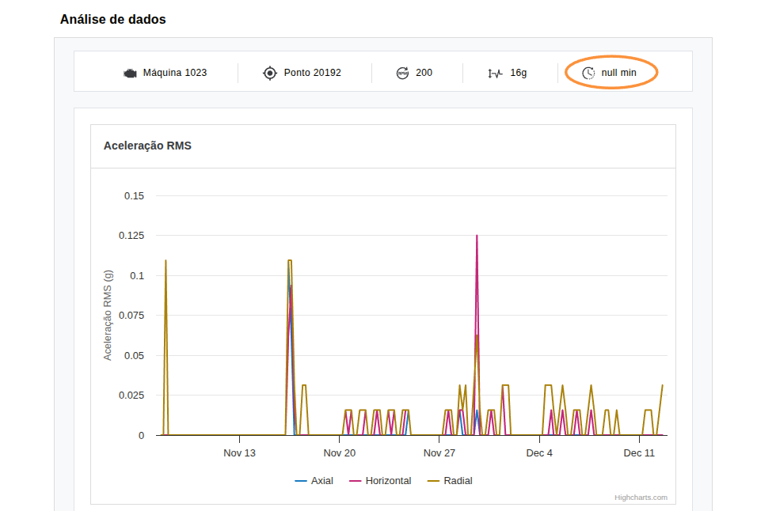

## ID: BUG-001 - Dado interval retornado null

**Severidade:** Alta
**Prioridade:** Alta

### Descrição
Ao realizar uma requisição para o endpoint de metadata, o dado `interval` está sendo retornado como `null`.

### Passos para Reproduzir
1. Acessar o link `https://frontend-test-for-qa.vercel.app/metadata.json`
2. Verificar os dados retornados

### Comportamento Atual
O dado `interval` retorna como `null`, quebrando o padrão esperado de tipo numérico e desalinhando o cabeçalho em relação aos requisitos.

### Comportamento Esperado
Conforme os requisitos e figma, o `interval` deveria retornar um valor numérico.

### Evidências

