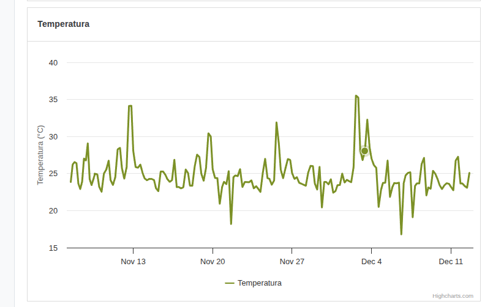

## ID: BUG-002 - Gráfico de temperatura sem tooltip

**Severidade:** Média
**Prioridade:** Alta

### Descrição
O gráfico de temperatura não exibe tooltip ao passar o cursor sobre ele, diferentemente dos demais gráficos, caracterizando uma quebra de requisito.

### Passos para Reproduzir
1. Acessar o link `https://frontend-test-for-qa.vercel.app/`
2. Passar o cursor sobre o gráfico de temperatura

### Comportamento Atual
Ao passar o cursor sobre os outros gráficos, um tooltip com os dados do período é exibido. No gráfico de temperatura, nenhum tooltip é apresentado.

### Comportamento Esperado
Conforme os requisitos, ao passar o mouse sobre qualquer série temporal deve haver feedback de tooltip.

### Evidências
