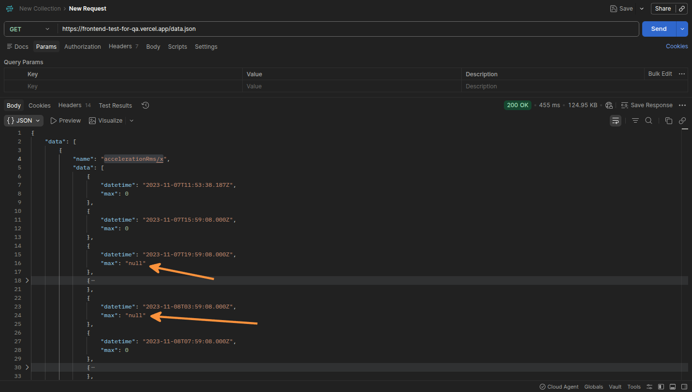

## ID: BUG-003 - Valores de max retornados como "null" string no endpoint de data

**Severidade:** Alta
**Prioridade:** Alta

### Descrição
Ao realizar uma requisição para o endpoint de data, alguns registros do campo `max` estão sendo retornados como a string `"null"` em vez de um valor numérico, o que ocasiona espaço em branco na linha do gráfico.

### Passos para Reproduzir
1. Acessar o link `https://frontend-test-for-qa.vercel.app/data.json`
2. Verificar os dados retornados na série `accelerationRms/x`

### Comportamento Atual
O campo `max` retorna a string `"null"` em determinados registros (ex: `2023-11-07T19:59:08`, `2023-11-08T03:59:08`, `2023-11-09T11:55:42`, entre outros), quebrando o padrão esperado de tipo numérico.

### Comportamento Esperado
Conforme os requisitos, todos os valores do campo `max` deveriam retornar como tipo numérico. Registros sem medição deveriam retornar `0`.

### Evidências
