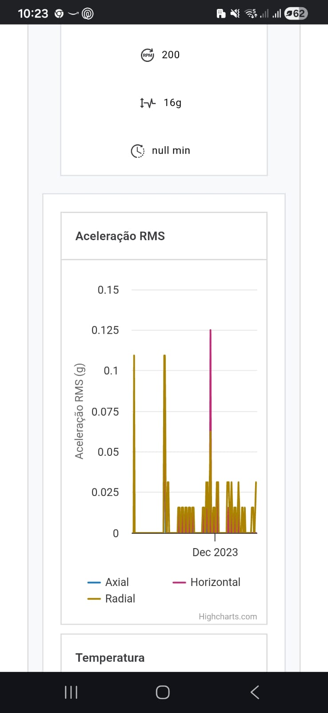
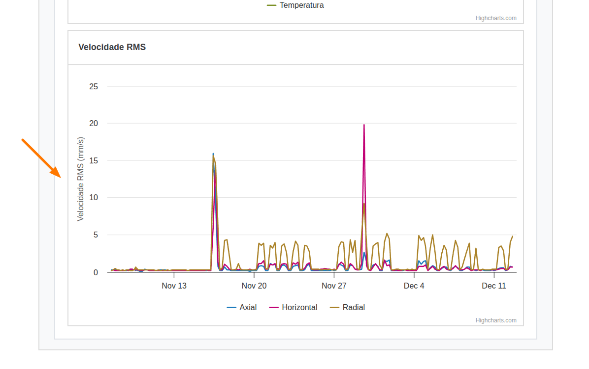
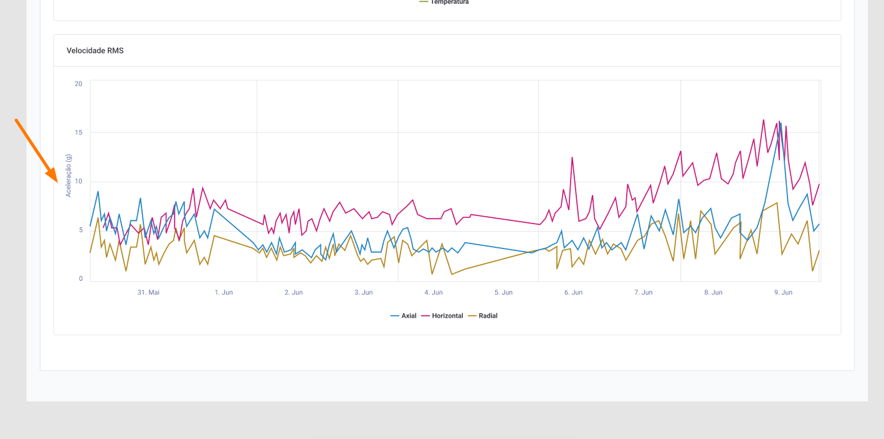
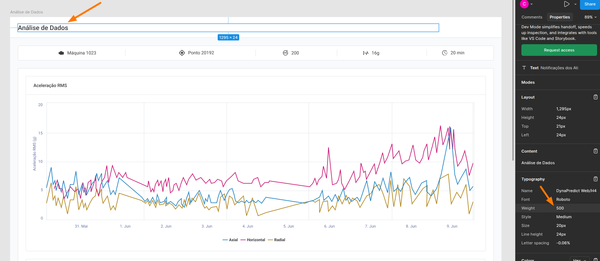
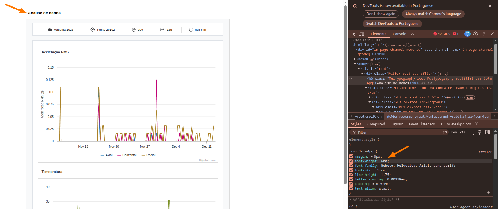

# Relatório de Feedback de Produto

Este documento lista inconsistências ou observações entre o protótipo do Figma e a implementação, ou requisitos ambíguos.

## Responsividade mobile
**Observação:** A responsividade da tela não aparenta ter suporte mobile, isso não está informado nos requisitos.
**Impacto:** Identidade visual e acessibilidade.
**Sugestão:** Alinhar as formatações de tela necessárias no requisito com o Design System do Figma.

### Evidências

## Label incorreta no Figma
**Observação:** Cada gráfico é acompanhado de uma label informando a linha de métrica do gráfico, como aceleração e temperatura. No entanto, no Figma o gráfico de velocidade contém a label "aceleração(g)" ao invés de "velocidade RMS(mm/s)", conforme aparece na página.
**Impacto:** Identidade visual e rastreabilidade.
**Sugestão:** Revisar o Figma para entender se foi um erro no design.

### Evidências

## Títulos com formatação diferente ao Figma
**Observação:** O título "Análise de dados" e os títulos dos gráficos estão com peso de fonte maior do que o mostrado no Figma, com `font-weight: 600` na página e `font-weight: 500` no Figma.
**Impacto:** Identidade visual.
**Sugestão:** Revisar a alteração com o designer para entender se a mudança estava prevista.

### Evidências

